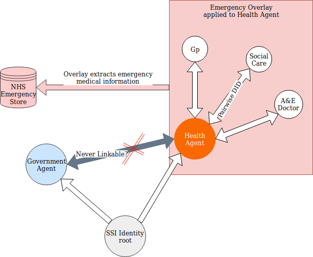
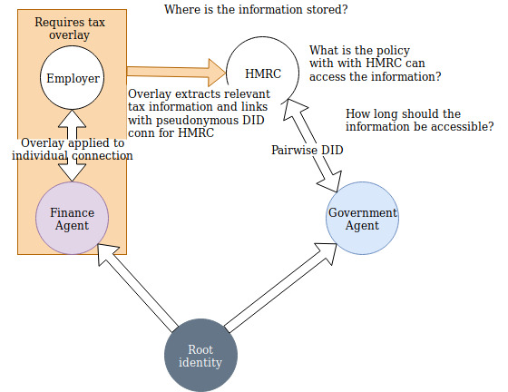
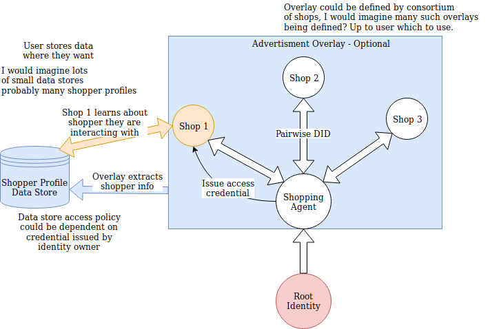

Currently in the Self-Sovereign Identity space I see a lack of talk about accountability. One of the main reasons organisations started collecting and storing data on us was to know who we are. More importantly, to be able to prove to others that they know who their customers are. Think of KYC.

I have been grappling recently with the inherent conflict between the anonymity and unlinkability of Self-Sovereign identity systems compared with the requirement to hold individuals accountable for their actions across multiple entities. Not to mention the benifits of more personalised experiences that come with linkability.

The abilitiy to build up a profile of a person based on their actions, although currently portrayed as evil has undoubted positive effects. The issue for me comes down to control. What attributes am I agreeing to be correlated across which domains. Currently, there is no way of knowing. Moving to Self-Sovereign Identity should involve making this explicit and firmly under the users control. It should not aim to remove the ability for linkability altogether.

Then the question arises - How can I enable linkability without giving away my anonymous DID's. I want to be able to build up this store of information generated from multiple entities such that within an anonymous DID connection I can:
* Prove that I am committing correctly encrypted attributes for all interactions across the DID to the store.
* Share the location of the store
* Share access to the store/ Prove the access policy of the store
* There should be no way to get from the store to other DID's contributing information to the store

I believe this could lead to some really interesting things. Entities such as shops, banks or anything could agree to interact with anonymous DID entities so long as they can prove that in all interactions they are commiting certain encrypted attributes to a certain store which is accessible under certain conditions.

But does this ensure linkability across private DID's? Couldn't a user just commit encrypted information to separate stores each time? 

I think there has to be a distinction made. Some information is optional such as building a shopping profile. It should be entirely up the the user what their store contains and which DID's they link by commiting to the same store.

But in some contexts I think it makes sense for the data store to be hosted by a third party. Perhaps the Government, or a trusted custodian. Entites with stricter compliance rules would require proof certain encrypted information is sent to a certain data store. 

Does this work? What is the mechanism for decrypting this information? Think about tax for example. If we could have auditors able to access financial information about an individual across domains.

If we are going to check an individual is paying the correct tax, then their need

There is an inherent need in identity systems to track our actions across unlinkable DID contexts. Suppose I am getting paid across multiple unlinkable DID's, there has to be some way for a tax entity to verify how much you as an individual are getting paid. Not how much you as a DID.

How might we start to map accountability for different contexts with different requirement?

Firstly, an overlay. An overlay, as I understand it is a construct that sits on top of a schema and interacts with certain fields to implement additional functionality that is best separated from the underlying data. Perhaps a broader definition is an construct that can be triggered for certain data fields.

I have an idea that uses this concept of overlays being developed to extract certain attributes from verifiable credentials shared across many different pairwise pseudonymous DID connections. These attributes could be verifiably encrypted under certain well understood and agreed policies that are very context specific. These encrypted attributes can then be used to give assurance that under certain conditions the anonymous individual could be held accountable by revealing these attributes.

An interesting question that arises is who is responsible for storing this encrypted information. I again think this could be context specific and highlight some examples below. However, I am wary of creating centralised stores of information even if it is encrypted. In an ideal world a DID might store its own accountability information which it can prove that under certain conditions it would be released. The problems I have with this are would this meet the trust requirments? Why should I trust a DID to release its information?

While these ideas are currently very rough I believe that something along these lines has potential. It could make us think about and clearly define the amount of information that is required for accountability in certain conditions in a way that everyone understands the terms involved. If we could implement cryptographic policies for verifiable credentials then these terms could be codified such that without breaking the encryption only people that meet the terms would have access to such information.

 For example for my health records no one ever should be able to access them accept medical staff. Certainly no one should be able to alter it accept them. This could be a medical agent rooted in my home medical service. An overlay could then be applied to the medical agency, extracting and encrypting all emergency medical information from all interactions that agent takes. This information still has as little PII as possible, ideally none but could be linked to the individual via biometrics. Biometrics could then be used to find medical information of someone passed out while not releasing any other information about the individual. It should be impossible to link medical agents to other entities agents. Medical information only revealed by biometrics to specifically authorised agents.

This is just one example and I would argue probably the only example where biometric identification could be preferable. 

I can think of others. 

You might have your financial agent, with an overlay applied to for tax. Or  audit for a company. This information could then be accessed by the tax office or the auditor. What's more you would be able to give accountability to your agent by proving you are using such an overlay. Or perhaps some specific connections would require proof an overlay has been applied.

Linkability between certain roots of identity should be very seriously considered. Always opting for unlinkability where possible. For example if I write a interesting book, should you be able to link that to my financial agent when it is caught cheating? Possibly though you would want linkability. To get access to improved deals and clothing suggestions you might link all you clothes shopping agents. 

The goal, I think, is to move into a world where there are clear boundaries around what an entity can know about another and under what conditions. How we define that both in terms of technology and laws is a more challenging matter.

Further down the line, I would hope, we could also adopt this principle of transparency within our society. To a certain extend at least. People could commit accountability to their agents by linking them together. For example being able to prove that if found of wrong doing, the agent thats interacting with can have their entire financial anonymity revoked But still that person should have anonymous health records. How might we build towards this?

Some other ideas involving accountability or not as related to accountability but using similar principles would be to use an overlay for advertising. Something that can build a shopping profile for you across different DID's used at different shops. which you can give access to certain shops.

Interesting convo with Sovrin people on accountability. 
belief that accountability will be much the same as it is now. I show my VC's to a bank. They store that information separately. Such as name, dob, address. If my DID is found doing wrong, the bank hands over that personal information. The authorities then pursue their investigation with me separatly. They say also stated that the bank can never prove I said those things about my DID.

This doesn't quite sit well with me. Firstly, we are still creating a store of personal information. Secondly, won't the authorities want access to my other DID's. Sometimes wrongdoing can only be unconvered when looking across multiple interactions with multiple entities.