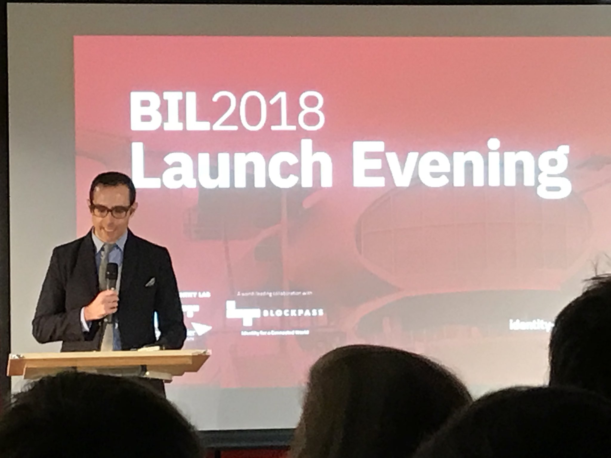
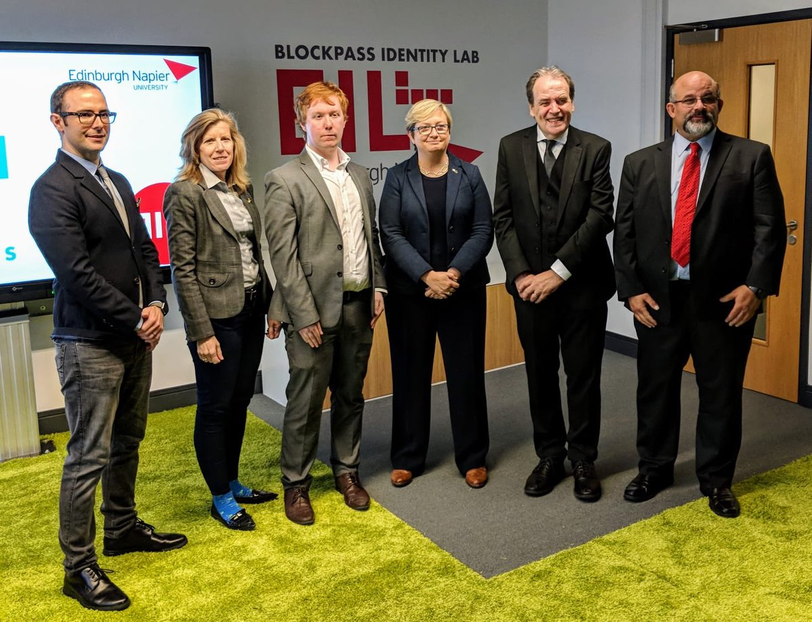

<blockquote class="twitter-tweet tw-align-center" data-lang="en">
NEWS: “Blockchain will have a significant and positive impact on multiple industries and the Blockpass Identity Lab will help to support its ongoing development” <a href="https://twitter.com/EdinburghNapier?ref_src=twsrc%5Etfw">@EdinburghNapier</a> <a href="https://twitter.com/BlockpassIDLab?ref_src=twsrc%5Etfw">@BlockpassIDLab</a> <a href="https://twitter.com/hashtag/Blockchain?src=hash&amp;ref_src=twsrc%5Etfw">#Blockchain</a> <a href="https://twitter.com/hashtag/BlockpassIdentityLab?src=hash&amp;ref_src=twsrc%5Etfw">#BlockpassIdentityLab</a><a href="https://t.co/FblFWDpF19">https://t.co/FblFWDpF19</a>
&mdash; Coin Rivet (@CoinRivet) <a href="https://twitter.com/CoinRivet/status/1045713998220587010?ref_src=twsrc%5Etfw">September 28, 2018</a></blockquote>

It was a whirlwind of a week, completing a whirlwind month since I left my job at the end of August. A month that has seen me travel to Helsinki for the [MyData conference](www.misterwip.uk/mydata), then on to Berlin for the blockchain week and impressive ETHBerlin hackathon. A short break in the Netherlands. Then a week down in London with Kathy. 

This week saw me move from London back to Ilkley for a couple of days, then up to Edinburgh to begin the next stage of my life. Researching at the newly opened Blockpass Identity Lab in Edinburgh - the first lab in the world focussed on Identity.  Or BIL for short aptly names after [Bill Buchanan](https://www.napier.ac.uk/people/bill-buchanan), a professor and expert on cryptography who I am hugely looking forward to researching under.

This first week was hectic, but one that couldn't have gone much better from my point of view.

I moved up to Edinburgh on Tuesday and met with my research lead Liam Bell and another PhD student Adam Hall. We got to know each other over a few beers.

On Wednesday I helped with and attended the BIL launch [event](https://www.scotsman.com/business/companies/tech/blockchain-lab-launches-in-edinburgh-1-4805746). Which included a fine speech by Adam Vaziri the CEO of Blockpass on his vision for the future of identity.

We also hosted VIPs from the Scottish Government. Exciting to see the government in Scotland looking to take a lead on this technology. I'm looking forward to future collaboration.

Thursday was the annual [ScotSoft](https://scotsoft.scot/) conference, including an entertaining and impressive awards dinner.

<blockquote class="twitter-tweet tw-align-center" data-lang="en">
Congratulations to the award winners of the Young Software Engineer of the Year at <a href="https://twitter.com/hashtag/ScotSoft2018?src=hash&amp;ref_src=twsrc%5Etfw">#ScotSoft2018</a> <a href="https://twitter.com/scotlandis?ref_src=twsrc%5Etfw">@scotlandIS</a> <a href="https://t.co/G6Z6CzNcgg">pic.twitter.com/G6Z6CzNcgg</a>
&mdash; Thomas Haywood (@thaywoodphoto) <a href="https://twitter.com/thaywoodphoto/status/1045437146935562251?ref_src=twsrc%5Etfw">September 27, 2018</a></blockquote>

All this while living at a hostel. 

On Friday I moved into Adams, my legend of a PhD course mate. Actually it's Courtney's place but she is just as sound.  Big thanks for putting me up, I don't think I could have hacked the hostel too much longer.

I can tell everyone I have met involved with the lab is someone that I will get along with as well as being someone to learn from.

Like Liam my research lead.

Friday was also the first BIL conference. A conference that we will be hosting every year. For a first event, it was impressive and full of technical detail. I am looking forward to the content we can produce for the following year. A dedicated team of 6 PhD students working in collaboration with Blockpass and other organisations should have some quality content to share.

This year I got dropped in the deep end. I was asked to take part in a panel discussing the Self-Sovereign future, a surprise that was only sprung on me the night before. Still, I found it an exciting and useful learning experience. It went well, I thoroughly enjoyed myself!

The conference left me optimistic for the future of this lab and what we can achieve together.

Saturday and Sunday was the first BIL hack. Another annual event we aim to host. While underattended there was some quality ideas produced. As well as a rewarding sense that we had introduced a new group of people about to fall down the blockchain rabbit hole. 

Like these guys from Glasgow. 

<blockquote class="twitter-tweet tw-align-center" data-lang="en">
Say hello to the &#39;Byte Me&#39; team at the <a href="https://twitter.com/BlockpassIDLab?ref_src=twsrc%5Etfw">@BlockpassIDLab</a> hackathon. They are building an <a href="https://twitter.com/hashtag/NFT?src=hash&amp;ref_src=twsrc%5Etfw">#NFT</a> based project for <a href="https://twitter.com/uniqxio?ref_src=twsrc%5Etfw">@uniqxio</a> <a href="https://t.co/8BrgOX2j94">pic.twitter.com/8BrgOX2j94</a>
&mdash; uniqx.io (@uniqxio) <a href="https://twitter.com/uniqxio/status/1046024544576786435?ref_src=twsrc%5Etfw">September 29, 2018</a></blockquote>

Then there was this team which came up with a fantastic outilne for how we could provide identities for refugees through localised trust and trust anchors enabling transistion out of these localised areas of trust. For example a refugee camp would be an area of localised trust and NGO's could be trust anchors.

My attention at the hackathon was spread across a number of projects. I worked on my Blockternship project [The Community Mind](https://github.com/Blockternship/TheCommunityMind), completing a basic integration of [TheGraph](www.thegraph.com) to create a dApp that hopefully ends up implementing this [vision](www.misterwip.uk/thecommunitymind). On top of that, for my current non dApp implementation of [The Community Mind](www.thecommunitymind.com), I locally implemented the [Blockpass](www.blockpass.org) authentication, allowing sign on via the Blockpass app scanning a QR code. I hope to have this deployed to my live application soon.

Furthermore, I gained some understanding of [Hyperledger Fabric](https://www.hyperledger.org/projects/fabric) including the composer-playground graphical interface while helping Adam look into asset tracking for food. 

We make a good team and have differing backgrounds. We can learn a lot from each other. I am excited to meet the rest of the PhD students and hope to see what we can build together!

Thanks to all our sponsors, [Blockpass](https://www.eyecademy.com/), [Uniqx](https://uniqx.io/) and [Eyecadamy](https://www.eyecademy.com/). I hope this is the start of things to come. Bigger and better things.

Also, thanks to Chris and Songyi from [Metadium](https://metadium.com/) for making the journey from Berlin. Great to see you again and have you involved. Hopefully more collaboration to come in the future - I would love to visit South Korea.

## Ideas and Thoughts

During the launch week, I met a lot of interesting people and had a lot of fascinating conversations. Here are a few ideas and thoughts that stuck with me.

- Using [NFT's](http://erc721.org/) as advertisement profiles that describe a user's interests and can be optionally used when visiting sites as well as providing discounts to the customer giving the incentives to share their profiles. This is an idea that was discussed by Solomon from uniqx and I think NFT's could be a great way to implement this. Imagine controlling an advertising profile from each shop that was associated towith you through a DID that you can prove ownership of using zero knowledge. You could show this profile to the advertiser or the website in return for discounts and a more personalised experience. But an experience that you can completely control.
- The Blockpass use case for KYC/AML is really interesting. They have focussed on an area and after implementing their application for login, I can tell they are close to having something usable and effective. Particularly from a regulation perspective. I look forward to working with them and seeing how we can use each other's expertise.
- Blockpass have an interest in finding out how we can prove cryptographically that information on organisations servers has been deleted. I spoke with Adam Vaziri about this, and from his legal experience and perspective, he believes organisations will have to store personal data to comply with regulatory bodies. He also believes changing the law is not the way to go. I have to agree with him. We had an interesting conversation around whether continuous access to data stored in a location of the users choice would be sufficient. I want to explore this possiblity further, starting with looking deeper into [Object Capabilities](https://en.wikipedia.org/wiki/Object-capability_model) as a possible way to achieve this.
- I want to continue building The Community Mind. I think it has potential, this week came with a couple of interesting feature ideas. Or at least rethinking of how it should work from a users point of view. Hopefully, a write up of this to follow.
- Collaboration and connecting with others in the identity space from differing backgrounds. Particularly looking forward to working with MyData, hopefully opening the Edinburgh MyData hub! I also desperately want to attend the [Internet Identity Workshop](https://www.internetidentityworkshop.com/).

## Looking to the future

The future is bright for this lab. I have a number of things that I would love to focus on.

I am hugely looking forward to learning the mathematics behind the cryptographic tools used in today's systems and powering the future. With experts like the King of Crypto Professor Bill Buchanan as my supervisor I am confident I will be able to achieve this.

I can't wait to start building project and ideas around this technology and advancing this space.

I have not decided on a research question, it is such a huge space. I am confident, if slightly nervous I will discover the question for me as I explore the possibilities with an open mind. 

My general area of focus, to begin with, will be around exploring how we can anonymise identities while retaining trust in the system through the implementation of cryptography. 

First goal though is to find myself a place to live!

