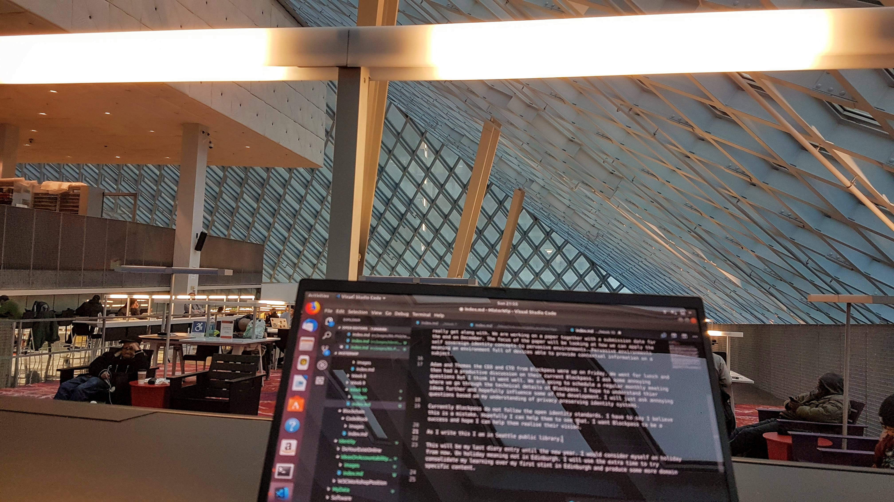

A less academic week I would say. More a week of meetings and organisation.  Both necessary and productive though.

I had a couple of MyData communications this week. A call to discuss hosting the general meeting. I hope I can come through on this, currently, I have not been able to find the appropriate space. I was banking on one or both of the universities being able to support this, however, they have been less receptive than I hoped. The fact that the planned meeting dates are in term time doesn't help.

We also had our MyData Scotland peer acceptance call and are now officially registered as a local hub for MyData. Exciting times, it is definitely a network and community that is worth being part of. I hope over the next year we can build a sustainable active hub that has a presence throughout Scotland. The ideas behind MyData are going to grow with importance as people wake up to the problems around our current approach to data management.

On Tuesday I found out about and attempted to attend my first [Credentials Community group call](https://w3c-ccg.github.io/). A weekly call discussing DID's and Verifiable credentials. I couldn't get the audio to work which was a shame. In the new year, I plan to regularly attend these weekly calls.

Then there we meeting with Zakwan, a researcher and lecturer at the university that I get along with well. We are working on a paper together with a submission date for the end of December. The paper will focus on how we can apply the self-sovereign identity concepts to pervasive environments, an area Zakwan has published in previously. Pervasive environments meaning an environment full of devices acting proactively on behalf of a person. For example, providing context updates on the individual's location.

Adam and Thomas the CEO and CTO from Blockpass were up in Edinburgh on Friday. We went for lunch and then had a productive discussion on their current Blockpass identity architecture. I asked some annoying questions but I think it went well. We are going to schedule a regular monthly meeting where we get into the technical details of Blockpass. I hope to understand their ideas further and hopefully influence some of the development. I will keep asking them tough questions based on my understanding of privacy-preserving identity systems.

Currently, Blockpass do not follow the open identity standards being developed and do not seem to be intending to in the future. I have to say I believe this is a mistake. Hopefully, I can help them to see that. 

As I write this I am in Seattle public library. A recommended refuge from the rain. It is pretty nice to be fair. I have to say I am not sold on Seattle yet, its grey, wet and not particularly pedestrian friendly. Still, I am here for the W3C workshop, not the weather. I plan to make the most of it. 

I have decided this will be my last diary entry until the new year.  I will not be going into university until January. You could say I am having a holiday. Although I have a load of papers to read over the break, papers that I hope my professor will also read so we can analyse them together when I return. I gave him a Christmas reading list.

Instead of writing diary entries I will aim to produce some more domain-specific content covering my learnings from the first ten weeks of my PhD. I also have a paper to contribute to. Let's see how it goes.

