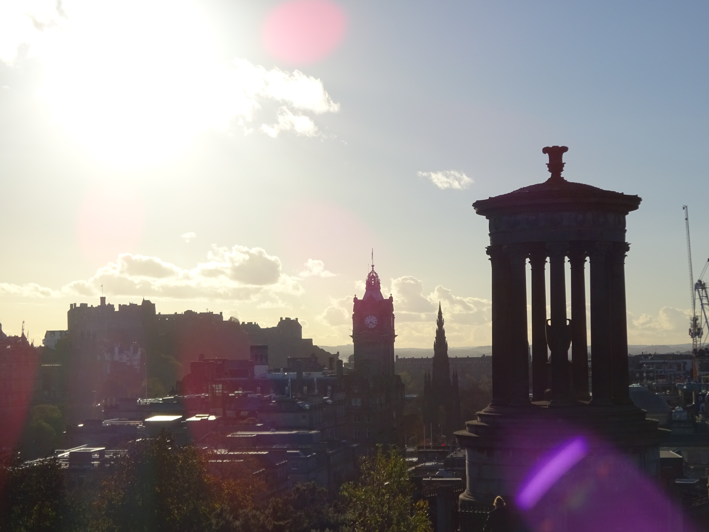

This week I began exploring the Zero Knowledge rabbit hole. Reading, scribbling and scratching my head. I made progress though. Understanding the mysterious cryptography behind a Zero Knowledge proof is going to be a tough nut to crack but I am confident I will manage it. 

I began with the  ZCash [paper](http://zerocash-project.org/media/pdf/zerocash-extended-20140518.pdf), the chain of references lead me to the Pinocchio [paper](https://eprint.iacr.org/2013/279.pdf) on verifying computation using a Zero Knowledge proof. Both of which I wasn't fully understanding. I would often get lost in the equations, but I will keep coming back to them with a goal of complete understanding. I am just waiting for the lightbulb!

For example, Vitalik's excellent [blog](https://medium.com/@VitalikButerin/quadratic-arithmetic-programs-from-zero-to-hero-f6d558cea649) on QAP construction for a mathematical equation was one of these moments. I worked through the maths on paper and after a lot of scribbles, I made it to the end and came out with a mostly solid understanding of what is going on from a mathematical point of view.

I also attended this useful [webinar](http://ssimeetup.org/zero-knowledge-proofs-zkp-privacy-preserving-digital-identity-clare-nelson-webinar-14/) from SSI Meetup by Clare Nelson on Zero Knowledge for Identity systems. This was full of links to articles and papers to explore further. An absolute gem was Matthew Green's two-part [blog post](https://blog.cryptographyengineering.com/2014/11/27/zero-knowledge-proofs-illustrated-primer/) on Zero Knowledge without all the equations. I'll get to them in due time. This blog was perfect for explaining the wonkiness behind the role a simulation plays in theorising about the Zero-Knowledgeness of a Zero Knowledge proof. A must read for anyone interested in learning more.

On top of that, I continued learning Rust, completing the next 4 chapters of TheBook. After a couple more chapters, I will start building as I learn. If I can code it, then I should understand it. Hopefully next week!

My brain was full by Friday, but we have the weekend for a reason. I kicked back and relaxed. Everything in Edinburgh is still new to me so I enjoy exploring. This weekend I went round Morningside. I also checked out High Society Soundsystem at The Dog House which was class. Seems like there is a decent music scene in Edinburgh.

Next week I will continue grappling with this subject. I am hoping the more I read, the more different explanations, the more examples and eventually the code that I write, will help me master Zero Knowledge. That's my focus at the moment. Understand the cryptography, then decide what to use it for. Where to direct my research.

Here is a diagram from the SSI Meetup webinar that sums up what I am trying to get my head around. Or actually just one implementation of what I am trying to get my head round...

And here is Edinburgh looking beautiful from Carlton Hill.

