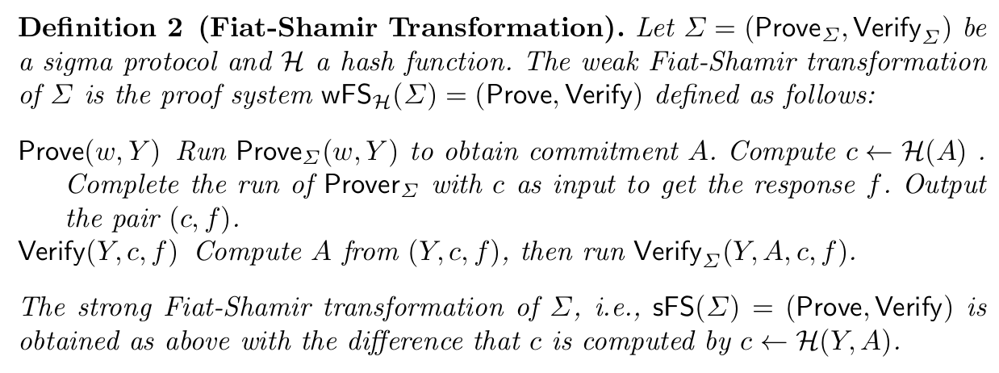
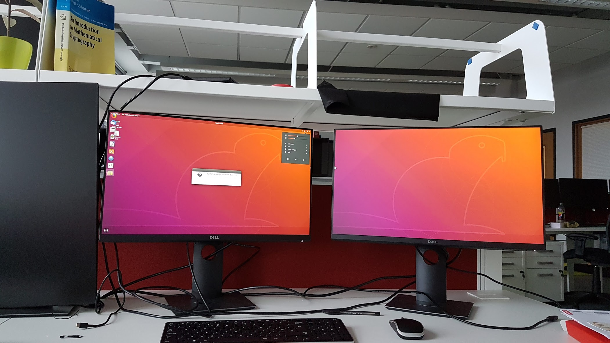

This week was a mixed bag. Well, that's how it felt on Friday, but on reflection perhaps I did more than I thought.

I completed my first implementation of a zero-knowledge proof which I am pretty proud of. Take a look at the [code](https://github.com/BlockchainIdentityLab/zero-knowledge-rust-example), I tried to comment the code and lay it out so it is understandable. I am sure there is plenty of room for improvement. There is a final section of the tutorial to complete, I'll look into that next week. But as it stands it is a working implementation.

Working through this tutorial has vastly developed my understanding of a ZKP. There is a difference between learning the theory behind a ZKP and actually implementing one in code. A difference that requires and cements the understanding of the theory. This is how I aim to approach my PhD, I need to see the code, understand the code and hopefully implement my own version in Rust.  

I now understand the role of commitments and merkle trees and how they are used by the prover to commit to the values of their witness function before a proof interaction happens. I understand an approach to make things zero knowledge is to mix it with randomness. See the ZKMerkleTree in merkle.rs. 

Furthermore, I understand the process of turning an interactive proof system, which requires both the prover and verifier to be online and engage in interactions to verify the proof, into a non-interactive proof system. This comes from the realisation by Fiat and Shamir that all the verifier is accomplishing in the interaction is providing a sequence of random numbers. Hence could be replaced by seeding a random number generator using a hash function. This is called a Fiat-Shamir transformation.

How does this work? 

Well, a hash function always produces the same output for a given input. So as long as the verifier knows the hash function used and what to hash, they can produce the same seed for a random number generator therefore enabling them to reproduce and verify the simulated interactions. 

So, what do you hash to produce this seed and how can the verifier replicate this?

You hash a representation of the problem and the proof up to the point you are at. For example, the first time the only shared information is the problem, so this is used to hash and seed the first random number generator. The random number produced is then a query on the witness for the prover to provide a proof against. Then the next seed is generated from a hash of the problem and the first proof. This creates randomness that no prover could fake.

It is pretty huge. It means anyone can verify a ZKP at any point in the future. So the only person involved in producing a proof is the prover.

Here is a more formal definition taken from a paper I read.

I also saw first hand the probabilistic nature of a ZKP. If I created a proof with a small number of simulated interactions sometimes the verify function would validate the proof even though the solution was incorrect. This was partly due to the fact you had to query the last element of the witness in order to validate a certain property of the solution - that both sides of the problem sum to zero.

If you are interested, check out the code and get in touch. I would love to discuss this stuff further with other interested cryptographers. I would also love to know of any other zero knowledge coding tutorials or implementations of proofs I could look at and possibly translate into code.

I guess the next step for me will be being able to take a paper, a theoretical idea and translate that into code. This is some way away yet though.

Another interesting aspect of this tutorial was the translation from Python to Rust. It provided a lot of the implementation challenges. I came to the realisation I don't like Python. While Rust is picky and can be frustrating I believe the code is easier to understand and reason about. In the Python implementation, everything is implicit. You have to figure out they types of everything. With Rust, the majority of errors will be picked up by the compiler often with a useful message telling you what to fix. The contrast between the two languages is really interesting. They feel like complete opposites.

The reason I felt the week was a mixed bag came from me possibly spending too much time on the Rust implementation. I didn't get much reading done. When I did get round to reading, it was a Friday and nothing really stuck. I ended up giving up.

Note to self: read at the beginning of the week.

I have a lot to read and the material is not the most decipherable at times. The general pattern is I start on a paper, then realise I am expected to understand some other concepts to really understand the paper. So I break off to look into that. And so it goes down the rabbit hole until I am thoroughly lost and part way through a number of different papers.

I haven't decided whether it is best to power through these papers without having full comprehension first so as to know what I am trying to understand or to work from the bottom of the paper chain back up to these top-level papers. The latter may take some time, but I am thinking that's the way I am going to go.

On that note next week I will start working through a couple of interesting looking university courses about the prerequisite knowledge required. These are on probabilistic checkable proofs and interactive proofs, [here](http://people.eecs.berkeley.edu/~alexch/classes/CS294-S2017.html) and [here](https://eli.net.technion.ac.il/files/2013/03/notes_2007_Fall.pdf). The content looks good and the professors Alexander Chiesa and Eli Ben Sasson are leaders in this space. Hopefully, they will provide a more gentle introduction to these concepts. 

After giving up on reading I spent Friday looking into [Hyperledger Indy](https://github.com/hyperledger/indy-sdk). This project is the open source code that [Sovrin](https://sovrin.org/) runs. I hold it in very high regard in the identity space. I really want to contribute to the code base and understand how it works. However, I have to say the getting started docs are terrible from a developers point of view. They tell you what the code should do and provide a high-level story of the workflow but very little hands of code examples. Maybe it's just me.

I did manage to get the [IBM tutorial](https://github.com/IBM-Blockchain-Identity/indy-ssivc-tutorial) running, which was interesting but again it still felt abstracted away. I will keep working on it, including attending the weekly Indy web calls on Thursday.

In other news, I believe I have decided what I want to focus my PhD on. I want to explore verifiable credentials and the questions that arise around this. Basically, how can I provide claims about my identity in a privacy-preserving manner while retaining trust? Over the next week, I will produce a document of questions I have around this topic. 

I believe by focussing on verifiable credentials I can explore the cryptography that will be needed to support this. Currently, I don't believe there is much academic work surrounding verifiable credentials and the use of Zero Knowledge for verifiable credentials. I think there could be a huge scope to increase the peer-reviewed research around this developing standard in the SSI space.

Oh and I finally got my desk at the lab set up correctly complete with my new laptop! Check it out.

We also had a MyData meetup. A small informal affair at the Hanging Bat. It was great to connect with like-minded individuals and discuss the potential of a local hub here in Edinburgh. We have already brought some new people into the MyData ecosystem, there seems to be a great appetite for it here.

The next steps will be our first proper meetup. Hopefully, this will take place in late November at the university. I am really excited to see what we can do here in Edinburgh. Not just talking about data but implementing some real use cases. Doing something tangible.

Actually writing about this week makes me feel like I have achieved quite a lot, even if I had a couple of off days. I also feel like I am slowly forming a schedule. I believe having a focus, verifiable credentials will help me identify the areas of research I need to explore.

Hopefully, soon I will create some fancy representation of my schedule, but I think it will take a couple more weeks to solidify. I have a couple of different ideas. For example, do I want to focus on writing code one week and reading the next? When should I fit in actually writing down some of my ideas? How rigid should I make my schedule?

I will work it out eventually but currently its just trial and error.

