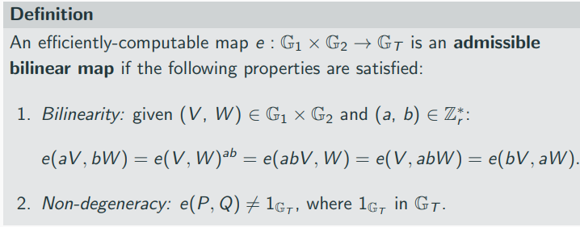

I started my week feeling fairly lost. Bill mentioned something called Attribute-Based Encryption. Which sounds great, you define a set of attributes which are encrypted and allow access to a system based on the presentation of a specific set of attributes. Or something like that anyway. 

I didn't quite get round to reading up on it.

Attribute-Based Encryption, like a lot of newish cryptographic techniques, involves Elliptic Curve Pairings. So I thought I would try to understand what they are and how they work. That's where I got lost. It took me the best part of the week for some basic understanding to crystalise.

There is still a lot I do not know.

I began reading this [post](https://medium.com/@VitalikButerin/exploring-elliptic-curve-pairings-c73c1864e627) by Vitalik. Which is all good until it gets to the part about divisors. What the hell is a divisor?

It was quite a blow that there was this whole extra area of cryptography to learn. Of hard hard maths that I didn't really understand. I was a bit down in the dumps on Tuesday.

However, I kept at it. I watched this YouTube [video](https://www.youtube.com/watch?v=8WDOpzxpnTE&t=4791s) on the topic. It was a gentle introduction and lulled me back into the sense that I could get it.

Then I read some more papers and I definitely couldn't get it. Too many random symbols and letters that I was expected to know and understand. Which I didn't.

Finally, I found [this](http://link.springer.com/10.1007/s00145-009-9048-z) though. A Taxonomy of Elliptic Curve Pairings. Just want I needed. A long paper going through all the families of ECC pairings, all the funny symbols and what they mean. I think I finally have some understanding of an ECC pairing and why it is useful.

A pairing is where you take two curves and combine them to produce a third curve. A pairing. This curve, or at least the ones that satisfy some certain properties to ensure they are still secure, allow for some interesting and useful cryptography.

They allow for encrypted multiplication which means we can use them to check quadratic constraints. This is used in SNARKS for checking the coefficients of the resulting polynomials of Quadratic Arithmetic Programs without revealing what these coefficients are. See [this](https://z.cash/blog/snark-explain7) excellent set of articles on snarks.

For a pairing to be useful for cryptographic methods it must be a bilinear non-degenerate pairing.

There are some ways to classify these curves with the important numbers being k the embedding degree and *P* the ratio between base field size and subgroup size for a pairing-friendly curve.

There is still a lot to figure out with pairings, but at least I have can read and understand roughly what a paper is talking about when they are defining the pairing they used. 

I will be reading the taxonomy paper again I am sure.

Then on Friday, I discovered a lot of resources on anonymous credential systems. These came from looking into the [IBM identity mixer](https://www.zurich.ibm.com/identity_mixer/) work that has been adapted and is used in hyperledger indy. Turns out there is far more academic work on credentials that I first thought. Particularly the work from [Jan Camenisch](https://jan.camenisch.org/).

I plan to read through all these papers and follow their paper trails throughout next week.

An interesting point, raised by my dad, that this week's work highlights is:

### How do I prioritize my research? 

There is only so much time in the day and only so many papers I can read in a week.

### How do I make sure what I am doing is the most important?

I certainly cannot keep approaching it as I am. I need a more practical way of organising and tracking all the areas Bill tells me to look into. As well as the areas I discover through my own research. I cannot keep letting myself get distracted by whatever comes up at that moment.

To address this I plan to create and manage a backlog. Where new areas of research go into the backlog and are prioritised. And each week is defined with a clear focus which I do not deviate from. At the end of the week, I will reaccess the backlog and define objectives and focuses for the following week accordingly.

At least that's what I hope to do, we will see how it goes.

Next week's focus is reading through the credential literature I have discovered.