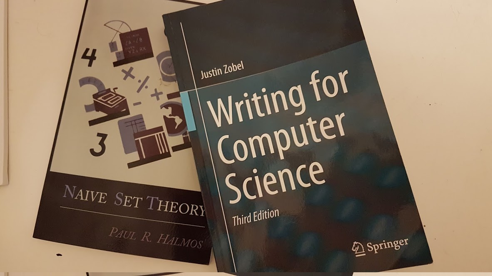
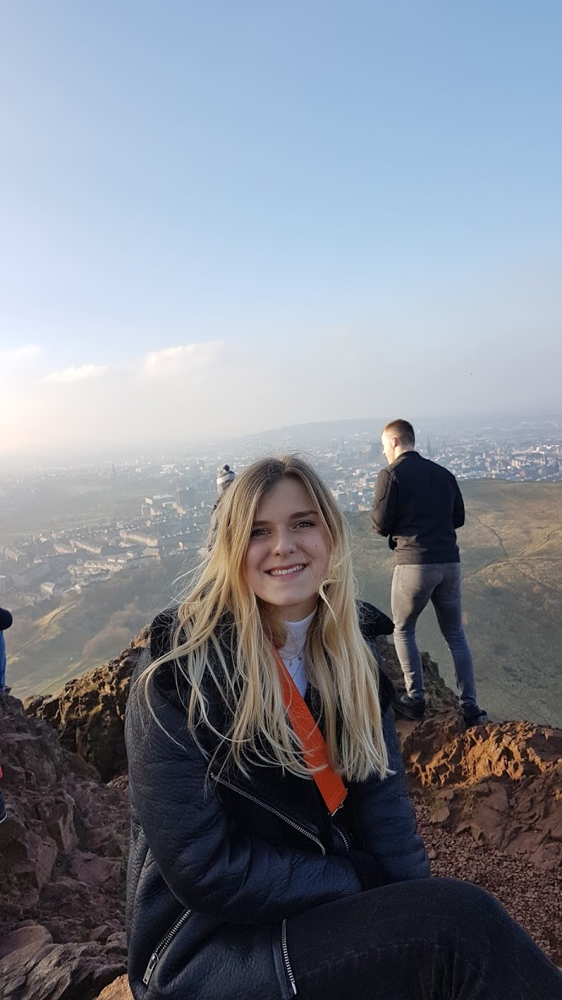

Better from me. Not perfect, but much better.

I followed a routine this week. I defined my weekly and daily goals and managed to achieve most of them.

One of those goals was to read more. Well, I am currently reading four different books, three non-fiction and one fiction. 

[Deep Work](http://calnewport.com/books/deep-work/) by Cal Newport provided me with some tips for focus. One that I have started implementing straight away is this concept of a shutdown. At the end of the working day, whenever I decide that is, I now go through a review and plan process. Where I look at what I achieved and roughly list tasks for the following day. This has given me structure while enabling me to flexibly adapt to whatever comes up. I have also reduced my social media interaction further and am working to stretch my focus muscles by attempting to memorise the order of a shuffled pack of cards.

[Writing for Computer Science](https://www.amazon.co.uk/Writing-Computer-Science-Justin-Zobel/dp/1447166388/ref=sr_1_1/258-5855565-5974265?ie=UTF8&qid=1542647561&sr=8-1&keywords=writing+for+computer+science) by Justin Zobel. This book is perfect, my parents bought me it during my dissertation but I neglected to read it. Now though I am going to work my way through this book over the next few weeks. It gives an overview of the kind of critical analysis of papers I should be making for my lit review. How I should structure papers and just generally how I should write research.

It is exactly what I need, some definitive advice and guidance on how to conduct research. I am glad I brought it up from home last week. 

The third non-fiction is [Naive Set Theory](https://www.amazon.co.uk/Naive-Set-Theory-Paul-Halmos/dp/1614271313) by Paul Halmos. Another book I bought a while back and thought might be relevant now. I read little chunks at a time and hopefully, by the end I will have a decent understanding of set theory and all the notation that goes along with it.

I also achieved my other goal of getting back to programming. Although my Rust knowledge has suffered from the two weeks off. It was slow going but I have completed challenge 3 and 4 of the [cryptopals](https://cryptopals.com) challenges. I need to keep up my Rust and these challenges seem like a great way to keep it ticking over. As well as providing coding challenges relevant to cryptography.

I read [this](https://medium.com/interstellar/bulletproofs-pre-release-fcb1feb36d4b) about a bulletproofs implementation in pure Rust that uses this library called [Ristretto](https://ristretto.group/). While I can't understand it yet I know I am on the write lines with learning Rust. More and more cryptographic implementations seem to be using it.

I also completed Week 1 of the Dan Boneh Cryptography coursera. Which was hard but really useful. My knowledge of basic cryptographic definitions and notation was limited and has been preventing me from understanding some of the papers I am reading. After completing this course I intend to work through his book for a more detailed [understanding](https://crypto.stanford.edu/~dabo/cryptobook/).

On Monday I met Al, an interesting friend of Liam's and mathematician who gave me some good advice over a few beers. Namely, don't over-focus on the cryptography. Learn it because it is interesting but to directly contribute to the base of cryptographic knowledge will be a really tough PhD. Rather find a way to use the cryptography in a novel way. Apply the cryptography to solve a problem. Then most importantly to find a problem to solve. Make sure that my research is solving a problem. I am hoping Al can become more involved in my PhD team.

I have been working on a presentation on the SSI workflow, covering all my new knowledge of this process. Then, as Bill suggested, trying to look at how SSI might be used in the healthcare world. I am taking a GP surgery as an example. Mapping out all the interactions, looking at the verifiable credential exchanges etc. It is proving quite tough.

On the topic of healthcare, our lab had a very productive meeting with Manny from [Truu](https://truu.id). A relationship that I am happy to have helped foster since hearing their presentation at the Sovrin meetup. Our next steps will be to put together a grant proposal that will provide the lab funding whilst working to create a PoC in a Scottish NHS trust that will use the Truu application to issue and verify doctors credentials.

In Other news: It was the first MyData AGM, the first board was elected. An important step in the MyData movement. I am officially listed as a [founding member](https://mydata.org/founders/). I also found out the Edinburgh University have joined the MyData organisation. Thanks to Jarmo Eskelinen who made this happen. He is heading up a data-driven innovation [initiative](https://www.ed.ac.uk/news/staff/2018/data-driven-innovation-lead-announced) at the university. is heading up this initiative. I hope we can work together to apply the MyData principles here in Scotland.

<blockquote class="twitter-tweet" data-lang="en-gb">
PRESS RELEASE: &quot;<a href="https://twitter.com/hashtag/MyData?src=hash&amp;ref_src=twsrc%5Etfw">#MyData</a> Global, a nonprofit dedicated to defending digital human rights, elects its first board of directors&quot; So far over 70 organisations and 400 individuals have come together for a more just, sustainable and prosperous digital society! <a href="https://t.co/6LWOAkpcve">https://t.co/6LWOAkpcve</a>
&mdash; MyData.org (@mydataorg) <a href="https://twitter.com/mydataorg/status/1063422692613922816?ref_src=twsrc%5Etfw">16 November 2018</a></blockquote>

I got accepted to the [W3C workshop](https://www.w3.org/Security/strong-authentication-and-identity-workshop/cfp.html)! Which is amazing news. This is in Seattle on the 10th to 11th of December. So looks like I am off to Seattle. Thanks to Blockpass for agreeing to fund this alongside the university. I am very grateful.

The only problem is I am not sure I will be able to attend the Hyperledger Global Forum. Maybe I can swing it, we will see.

This coming week, I will continue programming. Finish off my presentation on SSI. I am also working to create a review of Hyperledger Indy for Blockpass which my presentation will help me to write. Hopefully, I can use this to push to attend the Global Forum.

I am also going to begin my literature review. It is time I started getting some rough work on paper. I will begin with a review of different Signature schemes and how they can be used for Verifiable Credentials. Hopefully, by starting to write I can more efficiently direct my research.

I had an amazing weekend. Kathy came to visit and we had a lovely time. We went up Arthur's seat, cooked some tasty food and just generally explored the city. It was perfect.

