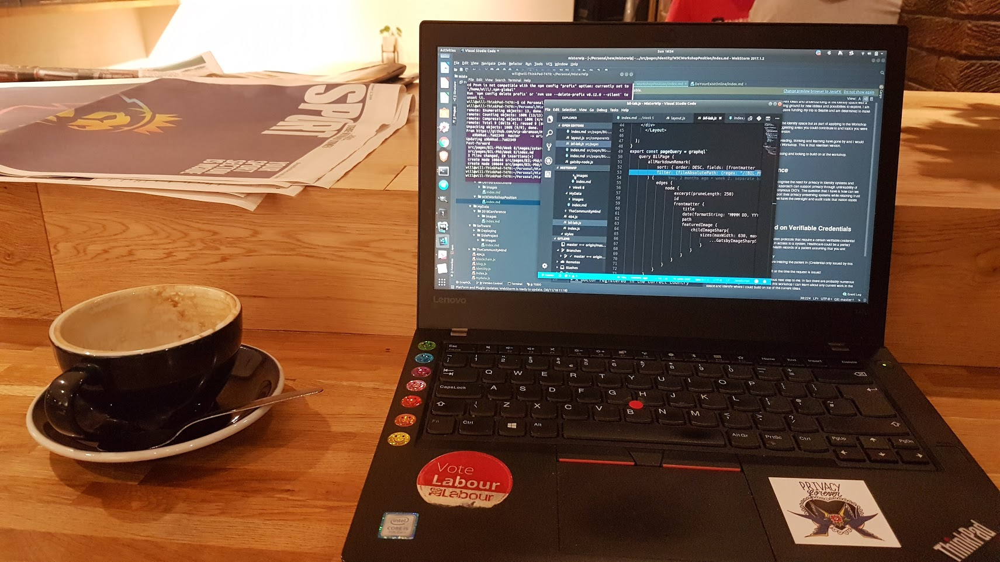

This week went well. I actually don't know if it was too different from the other weeks but things seem to be falling into place. I certainly felt better about my PhD than I have for a while.

We had a public MyData Edinburgh meeting, that while poorly attended, we managed to get a lot done. We have outlined out objectives for the following year in readyness to submit a formal application to MyData Global. We will then go through a process to be ratified by another local hub. I will hopefully outline our objectives in another post when I have tidied them up. We did make the decision to migrate to MyData Scotland as apposed to MyData Edinburgh. We felt it is more inclusive and gives more potential for collaboration.

I aslo submitted an application for a MyData fringe event at [DataFest 2019](https://www.datafest.global/). Our event will be titled Adapting Data Ecosystems to follow MyData Principles. This event will coincide with Edinburgh hosting the MyData Global general meeting. It should be a perfect opportunity to get people excited and involved with MyData here in Scotland. Exciting times

I have to say though it has been hard work. I believe in the MyData vision and want to help push this vision here in Scotland. However it is taking a lot of my time. As I was the intiator of the local hub I feel responsible for it's success. Still I am confident it will be a success and gradually more people will become involved.

Next week I am looking forward to meeting Jarmo Eskelien from the Data Driven Innovation centre to see how we can collaborate to further push MyData here in Scotland.

Apart from MyData stuff I made some good progress with my literature review and my general understanding. Things are seeming clearer. I keep reading articles revolving around similar ideas. Central to these ideas and indeed the research area I am hoping to contribute too is the work of Jan Camenisch.

This week I read User Centricity: A Taxonomy and Open Issues. A great paper that ties everything together into a single picture. To me it seems like Sovrin and others are simply an implementation of academic papers written by Camenisch, Lysyanskaya and others.

There seem to be four of five papers that articulate the crytpgraphy that can be used to create a credential based identity management system that satifies or nearly satisfied the taxonimy presented in this paper. 

These are:

* A Signature Scheme with Effiecient Protocols
* Efficient non-transferable anonymous multi-show credential system with optional anonymity revocation
* Dynamic accumulators and application to efficient revocation of anonymous credentials
* Signature Schemes and anonymous credentials from bilinear maps

There are more but these and the User Centricity paper I currently consider key pieces to my PhD. I have attempted to read some of these, but they cryptography went over my head. By the end of my first year though I will read and understand these papers.

To that end my Cryptography learning is going well. I have completed week 2 of the Dan Boneh course. It is hard. But I am learning.  

This Saturday I am flying to Seattle to attend the W3C Workshop on Strong Authentication and Identity. Read my revised position statement [here](https://misterwip.uk/w3c-position) and outline of what I hope to gain from this workshop.

You might have noticed I redeveloped my website. I hope it will become a central space for me to share my thoughts, questions and ideas throughout the course of my PhD.

In other news, I have identified two cafes that are prime for working in. One the Forest Cafe and the other Round Circle coffee. Both are top chill spots that are laptop friendly. I often have a good two hour reading or programming session in both these places.

No Rust this week really though which is bad. I also am terrible at waking up in the morning. Not sure what's happened to me, I used to be excellent at it.

Next week, I will be preparing for W3C Workshop mainly. I want to ensure I get the most out of the trip, it is a long way to go after all.