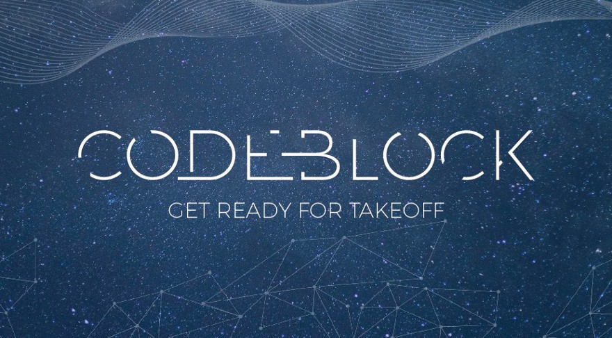

Eight awesome blockchain presentations across a wide range of topics.

One hundred crypto nerds.

A perfectly organised event.

All made for an inspiring Saturday down at Campus London.

First, I would like to say thank you to
[Blockchain](https://www.blockchain.com/) the company for organising the event.

I didn’t know what to expect from the day. When I first found out the name of
the company — Blockchain, I thought it rather odd. But these guys are the real
deal. Formed in 2011, they were Blockchain before blockchain was blockchain. How
cool is that?

The day was jam packed with information. Each talk provided new knowledge and
insights to digest. New questions to ponder. And new tools/projects to check
out.

Each talk presented me with new threads of the blockchain puzzle to try to
unravel.

I learnt a lot!

### The History of Block Chain Technology

By [Nic Cary](https://twitter.com/niccary), the co-founder of Blockchain. The
company which organised this event.

It was a great start to the day. Looking back at the history of the blockchain
space. Through the inception of Bitcoin, the pizza transaction, the creation of
Blockchain the company and a lot more.

I particularly enjoyed this funny video of early bitcoin adopters destroying
their iPhone's. All because Apple kept removing bitcoin wallets from their app
store.

### Anatomy of a Bitcoin Transaction

A talk by [Sjors Provoost](https://medium.com/@provoost). A true bitcoiner who
has recently started contributing to Bitcoin core.

Sjors clearly has a wealth of knowledge about Bitcoin. His talk provided a deep
dive into Bitcoin’s utxo transaction model. Including a look at some opcode for
how a Bitcoin transaction occurs.

He also provided a new perspective on why it’s a good thing Bitcoin mining
requires dedicated hardware which went something like this.

If the hardware required to secure the network was just general CPU power.
Organisations might already have a meaningful amount of compute power compared
to the total power of the network. Therefore they may be capable of attacking
the network should they decide to do so.

Think NSA, GCHQ or even Google.

The expensive cost of buying new dedicated hardware makes this far less likely
to happen.

A very good argument and not one I had considered before.

I enjoyed chatting with Sjors over a beer. We discussed upgrading Bitcoin and
why this is a slow process. [OP_NOP](https://en.bitcoin.it/wiki/Script), the
opcode that does nothing in Bitcoin yet but could potentially be used to add new
functionality.

He also spoke of his interest in
[Simplicity.](https://blockstream.com/2018/02/08/simplicity-a-new-language-for-blockchains-bpase.html)
A new language for blockchains designed by Blockstream. One a bit more thought
out than the current opcodes implemented in Bitcoin and Ethereum. Simplicity was
one of many things I took away from this day to look into further from this day.

### Towards a Generalised Block Chain Fabric

By Imperial College London PhD student [Alexei
Zamyatin](https://twitter.com/alexeiZamyatin?lang=en).

This was the talk that stood out to me when looking first at the schedule.

It did not disappoint.

Atomic cross-chain swaps, chain relays and Meta-layer protocols made for a very
technical presentation. While it was a real head-scratcher at times, Alexei
presented a clear picture of a very complex topic.

I was thoroughly impressed with his presentation.

I find the question:

> How can we enable secure communication and transfer of value between different
> blockchains?

really interesting and technically challenging. But also vitally important. It
is going to be exciting to watch the progress in this area over the next few
years.

I enjoyed the section about [Polkadot](https://polkadot.network/#cover). A
heterogeneous multi‑chain technology being developed by
[Parity](https://www.parity.io/). I hope to read the Polkadot white paper over
the next few days. Another one of those threads to unravel.

It looks complicated because it is.

Alexei also made an interesting comment about the alarming shift to centralised
solutions. Often these cross chain solutions begin with a set of predetermined
validators. They claim they will shift towards a more decentralised model in the
future. But as Alexei pointed out, what is the incentive to shift to a
decentralised model after the system has been created?

Having centralised systems makes things easier, faster and more efficient. Will
these projects really shift towards a more decentralised model in the future?

I guess we will have to see.

### Application of Blockchain APIs

By [Justin Tormey](https://twitter.com/j_tormey?lang=en) a developer at
Blockchain.

This talk gave an insight into what Blockchain the company does and why it is so
useful.

Blockchain are building the infrastructure for Bitcoin. Their main product is an
online crytocurrency wallet — mainly for bitcoin. However, the most interesting
product for me are the API’s they are developing.

This was the premise of Justin’s talk.

The API’s allow users to query and interact with the Bitcoin blockchain. You can
subscribe to incoming transactions, send transactions and a whole lot more.

Justin gave a live coding demo of these API’s being used with a great use case.
He developed a simple program to listen for incoming transactions arriving at
his bitcoin address. Once a transaction appeared on the network the program then
checked his new balance. If it was above a certain amount the code sent a
transaction with the majority of the funds to a cold wallet.

This provides a solution to the problem I am sure a lot of people have with
online wallets. Security.

Fascinating stuff. Check out the API’s provided by Blockchain
[here](https://blockchain.info/api).

### Crypto Markets and the Future of Digital Assets

By[ Xen Baynham-Herd](https://twitter.com/XenBH?lang=en). The Head of Strategy &
Lead Economist at Blockchain.

Xen’s talk provided a tantalising vision of the future as more and more of our
assets become digitised.

He described a cryptopia …

A future where you automatically stream money to a self-driving car for the time
of your journey. This car is then able to pay other cars for priority depending
on journey requirements.

A future where you can send money instantly to charities anywhere in the world
in response to a natural disaster.

A future where content providers get streamed money for the amount of time
someone spends digesting their content.

A future where the exchange of value is frictionless and accessible to all.

I loved it.

> “Our vision is not restricted to making the existing financial system marginally
> more efficient. We have the opportunity to build an entirely new one” — Xen

Both images are taken from Xen’s slides — I hope he doesn’t mind.

### An Introduction to Smart Contracts

By [Dominik Harz](https://twitter.com/nud3l_), Research Assistant at the IC3RE.

Dominik clearly knew his stuff when it came to smart contract development. He
explained Ethereum, smart contracts and smart contract security. Finishing with
a look into some of his current research.

Dominik also gave a simple, but incredibly useful, demo. Deployed a simple
voting smart contract to a test net and interacting with it once deployed.

I am currently trying to learn as much as possible about smart contract
development. Deploying and testing them has always been a challenge for me. I
picked up a lot of tips and tools from watching Dominik.

For one, use [truffle
develop](http://truffleframework.com/docs/getting_started/console), an
interactive console which spawns a new development blockchain. I am also going
to look into [Ganache cli](https://github.com/trufflesuite/ganache-cli), a fast
Ethereum RPC client for testing and development.

Seeing Ganache work provided a solution to an issue I had been running into when
testing smart contracts through remix. I only ever was able to test with one
address, this reduced my testing capabilities. With Ganache you can assign
multiple addresses in the test network.

Both Dominik and Alexei are lucky enough to have their research sponsored by
Blockchain. I didn’t particularly enjoy university but studying this technology
full time sounds awesome. I couldn’t help being a little jealous.

### Ethereum: Past and Present

By [Vinay Gupta](https://medium.com/@leashless). A cypherpunk, founder of
[mattereum](https://mattereum.com/) and veteran of the blockchain space.

Wow, this talk was awesome!

Before this event I had never heard of Vinay Gupta. After I left I had a clear
sense that Vinay was one of the leading thinkers in this new field.

Vinay spoke clarity, experience, and understanding of the whole space. As well
as having thought about its implications on the wider world. A world which
distributed ledger technology must try integrate with.

His company [mattereum](https://mattereum.com/), with the tag line *Smart
contracts for the real world, *are trying to do just that.

I loved his comparison between technology and magic. Society doesn’t care how
things work as long as they work. So for all intense and purposes it’s magic.

The problem is the cryptography underpinning this space is not quite at the
stage where people have accepted it and just agree that it works.

Vinay gave a reality check to the current blockchain enthusiasm. Posing an
interesting question:

> Is blockchain going to turn into a sealed box that does something specialised
> but outside it’s field has very little impact?

Like [edi](https://www.edibasics.co.uk/what-is-edi/), a hyped technology back in
the day. Most of us had never heard of it. Proving his point.

Or could it become like
[HTTPS](https://www.instantssl.com/ssl-certificate-products/https.html). Which
gets used every day by everyone without anyone paying it much notice or caring
how it works.

He then went on to point that actually blockchain was trying to become much
more. Where HTTPS integrated an existing payment system into the internet with
minimal lines of code. Blockchain technology is trying to build a new payment
system from scratch. Potentially a new internet along with it.

Is that really going to work?

I think Vinay believes in this technology, he is working really hard to make it
work. However he seems more aware of the challenge than most people. I got the
sense that he has been here before.

Another interesting analogy Vinay gave for the blockchain was of it being
exploited. Imagine the USA running it’s black ops on [Zcash](https://z.cash/) or
some other uber private coin. Is that really a good thing?

> Are we protecting weak from strong or strong from weak? — Vinay Gupta

All of that was just the introduction.

Vinay went on to explore digital identity in depth. A topic I have recently been
grappling with myself. A crucial, yet unfathomably difficult problem we need to
solve in order to bring about the future blockchain promises.

He emphasised the importance of solving key semantics. Mentioning [SDSI and
SPKI.](http://world.std.com/~cme/html/spki.html) These are public certificate
mechanisms (I need to look into these further). And talked in depth about
identity, a subset of key semantics.

His thoughts on identity insurance presented a well thought out solution to one
of the problems of digital identity. How do I know the information when verified
and claimed against on the blockchain was legit? What if the passport was fake?

Once information in the blockchain it’s almost certainly going to be believe
whether true or false. How do we protect against this risk?

Vinay’s elegant solution — Insurance. Much like VISA has insurance for
transaction fraud, the identity solution of tomorrow could have insurance
against identity fraud.

Vinay’s key message:

Could not have put it better!

I wish we had asked Vinay more questions. I should of asked him a question. I
think my brain was still trying to process all the information gathered
throughout the talk.

If I could ask a question now it would be something like:

> Explain key semantics in a sentence?

Although I can think of plenty. Vinay is definitely a fountain of knowledge in
the digital identity field.

Anyone else interested in digital identity should definitely check out this
[talk](https://www.youtube.com/watch?v=rxD9-hHCNz4&feature=youtu.be) by Vinay.
Also look into [The Internet of Agreements](http://internetofagreements.com/).
They are hosting an identity conference April 10th which I am looking forward to
attending.

### Off-Chain Payments for Fun and Profit, Liquidity.Network and REVIVE

By [Arthur Gervais](https://twitter.com/HatforceSec), lecturer at Imperial
College London.

This was another interesting one. They were all interesting!

Arthur gave an explanation of payment channels — he covered a full range.
Uni-directional and Bi-directional payment channels. 2 party and n party payment
hubs.

N-party payment hubs is the solution that Liquidity.Network provides. A company
that Arthur is co-founder of. These payment hubs bring some real benefits such
as low maintenance costs, low setup costs and high user throughput.

The basic idea is that instead of having to put a stake down for each payment
channel you open, you can just single stake for your payment hub.

It sounds like a really exciting project. The talk included a live demo of the
wallet in action deployed on an ethereum test network. You can test it for
yourself [here](https://liquidity.network/).

Arthur has also developed an open source [bitcoin
simulator](https://arthurgervais.github.io/Bitcoin-Simulator/get_started.html)
and lectures on blockchain at ICL. Check out his course slides
[here](https://drive.google.com/drive/u/0/folders/1LZ61GTsvOvwqYMkT5tmR7uVYcpytIzKc)
if you’re interested.

### The Community

Dispersed throughout the day was a refreshments. They put on a really good
spread. Breakfast, coffee, lunch and even beers afterwards.

This time was perfect for learning from the community. Sharing knowledge,
discussing the talks and hearing about interesting projects.

Everyone was friendly. There was a real sense of excitement at this event, a
sense that you are part of something important. On the cutting edge.

One of the projects that I heard about through community discussion was
[Zap](https://zap.jackmallers.com/) wallet. An open source, user focused
lightning wallet for bitcoin. I met [Diogo
Sergio](https://medium.com/@diogorsergio), who is currently helping with the
UI/UX for this project. Pretty cool stuff.

### Thank You

This event exceeded my expectations, well worth the journey down from Leeds. The
range of topics covered, the quality of the talks, the discussions, the
community. You can view all the slides presented throughout the day
[here](https://drive.google.com/drive/folders/1Q-86NYPtsKGr04vHM9_lptZRzTo3dWVN).

I left saturated with new knowledge and excited about the new areas I had
discovered to explore.

Thanks to my sister for putting me up for the weekend.

Me too!

**Thank you Blockchain for organising such an epic event!**

I hope to be back for more soon.