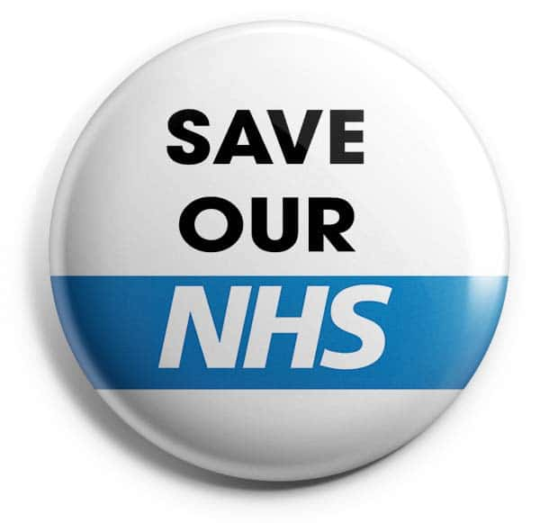

Each of us can trace some connection to the National Health Service here in the UK. This institution created back in [1948](https://www.historic-uk.com/HistoryUK/HistoryofBritain/Birth-of-the-NHS/) has been a beacon to the world. The NHS showed what healthcare could and should look like in the 20th century. Maybe it's time we reimagine what it should look like in the 21st century. At this current point in time, it is in grave peril. Covid-19 combined with severe underfunding and severe understaffing has left this bastion of British public service on its knees. 

If you have to read [Dr Adam Kay's](https://www.adamkay.co.uk/#adam-kay), no holds barred account of life on the frontline as a junior doctor [This is Going to Hurt](https://www.amazon.co.uk/dp/B06XWDJRGS/ref=dp-kindle-redirect?_encoding=UTF8&btkr=1#ace-g4131440328) you will understand where I am coming from. If you haven't read it, I highly recommend you check it out. This book left a huge impression on me, leading me to produce this stream of consciousness on [twitter](https://twitter.com/wip_abramson/status/1235184044004044800). 

Bear in mind, this book documents the experiences of a junior doctor from the period between August 2004 and December 2010. Now, I don't want to make this political, but how confident are you that our healthcare service is in better shape than it was 10 years ago? Time will tell, but I hope the cost will not have to be paid with the lives of too many of our loved ones. 

This is serious. Our NHS and the people that work within it deserve our respect and need our support. If you are in any doubt about this, watch this video report from Giacomo Grasselli a senior health official from Italy helping to coordinate a network of intensive care units in Lombardy.

`youtube:https://www.youtube.com/embed/9mrPHO-nkVE`

I want to highlight, the complex decision that a doctor makes throughout their career. The individual decisions doctors must make when triaging patients are based on numerous factors; the patient's current medical situation and the ability of the institution to provide them with care that can make the difference to name a few. Covid-19 has naturally led to an increasing strictness of this triage process. If there are only so many ICU beds available this decision is further implicated by a prioritisation, which the doctors must make. Think of the psychological burden this places on these individuals who have selflessly dedicated their lives towards caring for others.

I want to take this opportunity to encourage everyone to consider their connection to the NHS, or whatever health system your country has. Respect them, appreciate them and help them where you can.

For me, I have many deep personal connections with our health service. My mum is a recently retired GP who was loved by her patients, even if her children used to make fun of her for not being a *real doctor*. My grandad has had a stroke, my grandma is beginning to get dementia and my uncle has down syndrome. Bless them, thanks to our health service they are all still alive and enjoying life today. My other grandad, Jim, sadly passed away a while back in the care of an NHS hospital. My sister works in administration at a GP practice, and I have best friends who are doctors, nurses, pharmacicts and midwives.

I, myself, work for a fascinating and timely start-up company called [truu.id](https://truu.id). I research the implications of [digital identity systems](https://wip-abramson.dev/digital-identity) when applied to streamline the administrative overhead doctors require simply to manage their career. Overhead and slack that the system largely doesn't account for. Meaning more unpaid work, more stress and more frustration. The bureaucracy involved with being a doctor is mind-blowing.

**Remember: Not all heroes wear capes, but 99% of healthcare professionals are heroes. I am sure I speak on behalf of everyone when I say we are eternally grateful for your sacrifice.**

