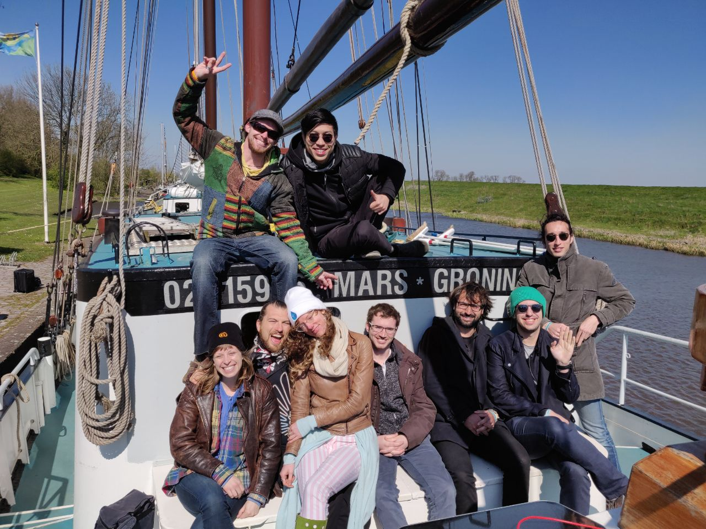

It's been a while since I took a step back and reflected on my progress and development as a researcher and generally a learner in the fast-moving field of identity, cryptography and everything in between.

A lot has happened. A whole university term has run its course. I just turned 24. And I am over half way through my first year of the PhD. 
<!-- `youtube:https://www.youtube.com/embed/XVLs5dw5hOY` -->

## Developing as a Researcher

I still consider myself primarily a software developer and builder over a researcher, but I have come on leaps and bounds since before the new year.

I have identified the core papers I want to build my research on:

* [Practical UC-Secure Delegatable Credential with Attributes and Their Application to Blockchain](https://acmccs.github.io/papers/p683-camenischA.pdf)
* [(Un)Linkable Pseudonyms for Governmental Databases](https://www.zurich.ibm.com/pdf/csc/pseudonyms_paper.pdf)
* [Privacy Preserving User-Auditable Pseudonym Systems](https://researcher.watson.ibm.com/researcher/files/zurich-ANJ/main_nymlog.pdf)
* [Short Randomizable Signatures](https://eprint.iacr.org/2015/525.pdf)

My professor and I have picked them apart together and I am pleased with the level of understanding I have achieved. 
The once daunting cryptography papers have resolved themselves into a tough challenge that I am capable of completing. 
I know the style, the structure and the techniques of writing these papers now. So I know how to read them. I have a process, it involved a couple of passes, a marker pen and often a whiteboard session or two. It really works for me.

This has given me a huge sense of achievement. I think back to last year when I was getting fed up reading similar papers and coming away feeling I had learnt nothing. But, I must have picked up something. A big part of this progress is down to Dan Boneh's excellent cryptography [coursera](https://www.coursera.org/learn/crypto) course. This material is golden to any budding cryptographer as it helps to embed a way of reasoning about cryptography that is distinct, at least in my view, from other mathematical problems.  It helped form solid foundations of understanding which I have been building on ever since.

As you will notice from the papers I have listed, there is a strong focus on the work of [Jan Camenisch](https://jan.camenisch.org/), a world-leading cryptographer. I have been fortunate enough to get to talk to him over zoom call and hope to be able to work with him in the future if his busy schedule permits it. It is great to know that the experts in my field of research are accessible.

I have listed four papers, four very low-level mathematical papers. I would like to have ~ten papers that together form the core of my literature. What I am lacking currently is the context for this cryptography. That is where I need to start looking, into the legal and societal implications of this work. I hope to make up the majority of the remaining ~6 papers out of these kinds of papers.

The one area that has been neglected is experience of writing cryptography in code. This was my initial goal way back at the start of my PhD, to learn Rust and write cryptographic protocols using it. I am currently still mediocre at Rust and haven't implemented as much cryptography as I would have liked. 

While I have fallen short of this goal I am not unduly worried. I have achieved a much greater understanding of cryptography from a theory point of view than I anticipated, I thoroughly enjoy working with pairing cryptography. I plan to catch up with the Rust implementations over the next 6 months. 

Furthermore, I am a regular attendee of the weekly Hyperledger Ursa calls which is a wealth of knowledge from both the theory and the implementation point of view. [Hyperledger Ursa](https://www.hyperledger.org/projects/ursa) is a cryptography library that is in the early stages of development, it aims to provide the core cryptographic primitives to all other Hyperledger projects. I think of it as roughly a next generation of an Open SSL type library. What's more, it is getting written in Rust! I hope to stick around throughout my PhD and at a minimum watch, it being developed and learn how to consume the library. Ideally, I will help with the implementation of the actual library.

The other part of being a researcher that I have undoubtedly improved on is academic writing. I have been working to distil my understanding of the core papers into higher level papers that include easy to follow use cases where this cryptography can be applied in the real world. I have a number of paper ideas, I really need to get my head down and write them up. The only thing I am lacking now is a clear novelty. What new contribution to the science am I making with these papers - I am working on it.

I recently attended a three-day writing retreat run by the university for researchers. I was astonished by how much I was able to produce, in that space of time. I think we had ten 90 minute writing sessions with breaks in between, it helped me to realise a level of Deep Work that I have rarely got to before. If I can get into this state more often I know I can produce an impressive academic output. 

I have also had the enjoyable benefit of helping out in a couple of labs this term. I was involved in Bill's ESecurity module, which was basically a practical cryptography module with some blockchain. It provided a great refresher into basic cryptography and gave me some practical experience. I even gave my first lecture, a guest lecture.to the eSecurity class giving a high-level overview of my research area. It is available on YouTube for the distance learners [here](LINK).

Adam and I have been growing into our roles as student reps, not sure how we ended up here, but interesting to see the bureaucracy of universities in action. Even if it mostly consists of almost pointless meetings. Still, the requirements are pretty minimal and hopefully, it will be a way to meet some different people.

Overall I could not be more pleased with my development as a researcher to date. It was a rocky start, I found it tough but now I feel like I know what I am supposed to be doing more or less and am capable of actually doing it.

## Rebooting the Web of Trust

While I am unable to attend this April's Internet Identity Workshop as I had planned to, I did attend RWot 8 in Barcelona. You can read my review [here](https://misterwip.uk/rwot8). It was epic and much closer than San Francisco.

From this rebooting, I am now part of an open source project called [Satyrn](https://github.com/WebOfTrustInfo/satyrn). It aims to be a simple teaching tool for node libraries much the same as Jupyter is for python. Been slow going as we don't have a lot of time between us but we are making progress. It is also great to stay in touch with some of the rebooting members.

The next one is in Prague from the 3-6th of September, I would really love to attend but I am not sure if the lab will support me. It also depends if I have my deliverable, the confirmation of my target degree, completed in time. The goal is early September.

We will see, it is a maybe. It would be a fantastic opportunity to build on the contacts I made in March and being in Europe again it is very tempting. Potentially I could self-fund.

Another huge milestone for me has been my close involvement with [Truu](truu.id), a connection that I made way back in November during the first London Sovrin meetup. It is validating for me to see some of these community events that aren't typically academic in nature start to bear fruit. Truu is a small, innovative startup building an identity solution for healthcare currently using Sovrin. It was set up by doctors to solve the administrative burden of authenticating doctors credentials and the often dangerous situations this can lead to such as under or unqualified doctors treating patients. It is more common than you [think](https://www.google.com/search?q=unqualified+doctors+in+uk&client=ubuntu&hs=qVH&channel=fs&source=lnt&tbs=qdr:y&sa=X&ved=0ahUKEwjh7M6zuOjhAhXCoXEKHXV4DzsQpwUIJg&biw=1213&bih=568). 

In February Manny, the CEO offered me a flexible trial period to come on as only their second developer. At first, I thought this would be a strain on my time, but it is all done remotely and they are very understanding of my situation. I have enjoyed being part of a development team again.

Truu is actually building the next generation of identity solutions in a domain that is of significant research interest to me and the lab. Truu gives me access to cutting edge software, it gives me an avenue to test out my research and the opportunity to talk to stakeholders that this research impacts. I really believe this can be a symbiotic relationship that benefits both parties.

MyData Scotland is another project I am heavily involved with that has started to pick up steam. We hosted the MyData Global AGM in Edinburgh, along with our first public meeting which you can read about [here](https://misterwip.uk/mapping-workshop). 

Crucially, I feel we have formed a solid core group around this local hub. We have expertise and interests to share the workload and have a real impact. I have said this before but I feel like the opportunity to affect change here in Scotland is huge. There is already huge data talent, Scotland wants to lead the way in data-driven innovation well to me there is no clearer way to do that than to provide citizens with a way to exert more control over the data they produce. Barcelona is a prime [example](https://ajuntament.barcelona.cat/digital/en/blog/city-data-commons) that this is possible.

To spread the MyData vision throughout Scotland I presented a talk at the Aberdeen data meetup. It didn't go as well as I would have liked. I didn't manage to convince many people that this vision was possible or even what people wanted. Perhaps I misread the audience but it seemed they were taking the position of who cares and how will we pay for this alternative approach. It is an experience I will learn from for sure, an I definitely need a better answer to the payment question. The answer, in my view, to who cares is anyone who values their freedom in this world.

An incredibly exciting opportunity coming out of MyData Scotland is a project called DIDs for Kids which we hoping to receive [EU Next Generation Internet](https://www.ngi.eu/) grant money for. Here is Iain Henderson's excellent outline of the goals of the project that we included in our proposal.

> "This project seeks to research, validate and shape how large scale deployment of decentralised identity might best emerge by tackling a ‘green field’ use case around newborn children. The concept this project seeks to research, validate and ultimately prove is that a new human being, with support from their parents and the community around them, can build life-long data assets that are secure, private and able to be shared with appropriate parties under full, audited control. "

Exciting times, but it all takes time!

## Odyssey Hackathon, Giveth and The Commons Stack

I ended my term with an epic holiday/hackathon. I self-funded a trip to the Netherlands to take part in the [Odyssey Hackathon](https://www.odyssey.org/), the largest AI and Blockchain hackathon in the world. It was an impressive event, with a strong focus on developing projects to solve real-world problems that will live on beyond the hackathon.

My team was part of the larger Giveth community who put forward an impressive 5 teams all building different aspects of the same project, The Commons Stack. The goal was, and still is, to build a sustainable crowdfunding mechanism for the commons that aligns stakeholders incentives with the commons they are funding.

For our team uniform, supplied by Giveth, we dressed as carrots to represent the incentives we were working to create.  It also had the benefit of making us really easy to spot in the venue.

You can read about the idea [here](https://medium.com/@abbey_titcomb/crowdfunding-the-commons-d590238d8c3c), and a technical deep dive in our solution using augmented bonding curves [here](https://medium.com/giveth/deep-dive-augmented-bonding-curves-3f1f7c1fa751). This is the current iteration of the [project](https://stoic-cray-69120a.netlify.com/) to give you an idea of what we created during 48 hours of hacking. This is just a JavaScript implementation for simplicity, although we also managed to write the solidity contracts. Expect big things coming out of Giveth and The Commons Stack over the coming year. I mean check out this beautiful design!

It was a real pleasure to be introduced to the Giveth community for the first time. A truly decentralised community with people from over 10 different countries. Many attendees had, like me, only met one or two others in person before.

In our team, none of us had met before the hackathon. But we made a solid team; Abbey: our leader, communicator and project canvas master, Rinke: the caffeine master and solidity wiz, Pavle: another solidity wiz and speaker of wise words, Jordan: involved in everything and even pulled an all-nighter on Saturday, Marko: Our remote designer who did a sweet job and me on the frontend.

This was our canvas.

I was so impressed with what we managed to create over the 48 hours, although we didn't win first place (we should have) we set up the Commons Stack project for success with a talented team behind it and a decent code base to build on. We left Groningen fast friends and I hope to work with all of them again. Pavle and I even continued the adventure crashing a Rinke's in Utrecht for a couple of nights which was just what we needed to unwind.

While the hackathon was hard work, the overall experience was a holiday. I travelled by train, very relaxing even if I had a few booking scares. We all stayed on a 34 person boat called the Mars which was originally built in 1924. We were in one of my favourite countries, the Netherlands, which comes with certain perks. Groningen, the city the hackathon took place was beautiful. I made some lovely, friendly, fascinating new friends.

The Commons Stack is a project I am to keep working on. If this project can be realised it will have a huge impact on how communities organise and fund themselves. The team is strong, the technology is cutting edge and there is research and systems design from [BlockScience](https://block.science/) to back up this idea. Whilst I am undoubtedly time constrained, it would be a mistake for me not to get involved. It is  an amazing opportunity, hopefully, I might even get some research out of it.
## Edinburgh

I well settled in Edinburgh. I love the house I live in, I love the city and I am really growing to love the research life. I feel incredibly lucky to have ended up in the position that I am in and am grateful for all the experiences that have lead me here. I mean to make the most of my opportunities

What's more, summer is coming. The sun is coming. I am looking forward to seeing the fringe for the first time, I am looking forward to exploring outside of Edinburgh, I haven't even been to Glasgow yet! If everything goes well I might even get my motorbike licence.

## Plans for the coming months

As you can see I am involved in a lot of different projects but my research has to come first. For me the challenge, and the goal, is going to be keeping going with these external projects while staying on top of my research. To that end, I hope to make as much of the work I do on the projects a part of my research. I at least hope that the work I do with Truu and MyData Scotland is directly relevant to the outputs of my PhD. If I can manage that then I should have an impressive piece of research to share with the wider identity community. The Commons Stack may have to stay external to the research of my PhD, at least for now.

I have a big deliverable coming up. A 5000 work report comprising of a literature review and proposed novelty for my PhD. This will be assessed through a mini viva and is a key decision point as part of my PhD. It is here where it is decided if I can continue on as a PhD candidate or if I receive an MRes instead. I am confident it shouldn't be a problem as I am already working on the report. The difficulty for me will be outlining exactly what my novelty is.

After that deadline is complete I plan to take a holiday and much deserved, I hope, rest with Kathy. I may even interrail from this holiday up to the MyData Global conference which I hope to attend. We will see.

A stretch goal, but entirely possible, is to publish my first paper. I have a lot of writings now, a couple of almost papers. I just need to put some time in to push them over the line. If I could publish before my viva that would be excellent!

One of the great things about being a researcher in this field is the flexibility of location. I can work pretty much wherever my laptop is. During the summer I plan to make the most of this by taking an interrail trip to Lisbon during June to join my family visiting my sister. While interrailing takes longer, it is relaxing, there is generally wifi and I find I work really well on the train. So while I won't be in Edinburgh for a few weeks I will still be working, I will need to be.

That's it for now. All the updates I can think of. Probably won't write another update till after my deliverable sometime in September. Wish me luck!