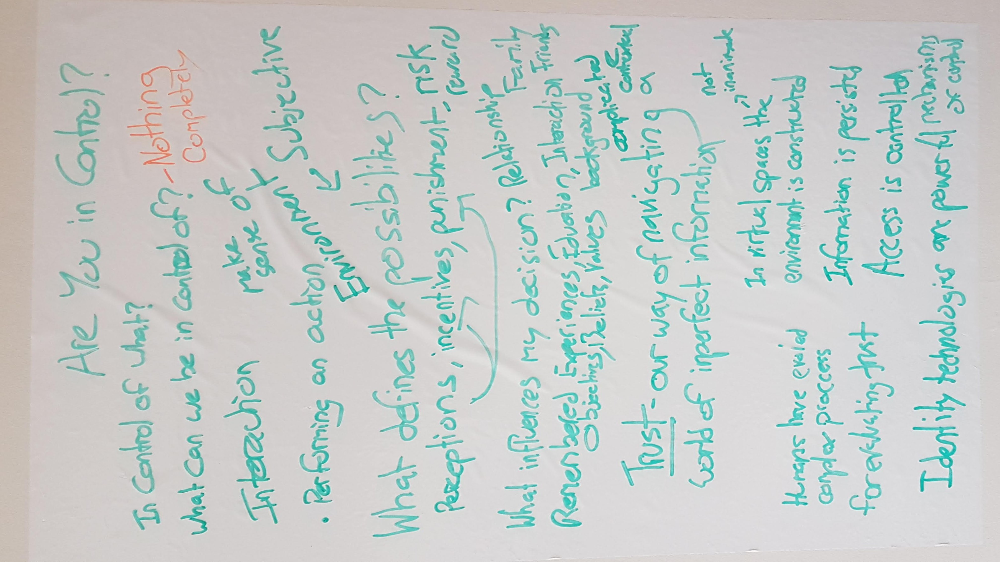

My first attempt at the [Cabaret of Dangerous Ideas](https://ondemand.thestand.co.uk/Video/EGMEGL/the_cabaret_of_dangerous_ideas). Scary...

I was nervous and I know I could have conveyed my thoughts with more clarity and coherence. I virtually missed out my section on trust - our way of navigating the uncertainties of our environment. Still, I am grateful for the opportunity and everyone who helped make it happen. I largely enjoyed myself. And I learnt a lot. I look forward to hopefully attempting a full show next year!

My show, [#AreYouInControl?](https://wip-abramson.dev/in-control), was an attempt to condense and convey a period of reflection into the role and impact identity technology in the complex system that is human society. A web of relationships and influence that limit and expand the possibilities of individuals as they navigate uncertainty and seek to optimise some values perceived to be important in a given context at a given moment in time and space. 

My background is not in social science, I research digital identity, privacy and to lesser extent cryptography. The digital world represents this fascinatingly tangled mesh of human social and economic interaction. It has infinitely expanded the set of possible possibilities. The fact that we could run a virtual show is a testament to the expansion of capabilities to interact. It has also created new risks - privacy, security, surveillance, manipulation. And new constraints on interaction, the set of characters and emojis we can use to communicate with, the mechanisms we use to identify and authenticate others, the set of possible actions a platform supports.

These new environments that we exist within are no longer inanimate, they are designed, developed and populated by human beings. The environment has become a source of data, a digital representation of collective memory. Whether intentionally or not, the constraints, risks and possibilities emergent in these virtual spaces are perceived subjectively by each of us. There can be little doubt that these systems present powerful mechanisms for influence at the individual, group and societal level.

The challenge that we must all grapple with, is power to who? For what purpose? Who decides?

Digital technology is neither good nor bad. It is up to us to decide the values these virtual spaces incentivise, what rules they enforce, who they benefit and how they can be changed.

So are you in control?
 
No, but is control something we should aspire for?. Uncertainty and independent thought is [*the difference that makes a difference*](https://press.uchicago.edu/ucp/books/book/chicago/S/bo3620295.html) in our complex human system. We should embrace it and protect it.

Instead of control, we should strive for influence and agency driven through intention and the freedom from the intrusive influence of others intentionally kept beyond our awareness. I am interested in technology that can foster cooperation, participation and democratic governance among individuals so they can become empowered agents for change in our society.

I am not sure how much of the above I managed to convey. What can I say, I certainly was not in control despite the influence I attempted to exert through practice and preparation.

   My attempt to prepare ...
 

