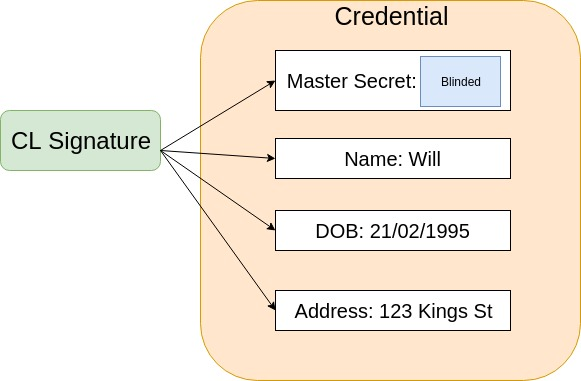
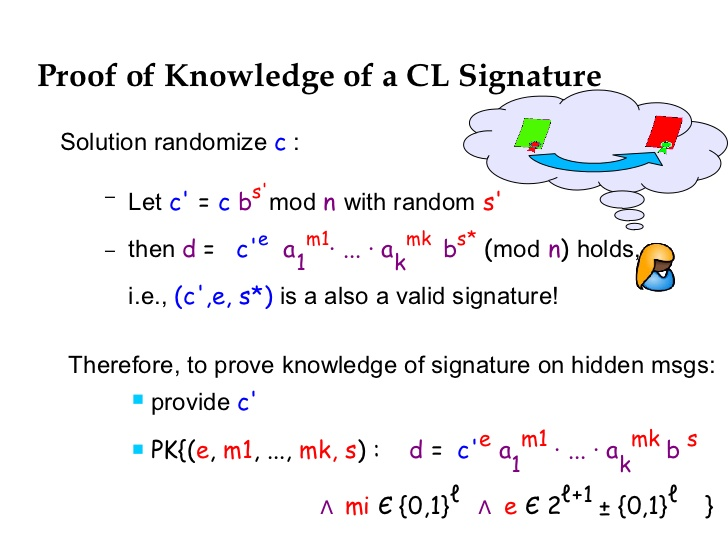

A CL Signature is a signature scheme developed by Jan Camenisch and Anna Lysyanskaya. This scheme has some properties that make it ideal for use in an anonymous credential system and is, in fact, the scheme that Sovrin, and I am sure others, currently use. In this post, I will try to synthesise my current understanding of this scheme, including a look at how Sovrin uses it in practice. 

Note: this is just my current understanding, please correct me if you notice any errors or miscommunicated concepts. For the more adventurous, these are the three papers I recommend reading: [1](https://groups.csail.mit.edu/cis/pubs/lysyanskaya/cl02b.pdf), [2](https://link.springer.com/chapter/10.1007/3-540-44987-6_7#enumeration), [3](http://cs.brown.edu/people/alysyans/papers/cl04.pdf). It is also worth taking a look at the [idemix protocol specification](https://domino.research.ibm.com/library/cyberdig.nsf/papers/EEB54FF3B91C1D648525759B004FBBB1/$File/rz3730_revised.pdf), which was designed by IBM Zurich as a specification for an anonymous credential system.

# The Properties of CL Signatures

CL signatures enable the issuance of a signature on a committed value, a blinded signature. Blinded signatures lots of different uses, most famous probably being in untraceable electronic cash designs first introduced by David Chaum in this [paper](http://sceweb.sce.uhcl.edu/yang/teaching/csci5234WebSecurityFall2011/Chaum-blind-signatures.PDF). The idea is that the receiver of the signature can commit to some secret information that only they know, the issuer then signs this committed value and presents the signature to the receiver.

This is key in issuing an anonymous credential. When creating a signature on an anonymous credential it is required that the recipient of the credential commit some secret information to this credential. The commitment to this secret information is then signed by the issuer and forms part of the credential. It is used by the recipient of the credential to prove that the credential was indeed issued to them and no one else. 

This leads to the second property of CL Signatures. The ability to prove knowledge of a signature on a committed value. To prove the credential I am presenting is indeed mine to present I must prove I have knowledge of the signature on the committed secret information included when the credential was issued. This is an area I could use a little deeper understanding, but it seems logical that one can only produce a ZK proof of knowledge of a signature on a committed value if they indeed have knowledge of the secret value the signature was created on.

The idea behind an anonymous credential system is that an entity interacts with other entities using different unique pseudonyms for each connection (or at least for some connections). However, when a credential is issued it needs to be tied to the entity as a whole rather than to the pseudonym with which the entity is known by the issuing party. CL signatures allow for control of credentials to be tied to a master secret known only by the entity, meaning credentials issued across one connection can be proved across another without loss of privacy through the linkability of pseudonyms. As a credential issuer only ever sees a commitment to the master secret, which can be randomised, they learn no information about the secret. A possible downside to these systems is that if a master secret were to be compromised then all credentials could potentially be stolen. Research is currently exploring making these systems more robust through the social recovery of keys and other mechanisms.

A credential is made up of more than just who is in control of it. A credential like your driving licence has your name, DoB, address etc. To make this signature scheme usable for credentials the scheme needs to enable signing blocks of messages. In an anonymous credential, each message block represents an attribute. Rather than amalgamating these message blocks into a single message using a collision-resistant hash function, CL signatures enable a useful feature - effectively signing each of these message blocks in turn. This means that any subset of these attributes can be presented along with a valid signature, allowing for much more fine-grained, privacy-preserving credential presentations than in the physical world.

Remember one of these attributes must be the blinded secret enabling the receiver of the credential to attest being in control of it. This means that a CL signature on an anonymous credential is most often a partially blinded signature on the blinded secret value and the other unblinded attributes of the credential.

Another property of CL signatures that makes them useful in a credential system is the ability to combine them. An entity can create a single proof containing attributes from multiple credentials. A credential proof is made up of predicates (evaluating to true or false), to combine attributes from multiple credentials the prover must submit proof of the CL signature on each credential. It is often restricted so that multiple credentials resented must have been issued by to the same master secret.

# Zero Knowledge

Zero knowledge is used in the creation of CL signatures. As CL signatures are typically created by two parties, one committing secret information for the other to sign along with some other visible messages. This is certainly the case in anonymous credentials. Zero-knowledge proofs are used to establish trust between the two parties that their secret parts of the signature are done correctly.

The receiver of the signature creates a Zero Knowledge proof of knowledge that they do indeed have knowledge of the secret information they are committing to the signature. In anonymous credentials, they also prove that the master secret they are committing to is the same one used to generate the pseudonym they are known by. They send this to the issuer along with the committed secret information. This is then easily verified by the issuer before they create the signature.

The issuer then creates the signature and builds a proof that the signature was created correctly. The proof and the signature is sent to the receiver who validates the proof against the signature and then can be certain they did indeed receive the correct signature.

# CL Signatures in practice

As part of my exploration of CL signatures, I have been dabbling in the code. It helped me to understand the nuances of the signature. The code I looked at was [this](https://github.com/gijsvl/camenisch-lysyanskaya) Java implementation, which while very useful for understanding the code (my java is decent), it was less useful for understanding CL Signatures in terms of anonymous credentials. 

Looking at this code in combination with the [indy-crypto](https://github.com/hyperledger/indy-crypto) Rust code which is designed specifically for the anonymous credential use case helped me helped me to further clarify my understanding. You want to look in the libindy-crypto/cl/issuer.rs && prover.rs files. Here you can find the code relevant for issuing a credential. For a full example of the workflow to issue a credential look in cl/mod.rs. Here you will find tests such as multiple_predicates() running through the issuing of credentials.

The workflow seems to be:

1. Build the credential schema - the list of attribute names that are included in a credential (Although in Sovrin these schemas may already be defined and stored on the ledger)
2. Add in attributes not defined in the schema - ie the master secret attribute
3. The ISSUER generates a public key from the credential definition along with a ZK proof this key is correct for the given credential schema. (To create a correct public key for CL signatures you must define the size of the message blocks - equivalent to the number of attributes for credentials)
4. PROVER adds their master secret as a hidden attribute to credential
5. ISSUER or PROVER or BOTH add attribute values to the credential. I assume here there is some attribute validation done previously by the ISSUER where they ask for a credential proof of values before issuing a credential.
6. PROVER blinds credential secrets:
    * PROVER first verifies proof of credential public keys correctness
    * For all hidden attributes in the credential the PROVER generates a commitment to that value using the credential public key created by the ISSUER
    * PROVER generates a proof that these commitments were created correctly
7. ISSUER then:
    * Verifies the proof of the blinded secrets
    * Creates a context for the credential
    * Signs the credential
    * Generates a proof that the signature is indeed correct for the given credential
8. PROVER then verifies this signature and accepts the credential if correct

I have skipped over some aspects such as credential revocation, but I think this is a great place to start for anyone looking to understand how CL signatures are used in anonymous credential systems.