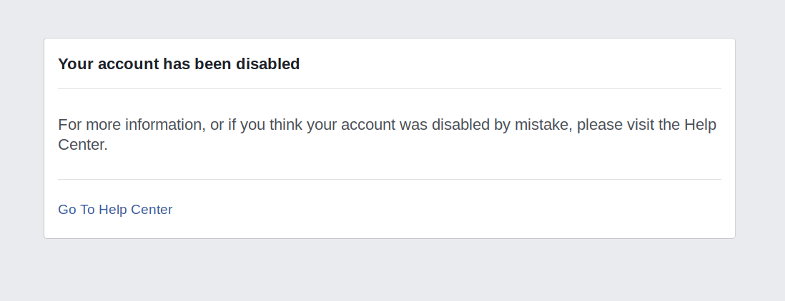

Last month I got erased from Facebook. No warning. No communication. Just one day when I tried to login I was faced with this message:

Leaving me thinking, hmm that's weird, probably just a mistake I don't see why my account would be disabled. I rarely use it, apart from as a messaging tool. I certainly didn't, and still don't, believe I could have done anything to legitimately get my account disabled.

The experience that proceeded this event both frustrated and shocked me. 

First, I naturally got in touch with via the help desk, requesting the reason and expecting it to be sorted relatively painlessly. This was the response I received:

> Hi,
> We've reviewed your account and determined that it hasn't followed the 
> Facebook Terms. This has resulted in the permanent loss of your account.
> One of our main priorities is the comfort and safety of the people who 
> use Facebook, and we don't allow credible threats to harm others, 
> support for violent organizations or exceedingly graphic content on 
> Facebook.
> To learn more about Facebook's policies, please visit Facebook's Community Standards:
> <https://www.facebook.com/communitystandards/?ref=cr>
> Thanks,

Wow.

The permanent loss of my account, for not following the Facebook Terms with a link to their rules. No detail, nothing. How can I even challenge that? Just imagine getting arrested, and sent to jail for breaking *the rules* without being told which rule you had broken.

So I was like okay cool, I should have deleted Facebook anyone they have probably done me a solid. I will just exercise my rights under GDPR and ask them to provide me all my data, including I hoped the actual reason and correspondence that occurred before the decision to delete my account was take - surely there must have been some right?

This was my fairly generic request, to the tricky to locate email address for these type of things - datarequests@support.facebook.com:

> To Whom It May Concern:
>
> I am hereby  requesting access according to Article 15 GDPR. Please confirm whether  or not you are processing personal data (as defined by Article 4(1) and  (2) GDPR) concerning me.
>
> In case you are, I am hereby requesting access to the following information pursuant to Article 15 GDPR:
>
> 1. *all*  personal data concerning me that you have stored; - ESPECIALLY THE  REASON THAT MY FACEBOOK ACCOUNT WAS DISABLED AND ANY COMMUNICATION  RELATED
> 2. the purposes of the processing;
> 3. the categories of personal data concerned;
> 4. the  recipients or categories of recipient to whom the personal data have  been or will be disclosed; -WHO WAS TOLD MY ACCOUNT WAS DISABLED AND WHY
> 5. where  possible, the envisaged period for which the personal data will be  stored, or, if not possible, the criteria used to determine that period;
> 6. where the personal data are not collected from the data subject, any available information as to their source;
> 7. the  existence of automated decision-making, including profiling, referred  to in Article 22(1) and (4) GDPR and, at least in those cases,  meaningful information about the logic involved, as well as the  significance and the envisaged consequences of such processing for me.
>
> If  you are transferring my personal data to a third country or an  international organisation, I request to be informed about the  appropriate safeguards according to Article 46 GDPR concerning the  transfer.
>
> [Please make the personal data concerning me, which I  have provided to you, available to me in a structured, commonly used and  machine-readable format as laid down in Article 20(1) GDPR.]
>
> My  request explicitly includes any other services and companies for which  you are the controller as defined by Article 4(7) GDPR.
>
> As laid  down in Article 12(3) GDPR, you have to provide the requested  information to me without undue delay and in any event within one month  of receipt of the request. According to Article 15(3) GDPR, you have to  answer this request without cost to me.
>
> I am including the following information necessary to identify me:
>
> <My Personal Info>
>
> If you do not answer my request within the stated  period, I am reserving the right to take legal action against you and to  lodge a complaint with the responsible supervisory authority.
>
> Yours sincerely,
> Will Abramson

There response, including a blatant disregard for the new law because **disclosure of the account information may create a security risk for other people on Facebook**:

> Thanks for contacting us. 
> It appears your Facebook account was permanently disabled for violating 
> Facebook's Terms of Service. You can read our Terms of Service at <https://www.facebook.com/terms>
> For security reasons, we're unable to provide more details about your 
> account at this time. Since the account is disabled, you can't access 
> our self-serve tools to download or access information related to this 
> account. 
> In certain limited cases, where an account has been disabled for serious
> violations of our Terms, and where disclosure of account information 
> may create a security risk for other people on Facebook, we reserve the 
> right not to provide users with access to their data.
> If you wish to contact Facebook about your account being disabled, you can learn how in the Help Center: <https://www.facebook.com/help/103873106370583>
> Please note, we will not take any further action on this request and 
> can't provide any assistance with a request to appeal or reinstate the 
> account.
> Thanks,

At this point I am thinking shit, I am pretty certain I have not done anything to warrant this kind of response WTF is going on.

Then there final infuriating email when I tried to challenge this:

> Hi,
> Your account has been permanently disabled for not following the 
> Facebook Community Standards. Unfortunately, we won't be able to 
> reactivate it for any reason.
> This will be our last email regarding your account. For more information
> about our policies, please review the Facebook Community Standards:
> <https://www.facebook.com/communitystandards/>
> Thanks,

I want to draw attention that throughout this they refer to my account as permanently disabled, not actually deleted. As well as the consistency across these emails - were they just automatically generated?

This experience has been enlightening for me for a number of reasons. I have realised how dependent I was on Facebook for connections with my friends, a lot of them the only way I contacted them was through messenger. This has left me quite handicapped when I comes to organising anything, additionally I will miss out on any rare attempts at organising something done by my friends. Unfortunately I grew up in the Facebook generation, it's what we know, it's easy and every ones on it. How could you not be?  In the future I vow to be more resilient at a minimum, no longer reliant on one service that can if they choose to just turn me off.

There is another more important point though, one for profit organisation governed opaquely by a few billionaires has far too much power and influence over our digital lives. It's the reason we need the solutions that decentralised identity and specifically decentralised identifiers enable. I spent 10 years of my life, give or take, on Facebook. Ten years of connections, photos and experiences. But they were never really mine, Facebook used then to hold me hostage, to trap me in a situation where to exit was unconscionable. Now they have set me free and brought to the foreground what I always new in the back on my mind - Facebook should never have become my space on the internet.

The other interesting part of this story comes from my experience challenging the system. As someone who has been a "loyal" user since the age of 14 you would  think that there would be some due process and transparency when it comes to a relatively serious matter of permanently disabling their account. To me, it is not even clear that I received anything other than automated responses. I think there are lessons to be learnt here when it comes to designing these decentralised identity ecosystems: as we digitise and automate our systems we have to make sure there is a clear and fair appeals process that must include human oversight. Additionally, we have to make sure that how these decisions are reached is transparent. In some cases these decisions can mean life or death to people, as this [book](https://www.amazon.co.uk/dp/B07PWVRW11/ref=dp-kindle-redirect?_encoding=UTF8&btkr=1) I recently read on the Indian Identity System Aadhaar highlights.

I think this really boils down to how do we govern digital institutions, particularly ones where the decisions made have an impact on say 1 billion users. Facebook is an opaque organisation - what are the rules, who makes the rules and how are these rules changed? It is a top down organisations where it's users actually have no say in how the system works or how it develops over time. I think we are going to see an evolution in the way digital institutions are designed and governed, which importantly will enable some for of participation of all individuals affected by the decisions taken by that institution. This is a fascinating area of research, that I hope will make organisations like Facebook seem antiquated and obsolete.

Anyway, I'll close with a few questions I wonder about and some for you to wonder about too:

* Could this happen to you? Are you dependent of Facebook or some other tool, such that if it were to be deleted it would cause you a headache? This could have happened to anyone. Prepare for it. Be more resilient. Keep backups.
* How should I take this further? In my view they have blatantly violated GDPR. Not responding within the allotted 30 day period. I think I could go to the information commissioner or something like that. 
* What are good examples today of digital institution design?
* To Facebook:
  * What was the decision process that you took before deciding to disable my account? Importantly, did this just happen by an algorithm?
  * What are the terms that you are claiming I violated? Where is my opportunity to refute these claims?
  * Do you still have my account - permanently disabled suggests not permanently deleted? I imagine so, please give me my information back and erase me from your system!
