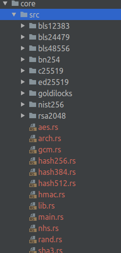
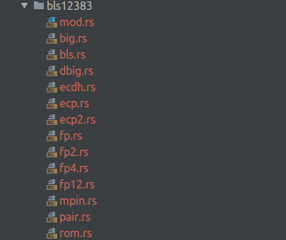

Over the last few weeks I have been getting to grips with the [MIRACL core](https://github.com/miracl/core) cryptography library - which describes itself as:

> MIRACL Core is a multi-lingual and architecturally agnostic Cryptographic library that supports elliptic  curve cryptography, pairing-friendly curve cryptography, RSA, AES symmetric encryption and hash functions. All code is entirely in the supported high-level languages. No assembly language
> and no third party code is required - these libraries are completely self-contained. MIRACL Core was designed from the ground up with side-channel attack resistance in mind. Multiple curves can be supported in a single application.

It is a fantastic library, which opens up a lot of opportunities to implement cryptography without worrying about managing some of the basement level challenges that arise when implementing the cryptographic primitives this library provides. For example, implementing and handling BIG integers. I have been particularly interested in learning how to use the pairing friendly curves contained in this library, as many of the newest cryptographic protocols require this type of curve.

Here is my attempt to synthesise my knowledge, so that you can have an easier on-boarding journey and more people can start harnessing some of the magical capabilities that cryptography research has discovered. Note: I focused on the Rust programming language, so some of this will be specific to that although by in large the API's are consistent across languages so this hopefully will be useful to everyone.

## Installation and Set Up

The first challenge is to actually get the library installed and built on your machine so you can use the library when developing your own protocols. There are some pretty good instructions in the repository for this already, but I will walk through it for completeness.

 First thing to do is clone the core repo, giving you the code for the library implemented in all the different languages supported, each under its own folder.

```
git clone https://github.com/miracl/core.git
```

Then choose your desired language and cd into it's directory within the repository.

```
cd rust
```

Now the next step, was a little strange to me, you build the library by running a python script, either config32.py or config64.py, then selecting the specific curves you wish the library to support. I spoke to Mike Scott about this and he explained this was for consistency and simplicity across the different platforms build processes, which makes sense. 

It is worth reading through the readme in your specific languages folder for any language dependent details.

#### Rust Tip

The readme for the rust section suggests using the libcore.rlib file with the compiler rustc to compile any code files you create. However, it is possible to use the library with cargo for an easier, more typical rust developer experience. Once you have built the library by running the python script, the contents of the rust folder will have changed, specifically all code files will now be under the folder core. This folder is just a rust library and can be included in any project.

First create a new rust project somewhere.

```
cargo new mymiraclproject
```

Then copy the core folder that was just created by the build into your new project.

Finally, update the cargo.toml file in your new project to include the core library as a dependency. Here path must equal the path to the core folder, which if copied into the project should be just under the root.

``` 
[dependencies]
core={path="core", version="0.1.0"}
```

You should now be able to run cargo build on this project and see the dependencies compile, if so you are ready to start developing some crypto.

# Library Structure



The structure of the library is fairly straightforward. Each folder under the src folder represents all the code for that curvev (apart from rsa2048). The rest of the files contain implementations for other useful functions such as encryption (aes.rs), hashing, and a random number generator (rand.rs).

## Random Number Generator (rand.rs)

Whenever developing cryptography, you need a source of randomness that you use to instantiate a random number generator which is then used when creating any random numbers required for the protocol. Cryptography relies heavily on randomness, however when experimenting a simple way to instantiate the random number generator in MIRACL is as follows:

```rust
    let mut raw: [u8; 50] = [0; 50];
    let mut rng = RAND::new();
    rng.clean();
    for i in 0..50 {
        raw[i] = i as u8
    }
    rng.seed(50, &raw);
```

This simply seeds the random number generator, rng, with a byte array of [0, ... , 50]. It should not be used for production.

# Elliptic Curves

This library supports many different elliptic curves, which can be used to implement many different protocols. My focus has been on digital signatures using pairing friendly curves.

## Example Folder Structure 



A curve, like the bls12383 shown above is made of the following files. As a consumer of this library, a lot of the code in these files are abstracted away such that, it is not necessary to fully understand their contents. The important files containing functions that you will use regularly are ecp.rs, ecp2.rs, big.rs, pair.rs (if a pairing curve), and rom.rs.

## Static Curve Constants (rom.rs) 

Each curve has their own set of constants which the library uses for it's calculations. This file might be a bit confusing, but just think it is a set of predefined constant values using byte arrays. There are a lot of constants defined in this file, however there are two that are important to understand and that you will need to use regularly:

* MODULUS - the large prime that all numbers are modulus of, also known as p is some papers.
* CURVE_ORDER - This is the order of the group defined by the elliptic curve bound by the field described by the MODULUS. This is the most commonly used static constant.

Now I got, and still get sometimes, confused by these two numbers. A way I like to think of it is relating it to generators in group theory. For the group defined by an elliptic curve it has an order - the number of unique curve points of CURVE_ORDER. That means that nG for n = 1 up to n = CURVE_ORDER will always produce a point on the elliptic curve. The points - (x,y) values will be constrained by the MODULUS => x or y can never be larger than the MODULUS.

## BIG Numbers (big.rs)

Cryptography works with large numbers, typically 256 bits, whereas our computers default maximum is only 64-bit or 32-bit depending on the operating system. So the ability to manage these numbers needs to be implemented, although some programming languages come with their own implementations. For the interested, this [paper](https://github.com/miracl/core/blob/master/MIRACL_Core.pdf) describes how the MIRACL library handles BIG numbers. 

The great thing about this library is you don't need to handle this complexity, you just need to understand how to use the big number structure defined. Here are a few of the functions I used regularly although I recommend familiarising yourself with the code within big.rs:

* Creating a new BIG from a byte array:

  * ```rust
    let mut q = BIG::new_ints(&rom::CURVE_ORDER);
    ```

  * This creates a new big int which represents the order of the elliptic curve

* Creating random numbers, you will use this alot

  * ``` rust
    pub fn randomnum(q: &BIG, rng: &mut RAND) -> BIG
    ```

  * Here you pass in a random number generator and a modulus which the number cannot be larger than. This is typically the CURVE_ORDER, q.

* Creating a BIG integer representing 1.

  * ```
    let mut one = BIG::new();
    one.one();
    ```

  * Specifically you have to create the integer before you set it to one.

* Convert to string - tostring()

  * Useful for debugging

* Modular Math - typically this will always be modulo q

  * Addition - modadd

  * Multiplication

    * ```rust
      /* return a*b mod m */
      pub fn modmul(a1: &BIG, b1: &BIG, m: &BIG) -> BIG 
      ```

  * Power

    * ```rust
      /* return this^e mod m */
      pub fn powmod(&mut self, e1: &BIG, m: &BIG) -> BIG
      ```

* Reduce modulo n - sometimes there is a need to reduce big integers so they fit back within a certain modulo. Will be needed whenever hashing a string to a BIG.

  * ```rust
    /* reduce self mod n */
    pub fn rmod(&mut self, n: &BIG) 
    ```

## Curve Points (ecp.rs and ecp2.rs)

The ecp.rs file (and ecp2.rs for pairing friendly curves) contains all the functions for creating and manipulating curve points. Note, there is no curve object in the MIRACL library. Also, remember that all curves have a generator which when multiplied by any number less than the CURVE_ORDER creates a valid elliptic curve point.

With that in mind there are a number of functions that you will need to use a lot

* Creating a generator point

  * ECP::generator() in rust, but all libraries should have a generator function
  * This create a generator for the curve that is always the same point on the curve.

* Creating a point on the curve with a known modulus. 

  * Typically used for creating a public and private key pair

  * ```rust
    let g1 = ECP::generator();
    // must be modulus the curve order q
    let x = BIG::randomnum(q, rng);
    // note pair.rs gives a more efficient way to do this
    let X = g1.mul(&x);
    ```

* Creating a random point on the curve with unknown modulus

  * Some protocols need random points on the curve, never knowing the modulus is a safer way to program this

  * ```rust
    let rn=BIG::randomnum(&q, & mut rng2);
    // Hashes the random number to an point on the curve with unknown modulus
    let mut A=ECP::hashit(&rn);
    ```

* Point addition

  * ```rust
    /* self+=Q */
    pub fn add(&mut self, Q: &ECP)
    ```

## Pairing (pair.rs)

All pairing friendly curves have a file containing the pairing operations available. You generally want to be able to compute some variation of the pairing function:
$$
e(g_1^x, g_2^y) \rightarrow e(g_1, g_2)^{xy}
$$
A lot of cryptographic protocols are based on this transformation, taking two points on separate elliptic curves and mapping them to a point on a third curve. This is a good [paper](https://core.ac.uk/download/pdf/81183426.pdf) on pairing for cryptography if you aren't too familiar. This is computed in the library using two functions, first computing the ate pairing then the final exponentiation.

```rust
let mut lhs = pair::ate(&g2, &A);
lhs = pair::fexp(&lhs);
```

Note: Both functions must be used for a correct pairing.

Additionally, as mentioned, this file includes functions for multiplication of elliptic curve points by big numbers which Mike suggested is faster. These are g1mul and g2mul respectively depending on the curve your point is from.

# Hashing

The last thing that I had to learn to implement some of the signature schemes I have been experimenting with was how to hash a message string, the thing being signed, into a big number so that it could be used within the protocol.

The MIRACL library comes with 4 hash implementations: hash256.rs, hash384.rs, hash512.rs and sha3.rs. They all follow the same API to produce hashes of byte arrays, the difference is the output size which is either a 256, 284 or 512 bit number. When choosing the hashing algorithm to use you need to make sure you are producing numbers big enough for the curve you are using. For example the BLS381 curve will throw an error if you use a 256 bit hash.

The API is as follows.

1. First, initialise the hasher.
 ```
let mut hasher = HASH384::new();
```
2. For each message, process it into the hasher in byte form
```
 hasher.process_array(message.as_bytes());
```
3. Return the hashed bytes from the hasher and convert into a BIG integer
```
let mut m = BIG::frombytes(&hasher.hash());
```
4. Finally, remember to reduce the BIG integer modulo the curve order
```
m.rmod(&q);
```

There is also a number of general purpose hashing functions available in hmac.rs which I believe abstract a lot of this away including choosing the appropriate hasher. However, I have not yet got to grips with the code yet.


## Converting Math to Code

To close off I will just give an example of some of the conversions from a mathematical formula into code that you generally come across when reading a cryptography paper.

#### Selecting a generator

$$
\tilde{g} ~{\leftarrow}{\$}~ \mathbb{G_2}
$$

This refers to selecting a generator the the second pairing curve (ECP2). So in miracl core you could represent this as:

```
let g2 = ECP2::generator()
```

#### Selecting random BIG integers

Typically used when selecting a private key
$$
(x, y)~{\leftarrow}{\$}~ \mathbb{Z}_p^2
$$
This means select two big integers $x$ and $y$ randomly from the set $\mathbb{Z}_p$. A couple of confusing points here - the small 2 is because you are selecting 2 elements and the $p$ often used to represent the modulus actually should mean the curve order. Particularly if $x$ and $y$ form a private key.

```
let mut q = BIG::new_ints(&rom::CURVE_ORDER);
let x = BIG::randomnum(&q, rng)
```

Note: I have not initialised rng above which would need to happen at the start of your code.

#### Creating public keys

$$
(\tilde{X}, \tilde{Y}) \leftarrow (\tilde{g}^x, \tilde{g^y})
$$

Here again, perhaps a little confusing because $g^x$ is not possible in elliptic curves and this notation actually represents $x \times g$. Here if available, I would use the functions in pair.rs to calculate these values.

```
let x_tilde = pair::g2mul(&g2, &x)
```

## Summary

I have attempted to give a very basic getting started guide to the MIRACL library and cryptography programming. This is the guide I would have liked when I was beginning to dive into this last year and will work best for those already exploring the field of cryptography.

Cryptography is both challenging and fascinating. I hope this article can help a few more people start experimenting with these cryptographic primitives in a practical way. 
