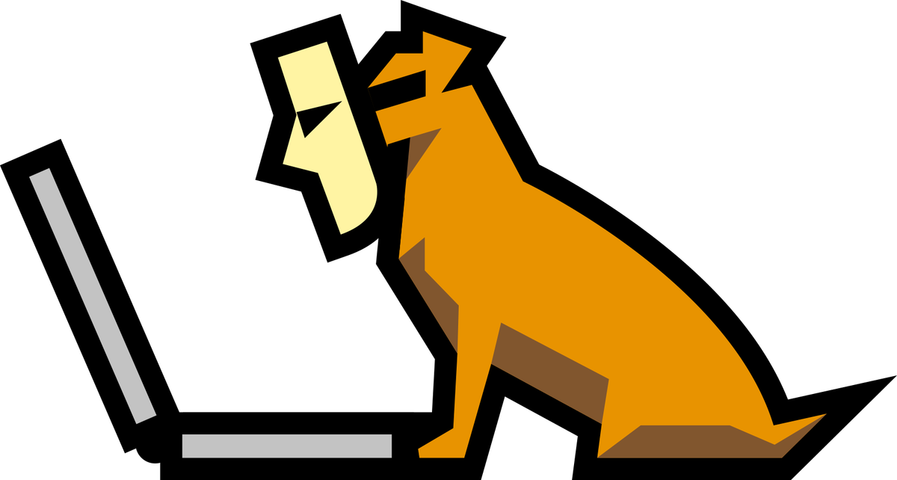
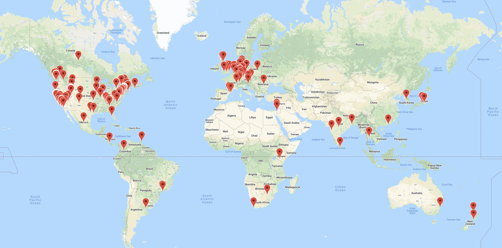
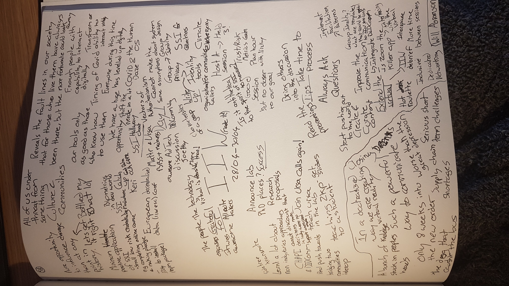

I finally made it to the [Internet Identity Workshop](https://internetidentityworkshop.com/). A three day unconference based on open space technology that has been running twice a year for the last 15 years. It's a bit like a pilgrimage for the identity community. I am going to struggle to do it justice in words. This April IIW went virtual for the first time, and impressively so. It provided a glimpse into the future of virtual collaboration, a future that, due to the current situation, we find ourselves in is fast approaching.

A virtual event is more accessible, more inclusive and hundreds of thousands of air miles better for our planet (I would love to see some stats on this). I anticipate many events will consider staying virtual permanently or becoming semi-virtual and encourage all events to experiment with what virtualisation could mean for them. We have an opportunity to level up as individuals, communities and humanity as a whole - [the Human OS](https://iiw.idcommons.net/COVID_Daze/Days_-_The_HumanOS_%26_new_relationships_w/connected_systems_%26_Services) - in terms of virtual participation, collaboration and value creation. In many ways these skills are the literacy and numeracy of the 21st century.

IIW went down about as smoothly as it could have, certainly smoother than most of us would have anticipated. Especially considering the timescales that the organisers made this pivot. However, we should recognise our privilege, not everyone has either the technology, connectivity or capability to take part. Working to empower others to influence change with and through technology should be high on our list of priorities. 

Look at the map of IIW attendees, people from all over the world logged in and participated. How many of these would have missed out if the event was held in San Francisco? I know I would have.

We are only 8 weeks into a world that is vastly different and changing fast. In many ways this is the warm up round [The future ain't what it used to be](https://iiw.idcommons.net/The_Future_ain%27t_what_it_used_to_be_%E2%80%94_How_to_approach_the_next_few_years_(COVID,_climate,_economic_depression_...)) and while this is certainly daunting.., in many ways the situation we currently find ourselves in could not have occurred at a more opportune moment. A substantial portion of the global population have the digital capabilities sitting within their homes to influence the direction of their lives in ways that would have been inconceivable even 10 years ago. The decisions we collectively take over the next few years could have more impact on the future of humanity than at any other time in history. 

Importantly though, we should be alert to our blind sports, technology is not a panacea for all the worlds problems. There is no technical fix for the human condition. We need to work hard to design diverse, inclusive and equitable solutions. We should [develop successful use cases based on the most marginalised](https://iiw.idcommons.net/Building_Technology_and_Successful_Use_Cases_based_on_the_most_marganilzed_as_the_answer_to_the_problem). We need to be aware of [the ethical implications](https://iiw.idcommons.net/SSI_and_COVID-19_health_status_certificates_-_ethics,_policy_and_next_steps), [the digital harms](https://me2balliance.groups.io/g/main/topic/digital_harms_dictionary_v1_0/69741179?p=,,,20,0,0,0::recentpostdate%2Fsticky,,,20,2,0,69741179), [the vectors of authoritarianism](https://iiw.idcommons.net/Vectors_of_Authoritarianism) and the unintended consequences that might be a result of the digital systems we push out into the world. We need to take ownership of the projects that we contribute to and hold ourselves accountable to our own morals and principles. 

[What will true Self-Sovereignty take?](https://iiw.idcommons.net/True_Self-Sovereignty:_What_Will_It_Take%3F) [What does that mean to us as individuals?](https://iiw.idcommons.net/Condensed/Repeat_Sovereignty_Principles_%2B_Practice_%3D_Opportunity) [And is Self-Sovereign even the right word?](https://iiw.idcommons.net/Must_we_call_it_%22Self-Sovereign_Identity%22%3F_(hopefully_not))

For me, the challenges with Self-Sovereignty are that as homo sapiens we are not. We are dependant on others for pretty much every aspect of our lives. We interconnected and part of a larger whole. We participate in communities, we are part of society and ultimately we are members of the human race. That is empowering and to be embraced. Together we have been able to achieve truly mind boggling feats.

I convened two open discussions on group identity to get a sense from the community about:

* How do we model the identity of groups and our relationships to these  groups and within these groups?
*  How do the tools we are all building help us do this?

The conversations in both session were fascinating, thanks to everyone who took part. You can read the notes [here](https://iiw.idcommons.net/Group_Identity_-_Open_Discussion).

I also held a session with Nicky Hickman on a paper we are working on studying [metrics for SSI](https://iiw.idcommons.net/Trust_/_Risk_Metrics_in_SSI_-_What_can_we_learn_from_technical_trust_in_order_to_inform_human_trust). And I hung out in a garden on the final day to discuss my research lab and the [PhD opportunities we have coming up](https://iiw.idcommons.net/PhD_positions_at_Identity_lab_based_in_Edinburgh_-_Come_ask_me_about_it.).

I really enjoyed the gardens but feel they were underutilised. Shout out to Brent and Nathan in the SSI Hallway chat, I learnt some useful details sitting on the back row with them including that you could be in two zoom rooms at once. 

The breadth and depth of the topics discussed at this workshop was staggering, inevitably leading to there being sessions you wish you attended but couldn't. There were plenty of these for me, like all the [KERI sessions](https://iiw.idcommons.net/%22KERI_(A)_Key_Event_Receipt_Infrastructure._A_ledger_agnostic_framework_for_decentralized_identity._KERI_unifies_many_DID_methods_types.) (must read the [paper](https://github.com/SmithSamuelM/Papers/blob/master/whitepapers/KERI_WP_2.x.web.pdf)), the session on [malware attacks against SSI](https://iiw.idcommons.net/Malware_attacks_against_SSI,_how_SSI_may_be_the_perfect_honeypot_if_you're_not_careful) and the [Glossary Results session](https://iiw.idcommons.net/index.php?title=Glossary_Results_-_Credentials,_Wallets,_Agents_Defined._%2B_Next_Steps&action=edit&redlink=1). I highly recommend exploring any of the [session notes](https://iiw.idcommons.net/IIW_30_Session_Notes) that stand out to you in more detail. My thanks to Lisa and Hannah in the documentation centre and everyone who wrote up session notes.

I was also thoroughly impressed with the technology on display in the [tech sandbox fair](https://iiw.idcommons.net/IIW_30_Identity_Tech_Sandbox_Fair) and [demo hour](https://iiw.idcommons.net/IIW_30_Demo_Hour). A couple of stand outs for me were the Transmute demo showing how to write a DID to the ledger using [element-did.com](https://element-did.com/) and the demo of [Manifold](https://manifold.picolabs.io/) including finding out they wrote their own [aries cloudagent](https://github.com/Picolab/aries-cloudagent-pico) for a [PICO](https://picolabs.atlassian.net/wiki/spaces/docs/pages/1189992/Persistent+Compute+Objects). Very cool.

I wanted to keep this short and sweet and while writing this I realised I could talk technical for a looong time. So instead I hope to publish separate article focused down in the weeds. On [BBS+ signatures](https://iiw.idcommons.net/ZKPs_for_JSON-LD_using_BBS%2B_-_Round_2) (awesome job from Mattr making these more accessible), [Hyperledger Ursa](https://github.com/hyperledger/ursa), [CHAPI/DIDComm](https://iiw.idcommons.net/101_Session:_Verifiable_Credential_Handler_(CHAPI)_and_DIDComm) and [Zero Knowledge math](https://iiw.idcommons.net/Come_teach_a_student_how_ZKP%27s_work_technically._Anybody_else_who_wants_to_know,_please_come,_and_someone_come_teach_us!) to name a few. One of the aspects I enjoyed most about IIW was that for the first time since becoming involved with identity I managed to form a good picture of the JSON-LD approach, tools and technologies for implementing Verifiable Credentials. I want to write up my new perspective on these technologies and highlight why I still believe anonymous credentials are a preferable approach.

I have not attributed any of the content in this article, but it many ways it could be attributed to everyone who participated in IIW XXX. This is simply a reflection of the thoughts and ideas that resonated with me over the course of the workshop. 

Thank you everyone who organised, facilitated, sponsored, attended, participated, took notes and curated notes. Everyone who made my first IIW so memorable. I really appreciate it. I feel recharged and full of ideas and creativity. It was the boost I needed. It was a truly mind blowing three days.

Finally, I just want to add that I am fascinated by the potential to explore and improve on how we virtually connect, collaborate and co-create value. The QuQoChat configuration was impressive, but lets use this as a base to iterate on. I am sure we all have ideas for features we would have liked to see and I know there are plenty of events looking to go virtual to experiment with. If I had to call out one feature in particular, it would be the ability to have serendipitous virtual meetings. Some sort of networking portal that assigns you with someone for a 5 minute conversation before moving on. This could even work for larger group conversations like the virtual celebratory drinks, think tables at a pub. Zoom is great, but it is pretty hard to have flowing and inclusive conversations when there is a large group. 

   Click to see my notes in full.
 

