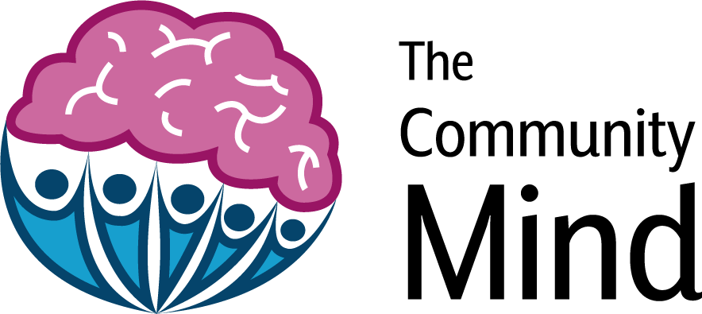

An idea has been maturing in my thoughts for a while now. Or rather I have been thinking about a series of ideas, programming projects I would love to actualise, which I recently realised share a common thread. Memory and how we access it. Probably not surprising for software developers, pretty much any application we can imagine requires some form of data store. Although rarely, in my experience, do we talk about this data in terms of memory.

My more recent work researching identity, privacy and trust in digital interactions has evolved and broadened my perspective on the importance of memory. Our identity, whatever we conceive that to be, must be understood to exist in close relation to memory. Or the mathematician in me wants to say as a function of memory I ~ F(m) [^1]. And as Herbert Simon details in the Science of the Artificial, memory is a key property of any intelligent system [^2].  The ability to take information from the past and apply it when navigating the present moment is a powerful skill in the Homo Sapien toolbox, both as individuals and a species.

These patterns of thought on memory percolating in my mind have further been influenced through my engagement with blockchain/distributed ledger both as a concept and through the practical application of it in application development. I especially find the ideas coming out of the Ethereum community transformative to the possibilities for digital application design. Persistent Compute Objects (PICOs) [^3] are a more recent idea and open source project I have been following that appears to support novel interaction patterns.

It has been an interesting journey to this point, what follows in a sketch of the evolution of my thoughts on memory told through the lens of three ideas and the questions these ideas sparked in me. Then I intend to reflect on where my thoughts are at now, because it is only now reflecting on these ideas that I see the common thread - human memory. 

The ideas that influenced my thinking and help illustrate my thoughts are; Viewing Time, The Community Mind and Nifty Books. Each originates at a different point in my life but all were ideas for programming side projects I could use to cut my teeth on a new technology, language or library. Each idea has a special place in my own memory, and it is from these memories that the thoughts I am sharing emerged.

## Viewing Time

My first idea, back before I knew how to program. The inspirational carrot I used to motivate myself to learn. Not that I ever wrote more than a few lines of code on this. It originates from a time in Maastricht visiting a friend, we were sitting looking at a beautiful view and I thought: 

#### What if we could create a timelapse of a view from a specific location? A View of Time.

I think I tried to get my friend to go back their every day to take a photo to do just this. Not the ideal solution, my thinking has evolved since then. Here are some of the questions I thought about:

* What if we could crowd source the collection of the photos for a view, enabling anyone with a camera to contribute?
  * How would view's of time be discovered, found, contributed to and viewed?
    * How would you prevent "bad" view from being added. Inappropriate, non valued, etc?
      * Who decides what a "bad" view is?
      * Authorisation problem
* Where would views be stored?
  * Who stores them?
  * Who has control over them?
    * Who manages that control?
* Who would host and pay for this application and why?
* How might Viewing Time change our relationship with our environment and help us reflect on the change happening all around us?
  * Chasing Ice, a documentary I watched on another visit to the Netherlands, emphasised how powerful this could be. [Here is an example](https://earthvisioninstitute.org/share-this/columbia-glacier-alaska/).
  * Watching a Chinese cityscape evolve over these last 20 years would have provided another staggering view of time and change.
    * [Here are some examples of this using satellite imagery](https://www.theguardian.com/cities/2017/mar/21/timelapse-satellite-images-china-fastest-growing-cities)
  * How might Viewing Time help communities record and interact with shared memories?
    * I was recently involved with planting a Community Orchard and became aware how valuable creating a view as a shared artifact could be. It might help communities celebrate and appreciate the positive changes they bring about.
* How might date, time or season be used to present different time-lapses of the same view?
* How would we prevent overtourism?
  * I never wanted to turn view's into used and abused tourist spaces, an acknowledged tension.
  * Explicitly want to avoid insta tourism type effects. How? 
    * [This is a funny add from the Kiwi's recently keeping me mindful of this](https://www.youtube.com/watch?v=Trs-isdu4eE)
  * What are the incentives?
    * How do we ensure this is an artifact all can enjoy while minimising the unintended consequences associated with the change in context-relative informational norms?
    * How might this be used to create incentives for positive, respectful tourism?
  * Realised in part this is about how views are discovered.
    * This got me closer to the importance of location.
* What if you could **only** discover view's if you were in it's location?
  * How might this help to prevent bad content?
  * How would you even prove you were in a certain location?
    * Who/what would you prove it to?
* What is the context and associated informational norms with a View?
  * Who defines and evolves these norms?
  * What are the rules?

* How might location be used as a strong authenticator?[^4]

These are all pointers, sketching the outlines of thought that I have been evolving over the 5 or so years since first appeared in my mind. 

It is an idea that I never made any meaningful, tangible progress on. Except for a few positive conversations with friends it has remained wishful thinking. It is in my humble opinion, a beauty of an idea, something that I would love to see happen. I am optimistic, the technology and mental model for application design is shifting in ways that open up an entirely new design space for these kinds of ideas. Something other than the for profit venture capitalist endeavours that have lead to the colonisation and privatisation of much of our virtual spaces. A for-profit venture could never be the best realisation of this idea.

### The Community Mind

This is my baby. My first [side project](https://wip-abramson.dev/sideproject). It is how I learnt React and felt the power of GraphQl. The first website and server I ever deployed - a challenging experience but one I [learnt from](https://www.freecodecamp.org/news/lessons-learned-from-deploying-my-first-full-stack-web-application-34f94ec0a286/).  It is was also my first encounter with authentication and account management, what a nightmare that was.

After completing a year in industry this was the next programming project I worked on. I committed a lot of my time to this work. Including spending a month straight on it while dipping my toes into the digital nomad lifestyle in Chiang Mai, where I was exposed to and became fascinated with blockchain, Bitcoin and all that crazy stuff. An influential period of my life really. 

Anyway, the idea revolves around creating a place for us to organise our questions. A space for questions to be shared and thought about, but not a place to collect answers. In my mind it was explicitly not for answers. Rather it would provide triggers to thought's within individuals as they pondered these questions from the their own unique perspective shaped by their lived experience. I am a strong believe that we all have the ability to imagine creative ideas and possibilities, the hard part of course is actioning those ideas. As in many ways this text demonstrates.

The initial inspiration for this idea came from the book [A More Beautiful Question](https://amorebeautifulquestion.com/). I wanted to try to develop something that would make it easier to ask and discover beautiful questions. A place where these questions could be crowd sourced, recorded and connected.  I wanted to provide an interface for individuals to explore a web of interconnected questions being thought by others. I wanted people to be able to contribute their own questions and thought pathways to this network. Each individual interacting with and contributing to the community mind.

The questions that surfaced when thinking through the design requirements of such a project were something along these lines:

* How will I manage questioners?
  * I was still thinking in a user account paradigm in these days. 
  * Who gets to ask questions?
    * Who gets to see the questions asked?
* How will questioners search and discover the questions they are interested in?
  * What if questions could be linked to other questions?
    * Who can link questions to other questions? Which links do people see and how do they decide?
    * What if these links grew in strength the more they were traversed and endorsed like neural pathways in our own minds?
* How will we prevent duplicate questions?
  * Am I trying to create a single global repository of questions? 
    * Or would it be better to allow each individual to manage their web of questions independently?
      * How might you enable the best of both?
* How will we prevent bad data? Questions that don't align with the ethos of the mind?
  * Whose mind? Who decides?
  * How might questions be optimally curated?
    * What is optimal and who is curating?
* Where would this information be stored? 
* What is the business model for such an application?
  * What are the incentives?

When initially developing this project I had in mind a database for storing questions and their links, which people would interact with. Searching and filtering to discover the questions they were interested in. Contributing their own questions and connections to this storage. All managed by some centralised application, providing a single view and interface for people to interact with. Today, I have a model of individual's being able to maintain their *own* mind, curating the questions and connections that find useful to them. Then providing a mechanism to network and aggregate the minds of others into a larger web of questions for all to explore. Imagine a mind like a GitHub repository, the entity that creates it would be able to manage the rules governing how questions and links are contributed. I even considered private minds as a potential business model. Although my desire was and remains today to develop an open source tool for recording, curating and discovering beautiful questions. I see them as a loose scaffold around thought, hinting at the problem space without prescribing the solution. A common entry point to creativity, that any individual from any background at any moment in time would be able to interact with. Using their own unique perspective to draw new insights and inspire different solutions.

I have a lot of fond memories developing this idea, including a weekend in Porto visiting a friend where I discovered the joy and value of committing thoughts to paper. Creating a physical artifact to interact with. Something that in my view can never fully be replicated in a digital medium, but what if you could have both?

   This book take me back
 

Towards the end of my [active development](https://github.com/wip-abramson/TheCommunityMind) of this idea I attempted to integrate a token, Simple Token, as part of a challenge they held. My idea at the time was to use this as some form of incentive mechanism for the application, although the actual execution was a bit clumsy looking back. You can view my submission [here](https://www.youtube.com/watch?v=kMABXKGoiAk&t=1s). Then there is this old [Github issue](https://github.com/Blockternship/projects/issues/5) from a month long hackathon called Blockternship. 

While development is dormant, I am still very committed to making this a thing. One day!

### Nifty Books

This is another lovely idea, in my book at least. Originating from my desire to learn how to write smart contracts using solidity, the Ethereum programming language. The idea stemmed from thinking through how we might digitally represent books the books we own, creating a distributed library and opening access to a wealth of books. Moving them off our shelves and into peoples hands, helping the wisdom held within them diffuse into more peoples minds and become recorded in their memories. Book's can provide an intoxicating fountain of knowledge or a refreshing escape from reality. I appreciate both aspects equally and would love more to experience their joy. 

For a bit of history of this idea you can see [my proposal](https://github.com/ethberlin-hackathon/ETHBerlin-Teambuilding/issues/23) for the ETH Berlin hackathon around this. I proposed creating an application that allowed anyone to mint an [ERC721 Non-Fungible Token](http://erc721.org/) to represent their physical book. Unfortunately, I ended up forming a different team and haven't made much progress on realising this idea. I remain a sketchy solidity developer at best. That said, progress has been made. The concept is more mature in my mind, and the ethereum development landscape has come a long way since 2018. As my recent experience at the virtual [ETH Denver](https://www.ethdenver.com/) highlighted, while I didn't manage to submit anything or even write much code I did get a sense for how far things have come. The [scaffold-eth](https://github.com/austintgriffith/scaffold-eth) repo seems like a great place to start, if I ever do manage to carve out time to create this.

I am convinced, and regularly reminded, how this idea could unlock so much hidden value. Book's deserve to be read more than once, indeed there is something beautiful about a book having been read by many different people. Throughout the course of my studies in Edinburgh I have developed a fairly extensive personal collection of some truly fascinating books. I would love to have a means to share them with others in the area also interested in this material. And yes I am sure there exist ways for me to do this if I really tried, but I believe giving a book a memory has more implications that simply making it easily shareable.

Here are a few questions that this idea has raised over the years as I wondered about how it might be developed:

* How might we digitally represent a physical book?
  * How would you link the physical book with it's digital representation?
    * Would a QR Code work here?
* How might we represent ownership?
  * What affordances should owners of books have?
  * What affordances should borrower's have?
* How would books within the virtual library be discovered, requested and returned?
  * How might you pay for postage of book between participants?
    * What if the model was to create primarily a local virtual library, but with exchanges between localities when requested?
      * Libraries have existed like this for ages.
* How might the digital representation of a book be used to embed it with a memory?
  * What information would the book want to store in it's memory?
    * How might we represent the list of borrowers without compromising their privacy?
    * What if the book had an interface to the Community Mind allowing readers to ask and share questions that the material provoked in them?
      * How might being in possession of a book, either as a lender or borrower provide a mechanism for access control into other applications? E.g. the Community Mind.
    * What can we learn from the way individuals interact with eBook's today?
  * How might this approach help us appreciate this medium more deeply?
* How might we deter bad actors abusing the virtual library?
  * What is the incentive model?
    * Who decides?
  * What is to stop malicious actors creating virtual book's unattached to physical copies? 
  * What prevents people from stealing book's they have borrowed?
* Who stores the information around virtual books? 
* How are the search and discovery capabilities for these books mediated? 
  * Who is mediating this?
* What can we learn from the way book's are shared and exchanged by travellers?
* What if the things we bought came with a configurable and extendable digital memory?
  * How might this both simplify and expand the field of interaction enabled and perceived by those in proximity to the device?

As usual, a whole load of questions. Always there are questions. I present them here to provoke your own thought and inquiry around these ideas.

## The Common Thread

Now, these ideas are not directly or intentionally linked. They are connected through me, and through my desire to produce ideas for software applications I would be motivated to create. Most developers you meet will have a few of these kicking around if you ask them. Over time all ideas evolve, dots connect and new insight emerges. The three ideas I presented trace the evolution of me, as much as anything else, from a computer science undergraduate to hopefully a final year PhD student. 

It is only recently, from the new perspectives my research has provided me that I can reflect on all these ideas and clearly see a common thread in my thinking. In keeping with the article will summarise in a series of questions:

* How might we use technology to experiment with the ways in which we can attach memory to the artifacts we place meaning in?
  * How might we design this memory to be open and extendable supporting permission-less innovation at the edges?
* How might artifacts use this memory to intelligently interact with it's environment and the people interacting with it?
  * How might such artifacts be designed to respect the privacy of those it interacts with while ensuring they are held accountable within a defined context?
* What if we started to centralise information on artifacts, using our physical interaction with these artifacts to provide an alternative to the search engine for the discovery of information?
  * How might centralising information on the artifact, be that a location, object or thought transform the way  design digital systems and our ability to actively maintain collective memory at all scales of society?
* How might context-relative informational norms for managing this memory be defined, communicated, upheld and evolved?
* How might such artifacts change the way we identify and authenticate digitally?
* How might this change the nature of the virtual spaces we interact in?
  * How might this provide natural limits to the participants within these spaces?
    * How might this create virtual neighbours and encourage trustworthy behaviour and positive relationships?
* What are the descriptive and normative properties for structuring memory?
  * What are the properties of collective memory that we experience in the majority of virtual environments we exist in today and how do they differ from the ways we have managed memory in the physical reality across time and context?

It is an exploration of the structure of memory, how we might augment this structure with intention using digital technology and the implications of this on meaning making within both individuals and groups. To date this exploration has predominantly involved a few powerful entities constructing, owning and manipulating the digital structures of memory to meet their own agenda's [^5]. 

It is also interesting to me that while working on this idea I created artifacts, both physical and digital, they hold meaning to me but are no longer only accessible too me. By committing thoughts to paper, code or words, they become remembered at least partially in a different kind of memory. Indeed this text itself is one of these artifacts.

I could go on, but it's long already and I wrote this for fun more than anything. A break from the rigidity of academic writing that can be suffocating at times. A more detailed, formal analysis of these ideas is for another time. 

Thanks for making it this far. These thoughts are pretty fresh, I would love to know what they triggered in you. 

[^1]: This is something my thoughts wander across on occasion. I am always drawn the ideas in quantum field theory where particles exist in a field of potential, it is only upon measurement that the field collapses. Feels like there is something interesting in having a similar mental model for identity.
[^2]: The Sciences of the Artificial, Third Edition. Herbert A Simon. 1969. This is a pretty dense book, but worth a read. Chapters on the Psychology of Thinking and Learning and Remembering are relevant to this post.
[^3]: Persistent Compute Objects, a fascinating but little known project originating from Phil Windely some time ago I believe. It is currently being actively developed at Brigham Young university. Some good links: https://picolabs.atlassian.net/wiki/spaces/docs/pages/1189992/Persistent+Compute+Objects, https://www.windley.com/tags/picos.shtml

[^4]: One idea that stuck with me from this is location based authentication. This is one of the reasons I was so interested by the [FOAM project](https://foam.space/location), although it seems a long way from reaching it's potential at the moment. Alternative, censorship resistant location services feels like something that would unlock a lot of value.
[^5]: I am reminded of a recent podcast episode I listened to involving Kate Raworth the creator of [Donut Economics](https://doughnuteconomics.org/about-doughnut-economics) and the [Centre for Humane Technology](https://www.humanetech.com/) responsible for the Social Dilema. [Here is a noteworthy and relevant clip (sorry it's on facebook)](https://fb.watch/451uHfBt0s/), although I highly recommend listening to the [entire episode](https://www.humanetech.com/podcast/29-a-renegade-solution-to-extractive-economics)
