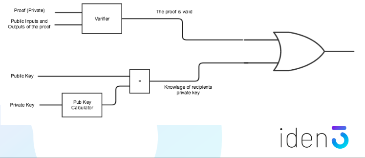
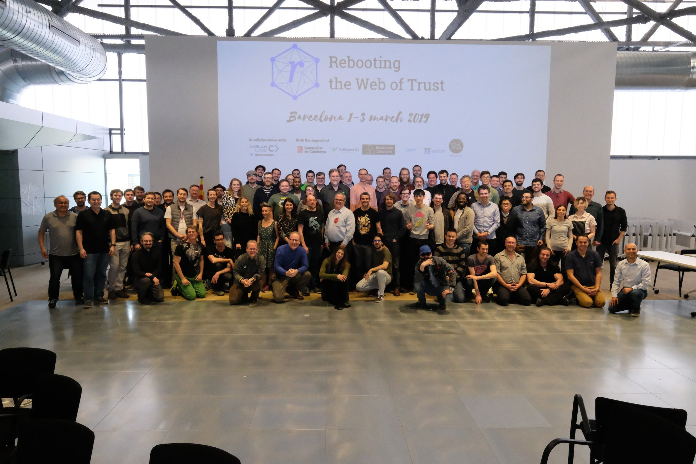

Rebooting the Web of Trust was a melting pot of ideas where experts from across the identity community come together to develop whitepapers and code addressing some of the most pressing issues in the space.

Probably the best community, conference, workshop experience I have had to date. The enthusiasm and belief in the technology and more importantly the ideologies driving this technology were clear to see. 

The event was a three-day unconference style workshop, with an emphasis on collaboration, participation and productivity. The goal is to uncover the ideas and concerns that are currently bubbling up within the ecosystem. Rebooting acts as the filter, or the rake in the zen garden as I had it described to me, but it is the participants who do the work.

It was an exhausting but exceptionally rewarding few days.

# Satyrn

I decided to spend my time at RWoT working with code rather than words.  The goal of our project was to create a markdown editor that can recognise JavaScript blocks and render them as an inline code editor. 

We wanted to create a tool for writing and presenting node library tutorials, which we hope to use to develop tutorials for the identity space.  One of the first tutorials we are going to try to create is writing a BTCR resolver. We made a lot of progress and nearly have an MVP. Check out our draft submission from the workshop [here](https://github.com/WebOfTrustInfo/rwot8-barcelona/blob/master/draft-documents/satyrn.md).

I worked with an amazing team on this project Joe, Ganesh and Eric. Super interesting, super smart guys. We would love to see this open source tool be picked up by the wider node community, who knows where it could go. 

Perhaps I should have worked on a white paper rather than code, however, I was inspired by Eric's topic [paper](https://github.com/WebOfTrustInfo/rwot8-barcelona/blob/master/topics-and-advance-readings/notebook-workbench.md) on this idea of creating a [jupyter style](https://jupyter.org/) notebook environment for interacting with identity networks. A tool like this would enable experimentation and education without the steep learning curve and hassle of deploying your own test networks. It could enable interoperability, use case and UI/UX testing in a few clicks. It is a tool I would love to use myself, so I decided to go out and build it.

You can help too, find the project on github [here](https://github.com/WebOfTrustInfo/satyrn).

Let's see where it goes.

# Interesting Discussion and Outputs 

## Social key Recovery

Social Key Recovery, in particular, was a discussion that intrigued me. A cryptographer's discussion. They looked at ways to improve the key management problem by; imporving Shamir Secret Sharing, considering the social implication of different solutions, asking whether recovery of keys made sense and making it user-friendly were all discussed. I read all the topic papers check them out [here](https://github.com/WebOfTrustInfo/rwot8-barcelona/blob/master/topics-and-advance-readings/social-key-recovery.md), [here](https://github.com/WebOfTrustInfo/rwot8-barcelona/blob/master/topics-and-advance-readings/security_shamirs.md), [here](https://github.com/WebOfTrustInfo/rwot8-barcelona/blob/master/topics-and-advance-readings/implementing-threshold-schemes.md) and [here](https://github.com/satoshilabs/slips/blob/master/slip-0039.md). The paper on [trust circles](https://github.com/WebOfTrustInfo/rwot8-barcelona/blob/master/topics-and-advance-readings/social-key-recovery.md) really got me thinking. How can we design Shamir secret sharing so that not all shares are equal? In real life my three work colleagues are not as trusted as family members or close friends, we need secret sharing schemes that can reflect this.

Then there was also a fantastically smooth user experience demo on N of M secret sharing on an iPhone wallet by Wolf McNalley. The application was written in swift, using bindings to [this](https://github.com/dsprenkels/sss) Shamir Secret Sharing library written in C. Very cool.

<blockquote class="twitter-tweet center" data-lang="en">
At <a href="https://twitter.com/hashtag/RWOT8?src=hash&amp;ref_src=twsrc%5Etfw">#RWOT8</a>, <a href="https://twitter.com/WolfMcnally?ref_src=twsrc%5Etfw">@WolfMcnally</a> live demos the slickest split key offline backup of a <a href="https://twitter.com/hashtag/digital?src=hash&amp;ref_src=twsrc%5Etfw">#digital</a> <a href="https://twitter.com/hashtag/wallet?src=hash&amp;ref_src=twsrc%5Etfw">#wallet</a>.  I have ever seen. Great UI with top-notch help text. He developed it for <a href="https://twitter.com/BlockchainComns?ref_src=twsrc%5Etfw">@BlockchainComns</a> and it will be all open source available in their github. Huzzah! <a href="https://t.co/h86ufxBIdy">pic.twitter.com/h86ufxBIdy</a>
&mdash; Drummond Reed (@drummondreed) <a href="https://twitter.com/drummondreed/status/1101823957257412613?ref_src=twsrc%5Etfw">March 2, 2019</a></blockquote>

## Legal Frameworks 

To sit in on these discussions was awesome for me. I realise that as a technologist I am only too happy to focus on the code. The how of identity. However, because of the importance of what we are trying to build here, we have to look beyond the technology. 

Code is the how, but really we need the why and the what first. And those answers come from understanding humanity, society, law and ethics. When we are self-sovereign identities what [jurisdiction](https://medium.com/cryptolawreview/crypto-jurisdiction-e67596cc1935) will we answer to, what laws will we follow and what are the implications of the technology we are creating.

One of the big takeaways for me this last week was that while this technology is trying to innovate in many important ways, we have to align ourselves with the laws and social constructs that have governed us for generations. This technology should support and improve on these laws, but not replace. We have built up vast experience in settling disputes based on evidence, it is called the legal system. Our goal should not be to replace this with code and cryptography but to use code and cryptography to make these systems work better.

I felt glad that these conversations about the laws and frameworks that will govern these new technologies are at the forefront of the conversation. As software developers we have to be held responsible for the technologies we bring to the world, I am committed to understanding the human impacts of this technology as part of that responsibility.

## Reputation

Reputation systems are a topic that regularly appears at rebooting. It is a challenging topic that is still to be resolved. I was recommended this overview paper from from RWoT 4 in Paris [Reputation Design](https://github.com/WebOfTrustInfo/rwot4-paris/blob/master/final-documents/reputation-design.pdf) to help explain why. This paper and the discussions around reputation were directly relevant to the work supporting my PhD.

There were some interesting demos in the area and the consensus certainly seemed to be that reputation is contextual. You cannot simplify an individual's digital existence down to a mere number. To do so would be a gross simplification that invites abuse. However, we still need to be able to make decisions about whether to trust identifiers and the attributes correlated to these identifiers. This assessment of trust or reputation takes place at the edges, depending on the need of the verifier at that particular moment and based on prior verifier knowledge and the information a holder of credentials has presented. Here perhaps a number would be calculated, but it would be contextual and ephemeral rather than permanant and ubiqutous.

## Zero Knowlege

I attended a workshop on Zero Knowledge by [Jordi Baylina](https://github.com/jbaylina) of [Iden3](https://iden3.io/). Creator of some cool developer libraries for writing circuits for zero-knowledge proofs using JavaScript. We learnt about how circuits worked in terms of a voting application and the importance of a nullifier.

In terms of my research, I am interested in this work because you could use a Merkle tree of trusted issuers so as part of a credential presentation the holder could create a proof that their credential was issued by a trusted entity. This trusted entity could be the governing body of the Governance Framework. Thus shrinking the web of trust. Something to explore.

 It is also very related to the work currently going on to upgrade to Anon Creds 2.0 in Hyperledger Indy who plan to use sparse Merkle trees for revocation registries rather than cryptographic accumulators. This workshop gave me a much better understanding of how these work.

There was also a slightly mind-bending use case for creating zero-knowledge proofs that can only be verified by the person the proof was sent to. This is done by ORing the proof with the fact that you know the person you are sending the proof to's private key. A clever trick that means while the verifier can check because they know you don't know their private key (at least they hope you don't), when they go on to show that proof to others they know that of course, you know your private key. So they don't believe you.

For a better explanation check out Jordi's topic [paper](https://github.com/WebOfTrustInfo/rwot8-barcelona/blob/master/topics-and-advance-readings/Zero-knowledge-Proofs.md).

## The DID Discussion

A number of attendees spent the conference refining the decentralised identifier specification which is a crucial piece of the SSI technology and is due to become a W3C working group over the next 6 months. This would be huge. 

<blockquote class="twitter-tweet" data-lang="en">
Start of second day of <a href="https://twitter.com/hashtag/RWOT8?src=hash&amp;ref_src=twsrc%5Etfw">#RWOT8</a>,. One of the biggest takeaways so far is that DIDs (<a href="https://twitter.com/hashtag/DecentralizedIdentifiers?src=hash&amp;ref_src=twsrc%5Etfw">#DecentralizedIdentifiers</a>) really are “the IP addresses of the <a href="https://twitter.com/hashtag/identity?src=hash&amp;ref_src=twsrc%5Etfw">#identity</a> layer” and thus it is critically important that we get them right. Nice to have a dedicated DID team here at RWOT. <a href="https://t.co/m5dmMRUsSb">pic.twitter.com/m5dmMRUsSb</a>
&mdash; Drummond Reed (@drummondreed) <a href="https://twitter.com/drummondreed/status/1101774408052559872?ref_src=twsrc%5Etfw">March 2, 2019</a></blockquote>

Note from Dan Burnett chair of the Verifiable Claims Working Group: DIDs are decentralised identifiers. NOT IDENTITIES.

# Academic Output

I was surprised and privileged to get funding from my university to attend this Rebooting. To an academic institution, they see an unconference event/workshop that has no paper submissions and publishes no peer-reviewed papers as a hard to justify cost. My justification was that Edinburgh Napier has just opened up a Blockchain Identity Lab, which it claims to be the first in the world. If we are really going to research at the cutting edge of this field then attending events like this is going to be crucial.

This space is moving at a lightning fast pace, these venues are where we can learn from the makers, builders and doers. I want my work to be directly relevant to this space, these communities help me identify where the real issues are. What are the sticky problems that require the academic rigour of research to solve?

The Blockpass Identity Lab aims to be a world leading research lab and I think we have every chance to be exactly that. However, we are a brand new lab. We have a lot to learn
 These events give us the opportunity to learn from the leaders of the identity space, not just learning from someone as they give a presentation but learning from them over dinner as they sit across from you. That is different. The academic value to be gained, while seemingly intangible is, I believe, massive.

I had some key queries answered for me. And formed connections with many of the attendees, all who have a different perspective but a similar goal. These connections are going to be the foundation from which I hope to build useful research. I have already arranged to review a number of cryptographic papers I shared at the conference. I also made contacts in the more squishy, human side of identity. An area I need to work hard to understand.

Also who says no output. This workshops goal was output. 25 draft documents were submitted by the end of the weekend. You can read them all [here](https://github.com/WebOfTrustInfo/rwot8-barcelona/tree/master/draft-documents). While not peer-reviewed, these papers are developed collaboratively from people at the forefront of this technological revolution. We would do well to take notice.

# The Community

This was no ordinary conference. Almost everyone was on the same page. Everyone was chasing similar goals and the passion really shone through. I was in Barcelona for 7 days and 7 nights and spent the vast majority of that time with members of the rebooting community. 

Every night there would be a group meal, whitespace to continue the discussion. Learn what each of us was working on and inspire fresh ideas for the following day. 

While the community was diverse for a technical workshop, more can no doubt be done to make this event and others more accessible. Identity affects us all, so it should be developed by us all. This cannot be another technology that is predominantly developed and pushed into the world by white, male technologists. The stakes are too high.

We need to make the material we produce more searchable and accessible to others. Particularly for newcomers. As one attendee highlighted "a pull request is simply a suggestion" but for the non-technical this is not obvious. It is a barrier to entry. One we need to work hard to lower. I am committed to trying to bring a wider range of backgrounds and perspectives into the identity space.

# Verifiable Claims Working Group

After Rebooting finished I attended a two day Verifiable Claims working group as an observer, thanks Dan for inviting me. It was eye-opening. Not so much in what I learnt in terms of new information but more in the process of how standards are developed. I have a great appreciation for these people that work tirelessly to develop standards without recognition.

HTML is a standard. I never even considered the people that spent time debating over the finer details of this specification so that everyone can develop websites and have them work across platforms using one set of tools. I barely gave HTML a thought, it just is.

The people working in standards have often been doing it for years across many working groups. The impact they have on developers lives is immense. I was quoted every member in a standards working group individually impacts something like 180 million developers. Huge respect for these people.

Standards in identity are something that we need in order to have interoperability across networks such that I can have a credential on Sovrin and still easily have this verified by someone using Veres One of any other identity network of the future. Something that did come to the surface at rebooting was that interop is still an untested dream, we need to work hard to prove interop works over the next year.

Staying two extra days also had the benefit of allowing me to continue to discuss and connect with members of the community. By the end of the week I had had a conversation with the majority of attendees, many of these I feel I could turn to for advice, feedback and help when working on my PhD.

# Thank You

Thank you, Edinburgh Napier, for funding this workshop for me. Thank you to Christopher Allen, Joe Andrieu and everyone else who helped make this happen. The sponsors in particular [Caelum Labs](https://caelumlabs.com/) who were fantastic. The steering committee. And all the participants. It was special. I hope to be back among this community soon.

