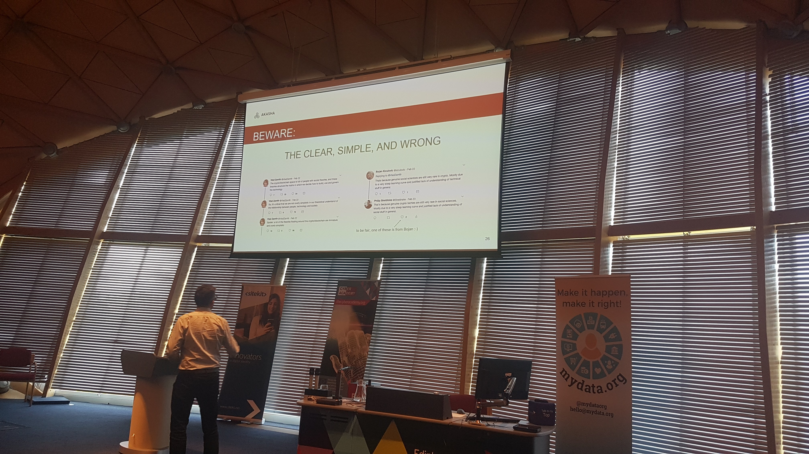

Our lab's recent [conference](https://www.miracl.com/) was the culmination of its first year in existence. A celebration of what we have learnt and a recognition of the challenges we still have to overcome. It was not perfect, there were some technical issues and timing was less than ideal. However, I am proud of what has been achieved both as a lab and as part of my personal knowledge-seeking journey. A year is not a long time. Above all I am glad I chose to quit my job last summer to take a step into the unknown, it was the right decision. The future looks bright.

My personal highlight was the [presentation](https://www.youtube.com/watch?v=2j7b67FHnJU) from Mike Scott, a cryptographer used to working at the basement level of our technology stack. He and the team at [MIRACL](https://www.miracl.com/) are now struggling to move up the stack, to package up and make available all the fancy new tools cryptography have built on top of the foundations of public-key cryptography. As a budding cryptographer myself, I know the potential of these tools is nothing short of magic. The challenge, one Mike and the team are working to solve, is helping people understand what is possible and providing the tools for them to deploy these solutions easily and safely.  Their core [open-source library](https://github.com/miracl/core) of cryptographic primitives is a great starting point. I look forward to collaborating with this team in the future.

The MIRACL project speaks to a conversation I had with Andrew Trask, the founder of [Open Mined](https://www.openmined.org/), an open-source project working to create a set of tools to make privacy-preserving machine learning easy and free for all to use. Trask gave me some invaluable advice, he told me to focus on building bridges between the real world and the academic solutions that already exist. Most importantly he said, "make it easy, open-source and free". I think that is good advice for anybody out their today. We need more bridge builders. I thank him for this advice and his fascinating presentation - one of the best of the day.

Another success from the day was the identity panel, organised last minute during the evening meetup. I thank Michael and [MBN Solutions](https://www.mbnsolutions.com/) for being so accommodating and apologise to anyone who came expecting something different. It seemed a shame to waste the opportunity to involve members of the identity community who are not usually around. I was delighted by the conversation and audience participation that the panel initiated. I want to nurture more of these kinds of conversations here in Edinburgh. This technology will affect us all, we should aim to listen and understand everyone's views and concerns. I know I can and did learn a lot. Please get in touch if you are interested in continuing this kind of informal discussion, it is something I would be keen to initiate and support. We could call it "Conversations on Identity" or something along those lines ...

An interesting point to come out of the panel, best summed up by a lady from the audience, was that two different problems were being discussed throughout the day. One about creating a system to solve a small, specific problem to meet a market need - the work of [truu.id](https://truu.id) in doctor credentialing being exemplary here. As Manny the CEO highlighted in his talk, this has the potential to save doctors time which can then be spent treating patients, as well as saving the NHS money and reducing fraud. The other problem, highlighted by Phillip Sheldrake in his talk on [beyond self-sovereignty](https://www.youtube.com/watch?v=0ETG_gDudwY), is that when we extrapolate these small systems out to human society do we understand the implications? What happens if by reducing the friction to ask for credentials, we create a world where we need to show our credentials for every interaction? What will we lose if we choose to digitize identity by focusing solely on the bureaucratic representation of identity? We need more people asking and thinking about these kinds of questions.

These are two separate but interlinked concerns. Society has a need to authenticate people based on their credentials to enable different levels of permission in certain contexts. The current approach, through paper credentials and usernames and passwords, is insecure and causes headaches for all involved in the process. We can and must do better. It is possible that through the development of new digital tools for relationship and information management we can unlock a higher level of human collaboration and collective intelligence - very much what the [AKASHA Foundation](https://akasha.org/) is striving for. However, we should proceed with caution to avoid unintended consequences emerging in the systems we create that could compromise individual privacy and freedom.

I do disagree on with Phillip is his strong words against [MyData](https://mydata.org/), while I can see and understand his viewpoint. MyData, as a name perhaps has certain connotations that we would rather avoid, and the conceptualisation through its logo simplistic. However, the MyData community is the one place, that I know of, that brings together an appropriately diverse blend of disciplines to tackle such complex problems - something that I pledge to work hard to improve on for our conference next year. I hope he or someone from the AKASHA foundation will be present at the [MyData 2019 conference](https://mydata2019.org/) to surface these concerns. You should all attend if you can! 

I close this post with a call to action. To all who attended and all who are interested in identity and the surrounding technologies. It is our privilege to be involved with, what in my opinion is, one of the most complex challenges of our generation, but with that comes huge responsibility. We must respect that and own it. The conference was full of people and organisations with good intentions, trying to develop technical solutions that empower individuals. I think it is important for us all to step back from time to time and ask ourselves whether what we are building today will be resilient in a future we cannot predict? What worst-case scenarios might we be enabling? I do not want to look back on what I helped to create with shame and regret about what might have been. I know you don't either. Remember good intentions alone are not enough.
>"The road to hell is paved with good intentions" - Phillip Sheldrake.

We are just starting to understand the emergent consequences of the systems pioneered through Google and Facebook now known as [surveillance capitalism](https://www.theguardian.com/books/2019/feb/02/age-of-surveillance-capitalism-shoshana-zuboff-review). It is a monster that nobody intended, but now we are left scrambling to control. As Andy Tobin said in his [excellent presentation](https://www.youtube.com/watch?v=JcVSdEUZni4), the BIL in collaboration with Evernym and I hope some others are looking to develop a credential ecosystem here in [Scotland](https://digitalscot.net/ssi-digital-ecosystem/) similar to the [Alberta Credential Ecosystem](https://www.aceprogram.ca/). If you are interested I invite you to join us. Let's make sure we as a community learn from the mistakes of the past and get this right. 

Thanks to all who presented, helped out and attended the conference this year. I hope to collaborate with many of you in the future. Let's work together to make Scotland a centre of innovation and thought leadership on Identity. If you have ideas, I would love to hear them. We can only solve this together. [Get in touch!](mailto:will.abramson@napier.ac.uk).
