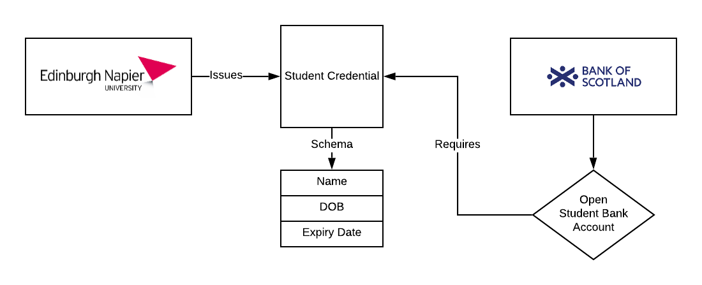
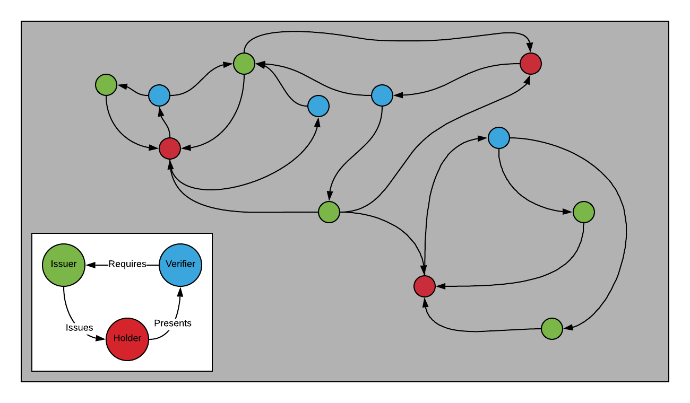

This is a brief summary of my current research focus and objectives for the rest of my PhD - I have two years. I write this in preparation for the MyData 2019 conference and would welcome feedback, comments and questions. If you are at the conference and find what I am proposing interesting, concerning or if you just want to find out more don't hesitate to get in touch - you can find me on the Brella networking app. I am still in the process of finalising my research direction, help me refine my objectives for the next two years so that my time and effort provides the most value to the identity community.

My tentative research objective is to develop a framework for analysing and evaluating identity ecosystems based on the digital footprint that they create. I hope to suggest a formal process for understanding the different entities within an identity ecosystem and how well they are working together.

By an identity ecosystem, I refer to decentralised identifier (DID) based identity systems that have a set of issuers, verifiers and holders who follow a set of rules to issue, obtain, present and verify credentials in order to meet certain authentication needs of that ecosystem. A simple example might be a typical proof of concept project, e.g. opening a student bank account where by a university issues student credentials to it's student and a certain bank agrees to verify these credentials in order to meet their need to verifying students are students before allowing them to open a student bank account. An example of a more complex ecosystem is currently being developed by [truu.id](https://truu.id), who are working with the NHS to develop healthcare ecosystem in the UK. These ecosystems are generally defined by a governance framework or similar. This is a public document which I believe will be mine-able for data, such as the set of trusted issuers, the number of credential definitions within the ecosystem, etc.

I am currently at the stage of defining what **might** be measurable in an identity ecosystem and would welcome any thoughts on this matter. My current thinking is that you can measure aspects on an ecosystem from a number of different perspectives: 

* The ecosystem as a whole - this could include the number of issuers, the number of credential definitions, the designed credential flows of the ecosystem (e.g. I receive credential x, then present it to organisation y in order to receive benefit z), the number of unique credential holders, the countries that this ecosystem has a legal basis in, information about substrate the ecosystem uses to register issuer DIDs - the current rubric under development at the W3C is a great resource here. These are some of the more obvious things to measure and by measuring it may be possible to infer things such as the most valuable credential to control in the ecosystem, the spread of issuers per credential - is there centralisation? Rate of change would also be interesting to measure as an ecosystem expands.
* This ecosystem when contrasted with other ecosystems - which other ecosystems does this ecosystem trust? which ecosystems trust this one? Is there a hierarchy of governance frameworks? How many issuers are issuers in other ecosystems?
* Issuer centric - this might include time issuer has been a member of the ecosystem, credential definitions they are trusted to issue, number of credentials issued. 
* Holder centric - number of interactions using ecosystem credentials, most used credential, number of ecosystem relevant DID connections. As well as more qualatative research which could follow a [Technology Acceptance Model](<https://scholar.google.com/scholar?q=technology+acceptance+model&hl=en&as_sdt=0&as_vis=1&oi=scholart>) type approach, looking at perceived usefulness, perceived security etc.

I recognise measuring what is essentially the meta-data of identity ecosystems may seem antithetical to the core privacy reasons for establishing decentralised identity solutions. However, I am not claiming that all of these things should be measured but I initially want to understand what it might be possible to measure. Analysis of this could provide useful insight into what we should always keep private. Furthermore, applying privacy-preserving machine learning techniques pioneered by the [Open Mined](https://openmined.org) community to extract key insights from entities while retaining their privacy would be interesting to explore. This is also the focus of Adam's research, another PhD student in the BIL. 

It is my belief that while identity ecosystems exist for different purposes, the core components will remain the same. I want to understand what is knowable about these ecosystems and their components.  Then more importantly I want to begin to attach meaning to this knowledge. By creating ecosystems that explicitly define what they intend to measure could create a resource for open innovation. Such a resource is surely a prerequisite for any analysis of the trustworthiness of identity ecosystems. I hope that through data we can turn identity ecosystems into scientific experiments that we constantly learn from and improve on whilst simultaneously enabling us to be specific about the features we want to avoid in these systems.

I don't claim to have all the answers, or indeed any of the answers just yet. This is just my current thinking behind what to focus my PhD thesis on. What do you think? Could this be valuable? What would you measure? What properties would you look to evaluate? Any and all feedback welcome. I would also be happy to share the full proposal document that I submitted to my research panel complete with 30 pages of literature review to anyone interested - it is WIP and quite a beast though just to warn you.

