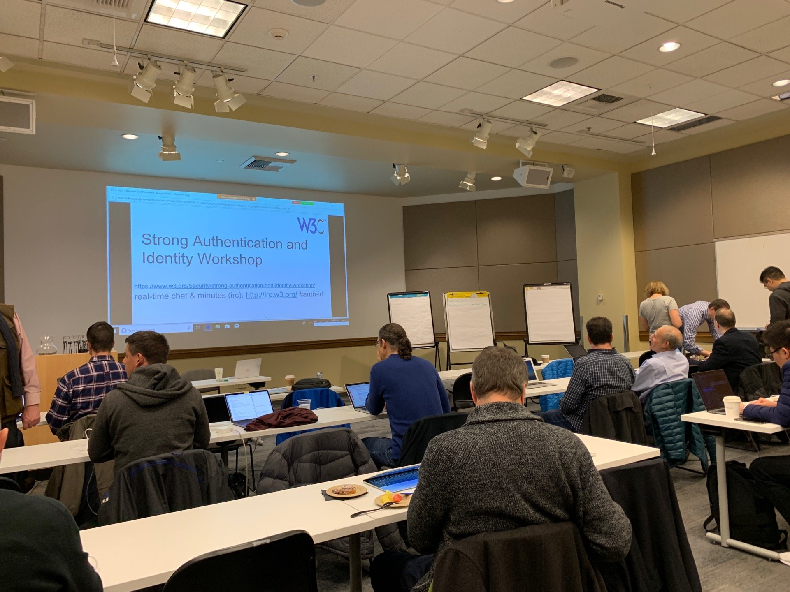

My first experience of the standards world at the [W3C](https://www.w3.org/). It was not what I expected, but a worthwhile experience that I have a lot to learn from. Developing standards is clearly a tough business. The challenge is to develop a small, inter-operable specification that all stakeholders agree upon while making sure to avoid scope creep and most importantly ensuring the standard you are creating will actually be useful. 

Standards workshops, in my opinion, are not places to share cutting-edge ideas or outline a new vision. They are places to analyse and explain current well-understood concepts, raise concerns and ultimately decide if work should go ahead to standardise these concepts across the industry. 

Standards are developed by working groups at the W3C. These working groups eventually come to a consensus on a well-defined specification of the standard. To form a working group, you have to meet certain requirements. These include; sufficient prior work has been undertaken by a community group, the willingness of participants to be involved, the need for standardisation and a lack of reasonable objections to the group.

Forming a working group is hard. A big part of this workshop involved what felt like a battle to form a Decentralised Identifier (DID) working group. Even though from my point of view the DID work has been well developed by the [Credentials Community Group](https://w3c-ccg.github.io/) (CCG). They have a [specification](https://w3c-ccg.github.io/did-spec/#bib-ld-signatures), they have organisations developing software using this unofficial specification and organisations willing to be involved in the working group. It seems to me like the logical next step to move the DIDs specification forwards.

It felt as if certain participants were being unnecessarily harsh on DIDs. Almost as if they didn't want to see DIDs standardised. This caused a bubbling tension throughout the workshop. It felt like a contest between Identity vs Strong Authentication communities at times. I guess I naively thought we would all be on the same team. 

I have to admit, I had a limited understanding of the new standards being developed outside of DIDs and Verifiable Credentials (VCs). These standards are much more mature and have gone through a number of iterations in which they have learnt from there previous mistakes. I think the SSI community could learn a lot from understanding these standards, their old flaws and how the newer iterations fix them. I know I certainly could. These standards include [OAuth](https://oauth.net/2/) and [OpenID](https://openid.net/) which have been around for a while. Through to more recent standards such as [WebAuthN](https://www.w3.org/TR/webauthn/) and the [Entity Attestation Token](https://www.ietf.org/mailman/listinfo/EAT). 

Experienced people developing some of these standards raised some valid concerns about DIDs. Concerns that need to be addressed. I just wish they had been more open to talking about potential solutions and ways to move forward.

The main concerns raised were around interoperability of the design. Specifically that there is no defined way to resolve DIDs to DID documents, it is currently different for different blockchains. The response and one I agree with is blockchains are different by design, they are inherently going to need different DID methods to resolve with. I don't see this as an issue so long as however, they resolve they end up with the same data model. I would say it is by design. Sure the specification could include a reference implementation, but should that be a barrier to forming a working group?

The other concern revolved around [phishing](http://www.phishing.org/what-is-phishing), how do you know the person signing the DIDs is really the DID subject, not someone impersonating that person. I am still learning but this sounds like a valid concern, I think a lot of work could go into combining thinking from standards like WebAuthn for DID authentication. [Veres One](https://veres.one/) have apparently managed to get quite far with this, I would love to see how. Again though, I don't see why this should prevent a working group forming. Particularly when it's aim is first to define the data model and syntax for DIDs. DID resolution or authentication is not directly included in the specification.

Some argue this is too small a scope to be useful. While simultaneously supporting small pieces on interoperable standards that are iterated on and improved. Interestingly, as Manu Sporny pointed out, the people strongly against the formation of this working group had no stake in the standard being developed. By that I mean, they are not currently using DIDs and did not seem to be intending to in the future. Whereas there are other people and organisations that are, and these are overwhelmingly supportive of this standard. I think roughly 60 of 80 companies involved in the Credentials Community Group want to be involved in this new working group.

Unfortunately, the workshop seemed to be more a collision of views and a talking at cross purposes. I think there is huge potential to combine some of the work and understanding from both communities. I would love to see more collaboration in the future. I certainly plan to read up on the other standards in much more depth.

 Working group aside there was a lot of thought-provoking content in the workshop.

A number of people raised concerns about missing content in the workshop's presentations. Specifically the lack of discussion on privacy and identity assurance. It seemed to me that while these topics were missing, the standards are simply not ready to discuss these higher-level concerns. Possibly this isn't the right forum for that discussion. At the same time though, things like identity assurance are the reason we are developing these standards. We are trying to create a more trusted digital world. Without talk on how someone can build on top of these standards to achieve this how will we know that these standards are correct.

I am on the fence with this. I think these discussions need to happen, but perhaps in a W3C standards workshop, the focus should be on getting these standards formalised so people can start solving these higher level issues with a solid foundation. A lot of talks was on scope creep, and if you start thinking about all the higher up issues you are going to struggle to reach consensus. 

I am new to the world of standards and while I now believe a standards workshop is not really a forum for new learning, I learnt a lot. A number of things presented to me were new or less understood topics of my research. I come away with a new list of technologies to look into further. [FIDO](https://fidoalliance.org/) and FIDO authenticators, [CBOR](http://cbor.io/), WebAuthn, late binding tokens and entity attestation token. 

I also left with some thought-provoking questions such as:

## How well will the identity standards being developed today scale to the 50 billion IoT devices predicted in the future?

This position, mostly pushed by Pindar Wong of VeriFi, is a very valid point. Are the standards we are developing going to be relevant in the future? IoT devices have different specifications. Usually lower power, lower memory and less storage. Not to mention the volume of IoT devices that are going to need to connect, identify and authenticate. 

It is not a question that I have an answer to, but I think it is something that everyone in this space should be thinking about. The concise binary object representation (CBOR) token and the Entity Attestation Token were most relevant and promising in terms of the IoT world.

On the topic of scaling, I learnt DID documents and VCs defined using JSON-LD are considered suboptimal for scaling because of their size. This could be considered a downside of the current specification because until recently no work was being undertaken to attempt to implement them differently. [Work](https://github.com/w3c/vc-data-model/issues/266) is currently ongoing to convert implement the specification using JWT.

I also had some discussion on both of my [position points](https://misterwip.uk/w3c-position), although not as much I would have liked. Like I say, I didn't seem like the correct forum.

I discussed accountability with Brent from [Evernym](https://www.evernym.com/). He sees the future of accountability for banks and other institutions being much the same as it is now. I question if there is not a better way, however hearing his example was very useful. 

Suppose I have a private pseudonymous connection with a bank, I would have to share VCs across this connection to build up the trust that enables me to access the banking service. These credentials could include; name, address, dob etc and would be issued from DIDs the bank trusts. Brent imagines that banks would still be storing this information against your DID in a database. Then supposing authorities have a legitimate reason to want to know who this DID is, they can provide these attributes. Note, they cannot prove cryptographically that the DID presented this information. It would be up to the authorities to use this information to perform a more thorough investigation.

Then there was the policy point, this was raised by others in the workshop as identity assurance. Again it is too early I feel. It is key though. It is where this needs to get to before DIDs and VCs can be used to build robust identity system. The crucial question here is: how can I trust the issuer of this credential?

VCs prove that the attributes presented in a credential are verifiable not verified! Meaning you can prove the information is the same as when the credential was issued, they do not mean you can trust the reliability of the information. A great example given was that it is perfectly acceptable to have a VC claiming "the grass is red". It is verifiable that someone issued a credential claiming the grass is red but it doesn't mean you should treat this as gospel.

## How can be build identity networks where we know who to trust as issuers of which credentials? 

A solution briefly touched on was a discussion on the use of registries. Note registries, not directories - I need to understand the difference more clearly. I believe it makes sense though, a specific identity network or Governance Framework (in Sovrin terms) could maintain registries of trusted DIDs able to issue specific credential schema. These registries could be publicly query-able. You still have the problem of how to trust the registries but I would argue it is in the interest of the identity network to maintain credibility in their credentials and hence accurately maintain these registries. Possibly they could even be maintained on-chain, is a thought that comes to mind. How identity assurance will work in the future requires a lot more thought.

 

I really enjoyed a presentation from Jack Callahan of [Veridium](https://www.veridiumid.com/) on biometrics. An interesting point was that biometrics are not the same as a password. There are currently legitimate worries about the use of biometrics for authentication because you can never change your biometrics. However, as was outlined, in the future this shouldn't be a problem. When our devices learn our typing habits, our heart rate, our speech and a whole lot more. Aggregating all this information together will create a level of liveness that will be easy to produce by our ever-evolving devices but increasingly impossible to fake. It has shifted my views on biometrics.

Peter Watkins from the Province of British Columbia's efforts to create identity systems also gave an interesting presentation. He highlighted that a government is uniquely placed to bootstrap a Self-Sovereign identity network. Governments are already in charge of Health Care, Education, individuals key events, registries of qualifications such as lawyers or doctors. They have lists of registered organisations, and they issue the licenses these organisations require to legally operate. They are naturally play a crucial role in many ecosystems. BC is looking at all this information and trying to find a way to utilise it. They believe the least risky way to do this is to empower individuals and organisations with a set of verifiable credentials issued by the government. Then citizens could share this information with whoever they wish. They are responsible. British Columbia has already been making great progress with the [Verifiable Organisations network](https://vonx.io/) and [TheOrgBook BC](https://theorgbook.pathfinder.gov.bc.ca/en/home). I am following them closely, I hope Scotland can follow their lead.

 He had some great advice on developing national identity systems, namely, you have to play the long game. You cannot force anything through as it is a sure way to lose public trust and public trust is paramount to the identity systems success. For example, in British Columbia, everyone is eligible for a driving license with NFC authentication similar to a contactless card. They waited for citizens licences to expire rather than forcing people to change. I believe Peter said they had been working to develop this system since 2008 and were only now starting to use some of its features. 

I had interesting discussions with [Aaron Parecki](https://aaronparecki.com/), the founder of [Indie Web Camp](https://indieweb.org/) and almost an impartial third party at this workshop. Through the Indie Web Camp and other forums, Aaron is pushing for an open, fairer internet that empowers the individual, but he is not especially involved in the newer ideas behind Self-Sovereign Identity. He presented on [IndyAuth](https://www.youtube.com/watch?v=EeCNlB7v08I), a variant of OAuth, enabling a bring your own identity solution, which when implemented can allow you to login to websites using the URL of your own website! It also allows for the issuance of OAuth tokens so websites you connect to can publish to your website. I hope to implement [IndieAuth](https://indieauth.com/) over the Christmas holidays. 

Christopher Allen shared his view on how in the future the numerous DID and DID methods might be interoperable. Applications could have different requirements meaning they only accept certain DIDs based on the qualities of the different solutions. A form of DID negotiation might take place before finally settling on a specific DID and method. For example, the government may only accept DIDs from Veres One while you are capable of using identifiers for Veres One, Sovrin and uPort. Your preference could be Sovrin for privacy but since Veres One is all that is accepted you use that. While this is probably a long way off it is not hard to imagine a world like this. It sounds very similar to the TLS handshake that happens today to negotiate which cryptographic suite to use.

Thanks to everyone who worked so hard to make this happen, not least Manu Sporny who invited me and unfortunately couldn't make it because of the snow. He still valiantly attended virtually. I'll admit it was hard going for me at times, but these workshops are necessary if we are to forge a common understanding and create a truly interoperable world for decentralised identity. I realise the importance of standards and respect and appreciate the hard work that goes into forming standards.

In reflection, I learnt a lot from the workshop but I feel I could have been more involved. I feel I could have contributed more, asked more questions and made more connections. I did not give as good a showing of myself as I would have liked. A shame, but it is an experience I will learn from. Not least that the west coast of America is a long way to go, I will think carefully before committing to such a journey again.

Still, I met some fascinating people and gathered a lot of valuable information.  In the new year, I want to become involved with the Credential Community Group, including attending a less contentious weekly web call developing DIDs and VCs. The 5-year roadmap presented around these specifications was both exciting and daunting. While some of the ideas around how to use DIDs and VCs are quite complex and involved sometimes, the underlying standards and foundations that this is built on are in the very early stages. 

We have a big task ahead of us and in a way, we are in a race. A race against more oppressive identity management systems that we are beginning to see emerge in countries like China. 

# Will the Self-Sovereign Identity model be a viable alternative before the majority of the world's population is involved in one oppressive system or another?
