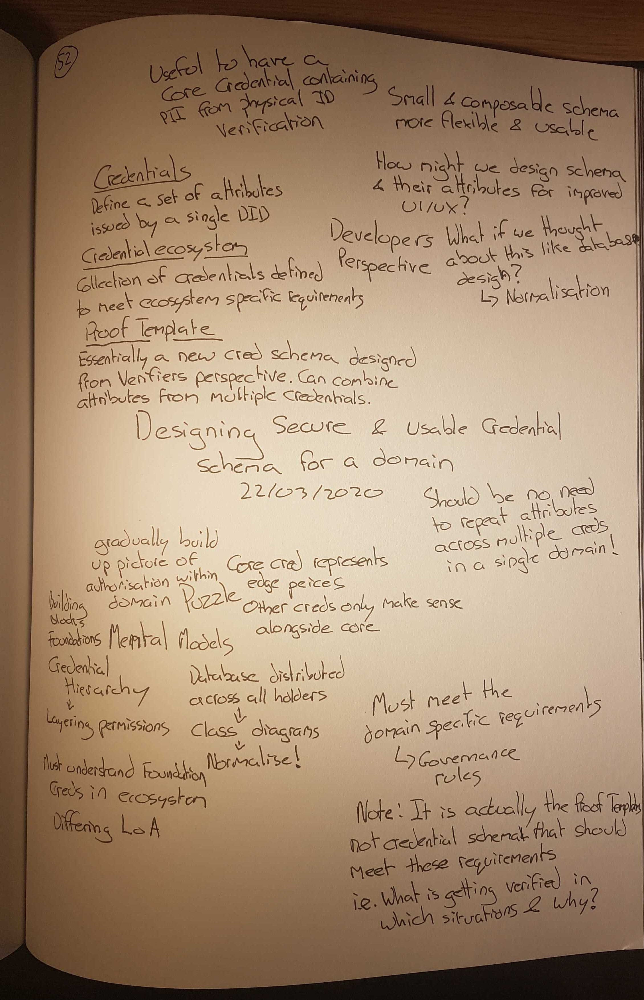

The Self-Sovereign identity space is still very much in its infancy, however, the technology behind it is maturing and the developer tools available are growing every day. The reason this space is still in its infancy is that real-world implementations and the experiences learnt from these implementations are few and far between. Most organisations are still exploring PoC's and pilots, typically with one or two credentials that lack the challenges and constraints involved with deploying these systems into production. Throughout 2020 I expect this to change.

 In this post, I want to put forward my views when it comes to defining a set of credential schema to fulfil a specific purpose within a domain. Note, I also have limited experience and have never deployed a production credential ecosystem so these ideas need battle testing. I hope this can start a discussion about best practice, and give people a firmer understanding when attempting to create credential ecosystems of their own.

Bear in mind, my focus is on [anonymous credential](https://wip-abramson.dev/cl-signatures) based SSI ecosystems, of which I am only aware of the hyperledger Indy/Aries/Ursa community. Not sure what I mean? Read [this](https://github.com/hyperledger/aries-rfcs/tree/master/concepts/0289-toip-stack). Before I go any further I just want to define some terms in case some readers are unfamiliar with the SSI lingo:

* **Verifiable Credentials**: A data object containing a set of attributes and their corresponding data values that have been digitally signed by a public DID. The entity controlling this DID is attesting to the validity of the attribute values within the credential.
* **Credential Schema**: An object written to a public ledger containing the data attributes that must be populated before a Verifiable Credential of this type can be issued. The recently written MemberPass credential schema can be seen on the Sovrin ledger [here](https://indyscan.io/tx/sovmain/domain/54177).
* **Proof Template:** A object, **not** written to the ledger, that defines the attributes a Verifier asks a Holder to present proof of. Proof templates can combine any subset of attributes from across multiple credentials, making them extremely powerful. A good way to think of them is essentially as a new credential schema, designed from the Verifiers perspective. 
* **Proof**: A cryptographically verifiable response to a proof request based on a specific proof template. This proof can combine attributes from across multiple credentials into a single presentation and digital signature.
* **Credential Ecosystem:** An SSI based identity system whereby a set of credential schema and proof templates are designed to meet the business/governance requirements of that ecosystem. These requirements vary depending on the ecosystem, and this can have big implications of the design of schema and proof templates.
* **Governance Authority**: An entity or collection of entities who come together to define the rules that govern a specific ecosystem. This is something that exists all around us today. 

A credential ecosystem is generally orchestrated by a Governance Authority, the entity or entities that define the requirements of the ecosystem and most likely the credential schema and also proof requests. Throughout the rest of this article, I will explore this through a Martian colony, who wishes to issue credentials to its colonists based on their skills, roles and qualifications.

To set this ecosystem up, first, the leaders of the colony need to get together to decide:

* The credential schema - What attributes are going to be issued, when and by who?
* The proof templates - What attributes are going to be verified, in which situations and why?

There are two approaches here, either start by defining the credential schema then move on to the proof templates when you know which attributes are going to be verifiable. Or, and probably preferable, consider which attributes do you want to verify in which situations then work backwards to make sure the credential schema reflects the needs captured in these templates.

A bad pattern that I have started to see, at least in my opinion, is the issuance of attributes representing the same data across multiple credentials in a single domain. I can see why this approach is appealing, multiple attributes attesting to the same data means more trust right? Or even simpler, why not just turn proof templates into credential schema directly?

The problem becomes clearer when you think about it from both a developer and user experience point of view. As a developer, the most sensible way to populate a new credential attribute is to request proof of that attribute, if one exists, from a different credential with the same attribute. The alternative approach is making the issuer re-type the attribute data for each credential the contains this attribute. I am sure we all know how reliable humans can be when they are typing. Plus, as an issuer, how frustrating is it going to be if they have to type in the same first and last name into multiple credentials, especially if these are all being issued at the same time. And from a holder's perspective, it's going to be harder to identify the correct attribute required for a specific proof out of the many that are attesting to the same data.

My advice would be: **Do NOT issue multiple attributes attesting to the same data unless another physical identity verification has taken place.** Even then, within the same domain consider why you would need to have another identity verification. Does that imply you do not trust the initial one: And if you do not trust the initial one why would others trust this one? Why have Verifiable Credentials at all?

I want to point out that I am all for multiple attributes attesting to the same data ... IF they come from different governance domains. 

Let's imagine the martian colony identifies three situations where they need to request proof from their citizens:

* **Leaving Base**: First Name, Last Name, Picture, Space Suit Level, Airlock authorisation
* **Construction**: First Name, Last Name, Picture, Heavy Equipment level, Speciality, Safety
* **Accommodation**: First Name, Last Name, Picture, Room Code, Room Number

This is a basic and fabricated scenario, however, I believe it is useful to illustrate some of my thinking. A naive approach, as discussed, would be to implement this as 3 credential schema that replicate these proof templates exactly. 

I want to put forward a mental model which I think is useful, at least for developers and system architects, when designing these systems. Defining credential schema within a specific domain is very similar to creating a relational database. You are defining a data model for your application, the difference is that this data is stored in Verifiable Credentials with each credential holder storing their record across a distributed database. The holders themselves, or technically their master secret, act as the primary key in this system such that you can have strong cryptographic confidence that all attributes within a proof were issued to the same entity. As with database design, I believe you should be thinking about how to [normalise](https://en.wikipedia.org/wiki/Database_normalization) the attributes required across all proof templates into an efficient entity-relationship diagram that *reduces  data redundancy and improve data integrity.*

Queries on this data model can be thought of as the proof templates. They allow verifiers to bring attributes from across multiple credentials (database tables) together into a single response. Because of the anonymous credential cryptography employed, verifiers can have confidence that the response corresponds to attributes issued a unique individual.

Let's revisit the Martian example, this is a credential schema model that I think makes sense:

* **Martian Passport**: First Name, Last Name, Picture, .... (any additional data you want) 
* **Leaving Base**: Space Suit level, Airlock authorisation
* **Construction**: Heavy Equipment level, Speciality, Safety
* **Accommodation**: Room Code, Room Number

At first, this might feel weird. Why would you want to issue a credential to someone without including their name? Surely people verifying someone's construction credential are going to want to know who the credential was intended to be issued.

The answer is, of course, they would. However, the question you should be asking is why would someone trust a name attribute from a construction credential over the martian passport credential which they know was issued to a higher level of assurance?

Credential schema are the building blocks for higher-order credentials which we perhaps confusingly call Proofs. These higher-order credentials gradually layer on permissions and all must be built on top of some subset of the foundational credential schema's attributes. These are rules that should be defined and enforced by the Governance Authority and upheld by Verifiers when they request proofs.

Is it the case that to enter and become a trusted actor within the ecosystem you require a specific credential? For example within the Martian colony, all workers must have a **Martian Passport** before they can have fixed accommodation, take part in construction or leave the base alone.

My suggestion is if this is true for the credential system you are defining, then make this credential a core credential for your ecosystem, push all key personally identifiable information into this credential and have strict governance rules on how these credentials can be issued. Furthermore, ensure that all proof templates defined for your system include a subset of attributes from this core credential. For example, every proof in the Martian colony must include the First Name, Last Name and Picture from a martian passport credential.

This has additional benefits when you come to consider credential revocation. Because your data model is normalised and all proof templates include some attributes from the core credential you can have confidence the revoking the core credential of an actor will mean access throughout the ecosystem will be revoked. Whereas if attributes are duplicated, it increases the chance that revocation might go unnoticed for some time.

I also believe that the way we design the credential schema and proof templates within an ecosystem has huge implications for the type of user experience we can produce. Giving your frontend developer and UI designer a clear understanding of the attributes that must always be present in any verification will help them move away from the typical approach - displaying lists of attributes. Fixing attributes makes the design more rigid, but also far more meaningful.

The ideas put forward in this article largely remain a hypothesis, I welcome any constructive criticism and I look forward to testing them in the wild. I am, at least when I need to be, a frontend developer and have experienced the issues with the current approaches first hand.

 I want to finish by saying that while undoubtedly domain-specific experts and governance authorities should have a huge influence in the design of these credential ecosystem, it is our job as developers and system designers to work out the finer details. You wouldn't tell an architect how to design a house, you tell them the features you would like the house to include. I see no reason why this should be different.
 
 

   
   Click to see my notes in full.
 

