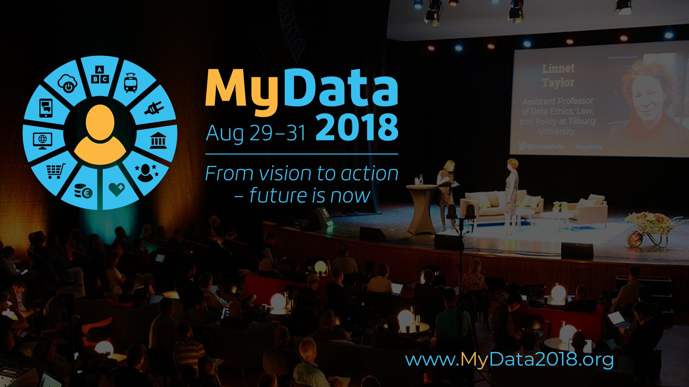
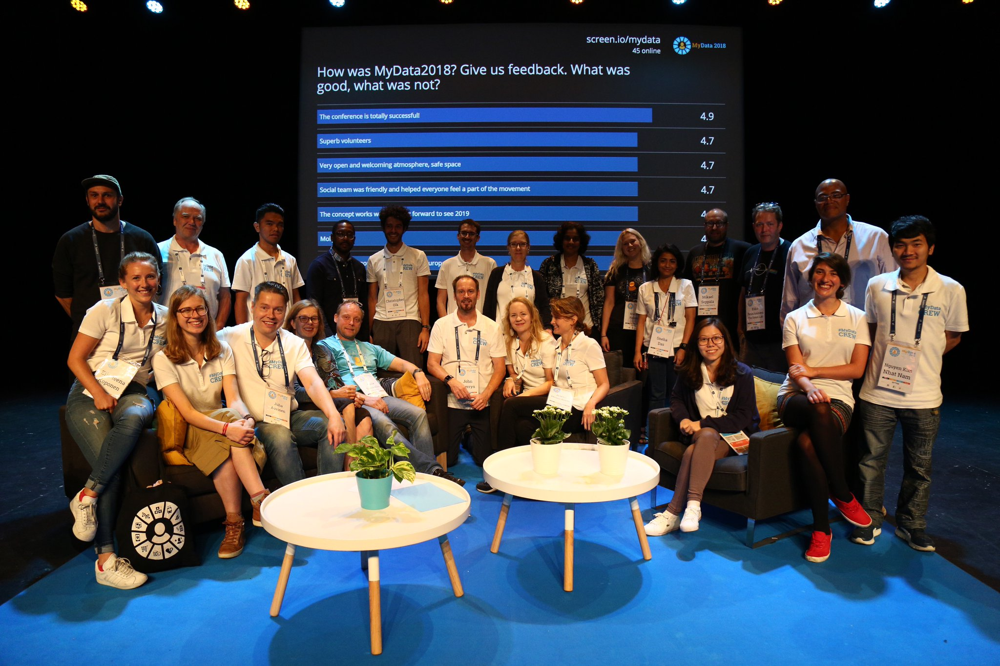
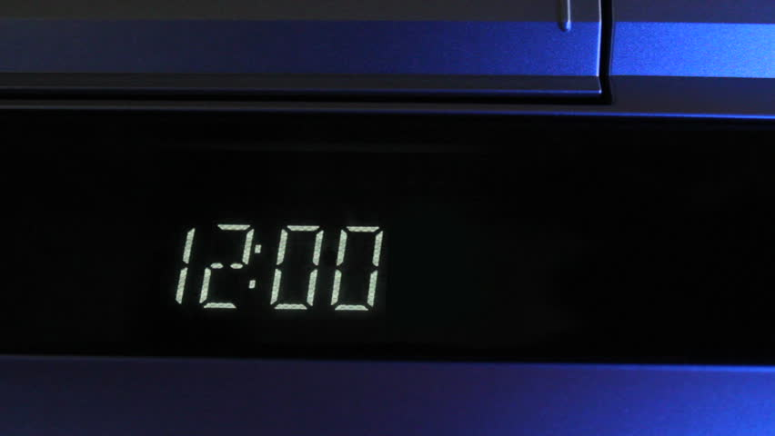
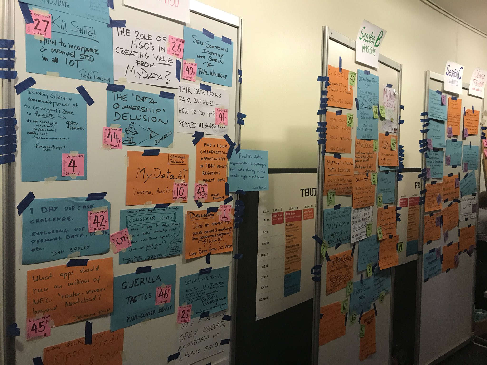
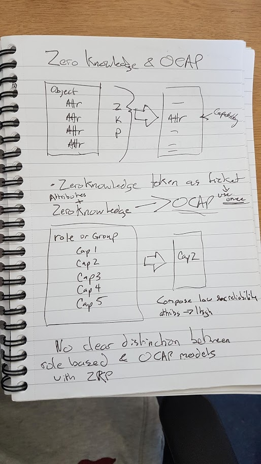
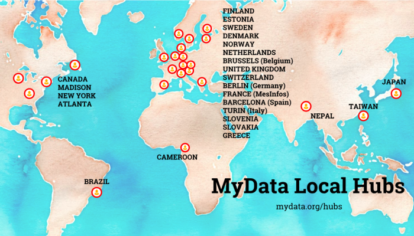
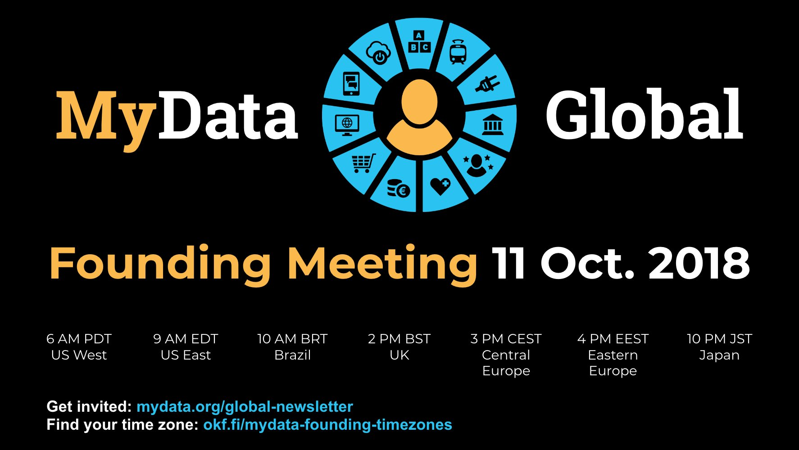

Wow, what a conference. MyData exceeded my expectations and changed my perspective on a number of issues regarding data. Is it ours? Is it mine? Do I own it and should I? If I own it, should I be able to sell it? 

The scope of the problem discussed at this conference was huge. 

I was pleased and impressed to see so many experts from all over the world gather to focus on what I believe to be a critical problem of our generation. 

How can we assert our rights over our data? What even are these rights? How can we change the current data monopolies that exist today to create a fairer society? How can we use our collective data for the common good?

The conference was full of intelligent discussion from a diverse range of backgrounds all trying to grapple with these problems. The multidisciplinary nature of the event forced everyone to think about the problem from a different perspective. MyData highlighted the need for this collaboration across disciplines and the consideration of everyone in order to untangle the current mess the digital age has left us in.  

This was the third MyData conference. While it still young, things are happening. I can’t wait to see where this space goes, where MyData goes, particularly with the foundation of its international NGO. I can’t wait to come back next year and find out what everyone has been working on.

# Volunteering

I was fortunate to attend this year's conference as a volunteer. A real experience. Volunteering puts you at the heart of the conference. You get to know the organisers and get a real sense of the excitement that the conference generates. Also, you appreciate the hard work put in to make these things happen. I cannot recommend it enough. Plus, you save some money along the way.

On that note, a big thank you to John for organising the volunteers such a cracking Airbnb and being an efficient while relaxed coordinator of our activity. He played a humble but huge roll in the success of the conference.

The whole crew were amazing. Jogi, Viivi, Sille, Salla, Rikka and John - Thank You!

As a volunteer you are presented with the perfect opportunity to learn from each other as you try to understand their view on the MyData world. I was the only techie in the house and this led to some interesting discussions revolving around data. Particulaly around the use of distributed ledger technologies which have got themselves rather a bad name in the non-tech world at the moment (don’t mention blockchain).

As a volunteer, I was part of the note takers team – which was ideal for me. My role was to attend different talks throughout the day and write up some brief notes – probably what I would have done anyway. These notes were then relayed back at the end of the day to Linnet Taylor and the rest of the team. 

These daily reviews were a real bonus of being part of the note taking team. We would feedback and discuss any key points that surfaced from the day.  Anything that surprised us. It provided a great overview of all the different streams of thought taking place throughout the conference. There was so much going on. So many interesting points. So many ideas.

Even more rewarding was listening to the closing plenary. This was a pretty epic overview of the conference summed up in an hour by Linnet. Worth a watch. It was a real pleasure to be involved. I hope I contributed something of use.

# Make it happen, Make it right

The MyData slogan really resonated with me.  

We have to make this change happen. We have to make this change right. Everyone is more inclined to one way or the other. For example, the technologists often tend to lean towards making it happen, often without too much consideration if the solutions they are creating are suitable. Wheras the researchers, the social scientists are perhaps more focussed on making it right.  

We need to do both for this to succeed. 

To make it happen but not right we risk creating a monster. Something that spirals out of our control and creates a whole load more problems for the world later on. 

But to make it right without making it happen, we risk a different vision for the future being accepted because they made it happen.

This raises a challenging question though. Making it right for who?  

MyData needs to be global and local at the same time. To be successful it has to work in the different contexts and cultural backgrounds of the world. We have to try to make it right for each and every one of us.

The world of data is murky and complex at the best of times. While this conference provided me with a broader perspective of the problem, it also highlighted how much work there is to do. 

Still, I left hopeful. The level of expertise present was almost overwhelming at times. But they say surrond yourself with people smarter than you, I certainly did that all week. I learnt a crazy amount.  

The cross polination of disciplines and ideas made MyData a breeding ground for fascinating conversations and new ideas. It gave me the big picture view of a challenging problem that we need to solve. We need more of this kind of thinking.

We have to work together!

# Why do we need to solve it?

Many people have many different answers to this question. Personally, I find the alternative is too scary to consider. Data may not be the next oil, but when collected and aggregated in the vast quantities that the GAFA’s (Google, Apple, Facebook and Amazon) are now capable of, it generates enormous value and power. An oligarchy where rather than the wells running dry these companies, if unchecked, will continue to extract and monetise more and more of our personal data.

Do we want our world to be ruled by a few large companies able to pick and choose the rules they follow and exert massive influence over our democracies and our lives?

This gets scarier when you consider the AI revolution that is exploding into the reality right now. AI is driven by data so the companies that control the data will control the AI.

At a talk in MyData on ethical AI, the use of our data to train AI was dubbedd the greatest robbery of our time. Big companies using our data to train their AI which eventually will replace us in the workforce. We discussed the plight of a customer service phone operator. They produce huge amounts of voice data that can then be used to train an AI to replace them. The better they do their job the better the AI gets. This value that thier data is creating is currently stolen from them.

Pretty shocking when you think about it.

Everyone has there own views and reasons for wanting to address this problem, I am sure all of them are valid. Data influences so much of our lives, it is only natural people should want to have more control over how exactly this influence is exerted.

# This is not a Technological Problem

An interesting take away for me was the very gentle undercurrent of anti tech sentiment. A common theme I heard was that this is not a technology problem. I was told to stop thinking of this as a technologist. It is more of a moral or socio-political problem. Sure technology will be involved in the solution but the problem is not with the technology.  

This goes back to the saying that technology is neither good or bad it is how we use it.

Then there was John Wunderlich rather elequent statement in a pre-event:

> Just as war is too important to be left to the generals, data is too important to be left to the technologists.

The techies, me included, tend to be all about solving problems. We solve a problem, then move onto the next. Rather than stopping and considering the implications of our solutions. In a way it was the technologists that created this mess in the first place.

A refreshing aspect of this conference was the deas and communication across disciplines. It isn't something I have really experienced before and I found it invaluable. To think about a problem from multiple perspectives is a skill I aim to improve, MyData was a great starting point for this.

It was a common theme throughout the conference. Not at all that there was any bad feeling. More that there was general consensus this problem required more than just some lines of code to solve. They probably just wished we listened more before diving into the solution. I can see where they are coming from sometimes.

# The IEEE Extended Event

The conference began for me with an extended event organised by John Havens from the IEEE that I felt privileged, if underqualified, to attend. The goal of the afternoon was to provide a basis of ideas from which a paper could be written. I look forward to reading it.

It was a great learning experience for me. Listening and learning from some real experts. My whole conference was like that.

A take away for me was to look into [Ethically Aligned Design](https://ethicsinaction.ieee.org/). 250 pages curated by the IEEE and leading experts in the ethics of technological design. Something we should all be thinking about more. 

The session was full of interesting discussions on ethics such as whether software developers should be allowed to call themselves engineers. An engineer in software doesn’t have the same meaning as it does for a civil engineer. They have to get accredited. They have to get planning permission to build a structure. Compare that to writing software where anyone can set out to build an AI with no regulation, no accreditation and no oversight. How can we hold developers more accountable for the software that they produce?

# Talk of the Conference

At a conference with so many interesting talks and discussions, it is hard to pick a favourite. However, Mikko Hyppönen's keynote on the future of web was a real highlight for me. He spoke with authority and humour presenting some insightful and scary predictions about the future of computer security in the age of IoT.  

This guy wrote his first game in 1986, he is a true O.G on the web. You may have heard of Hyppönen's law which is basically:

> "Whenever an appliance is described as being "smart", it's vulnerable."
>

Don’t like smart devices?  

Think you would never get one?

Well, think again. Mikko predicts that in the future, as hardware prices continue to decrease there will be no devices sold without sensors extracting information from you and your home. The only difference with smart devices will be that you know the sensors exist and can use their data as well as the companies.  

Think you will be able to block them from your Wi-Fi?

Think again. They won’t be using your internet they will be connected to 5G or other networks completely out of your control.

A scary and worrying vision of the future, but it rings true to me.

He then raised another point which I hadn’t considered before. How do these smart (vulnerable) devices fail? What happens when the internet goes down?  

Will they fail safe? Will they fail closed?

Then there was Mikko’s brilliant example of how humans don’t read manuals. Did you ever have a VHS player? Did you bother to set the time or was it just flashing 12:00 like everyone 'elses'? 

You probably didn’t read the manual.

The point he made very effectively was that we cannot design systems that rely on humans to set up their security. Security has to be built in and switched on by default. It should be an essential requirement for designing networked systems.

There was too much content to cover in this post but I highly recommend you [watch](https://www.youtube.com/watch?v=zwkDTKkafOc&feature=youtu.be) his presentation if you have time. Most presentations at MyData were recorded, a real treasure trove of [information](https://mydata2018.org/presentations/).

# Open Space: A Festival of Knowledge

The conference dedicated a whole afternoon to the open space unconference style. Over 50 different sessions, suggested and hosted by the attendees spread across 3 one hour time slots. There was far too much going on.  

It was a real festival of knowledge.  

Anyone could submit a session to the open space. That could be discussing a topic, presenting an idea or working through a question. Anything went basically. Then everyone had to decide which sessions they were going to attend – this was not easy!

We tried to get notes from each session which will be writted up into a document that I am very much looking forward to reading. I am sure it will be shared with the public.

I attended some quality discussions. In particular the one on Self-Hosting led by Ben Goering which has started me down a rabbit hole.  

I also attended a presentation on the current state of Sovrin by Phil Windley. While possibly I could have attended a more varied session it was still very useful and included a live demo of how one of these wallets for verifiable credentials would look like and how they might interact with a service. In the demonstrated case purchasing an airline ticket.

Also, check out this [blog post](<http://www.windley.com/archives/2018/08/youve_had_an_automobile_accident_multi-source_identity_to_the_rescue.shtml> ) he wrote which highlights the power of Self-Sovereign identity in a real world situation. 

The last session I attended was an interesting idea from Gianfranco to perform a live zero knowledge demo of the ali ba ba cave [example](http://cryptowiki.net/index.php?title=The_simplest_example_is_the_cave_of_Ali_Baba_(Ali_Baba)). We performed this to the whole conference hopefully giving some basic understanding of how a Zero-Knowledge proof works. The group was combined with Nathan George the CTO of Sovrin who presented a more in-depth technical discussion on Zero-Knowledge proofs and there use in a Self Sovereign Identity system such as Sovrin. I learnt some truly mind-blowing stuff and am glad that I will be studying this topic for another 3 years. It sounds crucial. This was not the easiest session to be the note taker!

I was lucky enough to chat with Nathan on his own later in the conference. Where he explained to me the power of Zero-Knowledge proofs when used for object capabilities. Including drawing me a diagram.

I didn’t even know what object capabilities were – now I am looking to learn as much as I can.

Some interesting sessions that I missed out on were a session on overlays in Sovrin, Kaliya Young’s session on the Aadhar identity system and whether it should be rolled out to places like Africa. There were loads!  

The open space was such a great way to tap into the obvious expertise of the community attending MyData. There was something for everyone and I am sure everyone learnt something new. Really impressive!

# Self-Hosting

This was my favourite open space session. Something I didn’t even really understand but was interested to learn more about it. Self-hosting is basically the idea of running your own applications on your own servers and reducing your reliance on third-party hosted applications.

The internet subculture around Self-Hosting sounds fascinating. The anarchists. The original decentralisation believers who try to vote with their feet. It is a very cool area that I am determined to learn more about and follow some of the principles being it.

In particular the principle from the [Indie Web Camp](https://indieweb.org/) – POSSE.

Post On (your own) Site (first) Syndicate Elsewhere

This article is an example of me doing just that.

[Ben Goering](http://www.bengo.co/) was the leader of this session and a fascinating guy. He introduced me to [Mastodon](https://mastodon.social/about) a federated social network platform where you can host your own profile while still being able to connect and interact with others.

I also went to a talk by him on his work creating [activitypub](https://www.w3.org/TR/activitypub/) a W3C standard used in a lot of these federated social networks like mastodon. Old school decentralisation before all the hype. Very cool.

Through Ben I met [Amy](http://rhiaro.co.uk/) a true anarchist in my opinion. As well as an impressive climate hero. She lives out of a rucksack and travels Europe without flying. She hasn’t flown once this year! 

In her words self-hosting is:

> “Making everything harder for yourself”
>

Challenge accepted.

The goal of self-hosting is trying to guarantee your presence on the web in 100 years time when all the current organisations like Medium and Facebook cease to exist. Currently ,I only publish on medium – if it closes down I would lose all my articles. That needs to change.

Out of this some of my goals for the next year are to claim some internet space for myself

- Buy a domain name or two

- Route a domain name for email
- Follow POSSE as much as possible
  - Create a website for my content
  - Create a mastodon profile

I am now well on my way to accomplishing these.

# Self-Sovereign Identity

While I loved the conference for the diversity of ideas and presentations from a wide range of domains my primary driver for attending was for the technology. What can I say, I’m a techie. I wanted too further my knowledge of Self-Sovereign Identity, in my opinion a crucial piece of this puzzle. As well as to understand how it fits into the wider picture.

While the core ideas around SSI presented were nothing new to me, this conference helped to solidify my understanding as well as providing me with some new ideas to explore. Such as the overlays that are being worked on at Sovrin. Object capabilities and the use of Zero-Knowledge proofs as object capabilities. These were all new ideas that I came across and will be exploring further.

I have furthered my contacts in this space. I am now a member of the Sovrin slack, which looks like its going to be a fountain of knowledge. I hope to get involved with the [hyperledger indy-crypto](https://github.com/hyperledger/indy-crypto) work including attending some regular online meetings suggested to me by Nathan.  

I really want to attend the [Internet Identity Workshop](https://www.internetidentityworkshop.com/) in California. It sounds epic and a great way for me to continue my involvement in this space. I hope to attend this as part of my PhD!

It was also fascinating to hear these thought leaders opinion on where the space is heading. How long is it before we have some working examples of this in practice. The answer was resoundingly not that far! Sovrin is working with British Columbia to create the [Verified Organisations](https://von.pathfinder.gov.bc.ca/aboutvon/). Basically converting the government's current registry of businesses into digitised verified credentials. That includes issuing all the licences they require to be businesses ie liquor licence as verifiable credentials. 

# Other interesting insights

There was simply too much to cover it all but here are a few things I found really interesting.

## GDPR and Data Portability

I sat in on a few sessions on Data Portability and GDPR the interesting take away for me was that I don’t really understand GDPR. I don’t think many people do. I don’t know if we need to though, many regulations I don’t understand benefit me. More disconcerting was the general consensus in the organisation that neither companies or users particularly care about the GDPR and its potential benefits.

We need more buy-in from both users and businesses though. The potential that is locked away when data is made unportable is a huge waste. I don’t think companies realise it.  

To change this we need more use cases for portability. A user doesn’t just want a basic data dump. They want places where they can put their data and gain value from it. They want to know what they can do with the portability of data. How it can benefit them.

I would urge everyone to submit at least one GDPR request just to see the kind of stuff companies are storing on you. You can get a default email provided by Ian Forrester [here](https://cubicgarden.com/2018/05/24/data-portability-and-gdpr-been-waiting-a-long-time-for-this/). You will be shocked I imagine.

An interesting issue was raised around data portability at MyData. If we make data more portable but do not fix the current issues with consent. Ie users just clicking accept without really knowing what they are accepting. Will this just lead to users giving away even more data. For example, if data portability means companies can transfer your data between themselves without going through the end user as long as there is "consent" could this lead to unaware users handing over their banking data? Something to consider for sure.

## Ownership vs Rights Over Data

An interesting conversation that came up multiple times this year was the conversation of ownership vs rights. What does it mean to own our data? Does that even make sense? Check out the [data ownership delusion](https://medium.com/mydata/the-data-ownership-delusion-4012cc232a2a) for a great discussion of why it probably doesn’t by Gianfranco.

These conversations shifted my views. I came to MyData believing in the ownership model. Believeing that individuals should be able to create revenue streams from their data. But would this work? Data becomes powerful when aggregated over a large population, your data on its own is fairly worthless. Also raised was the issue of equality – if you have no money would you be forced to sell your data? Finally, should you really be allowed to sell your data even if you could make money from it? You cannot sell your freedom. It was compared to data prostitution or selling your organs. 

Note: Data is not the next oil. Oil is finite data is not. Thanks for pointing that out to me, very true.

Now I am a far bigger believer in the rights model. The idea that a user should be able to assert some control over how their data is used. People talked about data trusts and data cooperatives as different models for the governance of our data. I liked the idea that this is not a one size fits all problem. We will see different problems with different requirements for how to govern data using different models. 

Another interesting thing to come up was about inferred data. Should data a company has inferred from your data, spending there time and money working out things about you from your data but not exactly your data be under your control. Should they tell you about it in a GDPR request? What if they infer something that you might not want to hear such as you are showing suicidal tendencies? This divides opinion. Businesses in particular believe this information is theirs and currently I do not believe it is included in a GDPR response. The question of where we draw the line in the world of data is one we need to think carefully about.

A shocker by the way that came out of a session I did on data portability with some guys from the UK Open Data Institute. When the UK government decided to privatize the postal service we sold off the registry of all addresses in the UK. You now have to pay to access this registry that was created with taxpayer money and is now in private hands. Crazy! 

# A Family Affair

The social aspect of this conference helped to tie it all together and fostered a community feel. As well as providing a great opportunity to network and discuss takeaways from the conference. There were organised group meals. Evening drinks. All sorts.

Everyone was friendly, everyone had something interesting to say. I met some really interesting people.

Best of all was the Sauna evening. I never overly enjoyed a sauna before this but this was really good. A truly Finnish experience and one that I thoroughly enjoyed.

A lot of conferences may call themselves a family but MyData really felt like one. A close knit community of individuals and organisations working together to bring about the MyData vision.

# Lovely Helsinki

To make this conference even more special it is set in the lovely capital of Finland. I have had the pleasure to spend a week here. My first time in Finland, but I will be back.

The transport system is naturally switched on. Strange how so many countries seem to get public transport right, where the UK struggles. I could rent a city bike for a week for 10 euros.  On top of that, there were trams, busses a metro. The city is probably small enough to walk as well.

The Finnish are most welcoming and friendly even if the price of a beer is rather high.  

I did plan to get out to Nuuksio a national park around an hour from the city. But an unplanned late Friday night celebrating the end of the conference ended those hopes. Instead my Saturday consisted of going for an Indian, taking a bike around the lake then moving to a beautiful apartment.

I had to leave my hostel I was in, a blessing really, because even though it was on an industrial scale somehow it was full. I decided to treat myself to a cracking apartment in the centre. It even had a sauna. So I cooked a meal and spent the evening relaxing.

It provided me with the perfect opportunity to regroup for the next leg of my trip. Which as I write this I am embarking on. A 29 hour ferry to Germany then Berlin Blockchain (shhhh) week. Busy busy. But I am looking forward to it.

# Participate in This Movement

This is a movement. A community. A family. We all want the same thing. I urge everyone to at least follow this movement, but even better get involved. Start learning about the problem. Start taking more responsibility for your actions online. Make a GDPR request.

 Is there a local MyData hub near you – join it.   

Sign and promote the MyData [declaration](https://mydata.org/declaration/).

MyData will soon become a registered international NGO. You can become a member. You should!

# Looking to the future of MyData

It is clear to me this movement is still in its infancy. I am excited and optimistic about its future but there is a lot of work to be done before these ideas are accepted into the mainstream. We need more real use cases. More interest. More collaboration. But people are starting to wake up to the robbery being committed by the GAFA. The question is can we provide them with a viable alternative. Nowadays if you care you still have no option really.

I really liked the metaphor that we are still exploring the map of possibilities to manage and control data. There is still undiscovered territory. There are some bits that we are guessing at. Like blockchain for example. Some of us have drawn it on our map, we think it probably fits in somewhere but no one or at least very few of us have actually been there and proved the concept. It is a new, foreign world to us and we have a lot to learn.

I do firmly believe in the ideas being pursued by MyData and I hope with the founding of this organisation they will start to move at an ever-increasing pace. I will be back next year. You should come too!

      