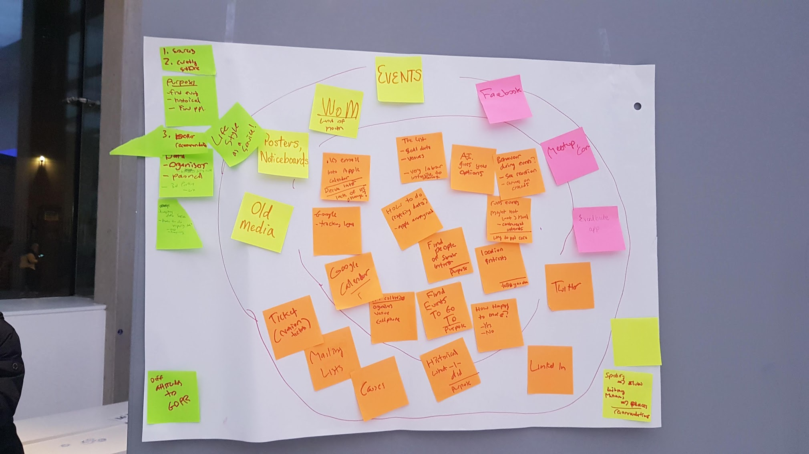
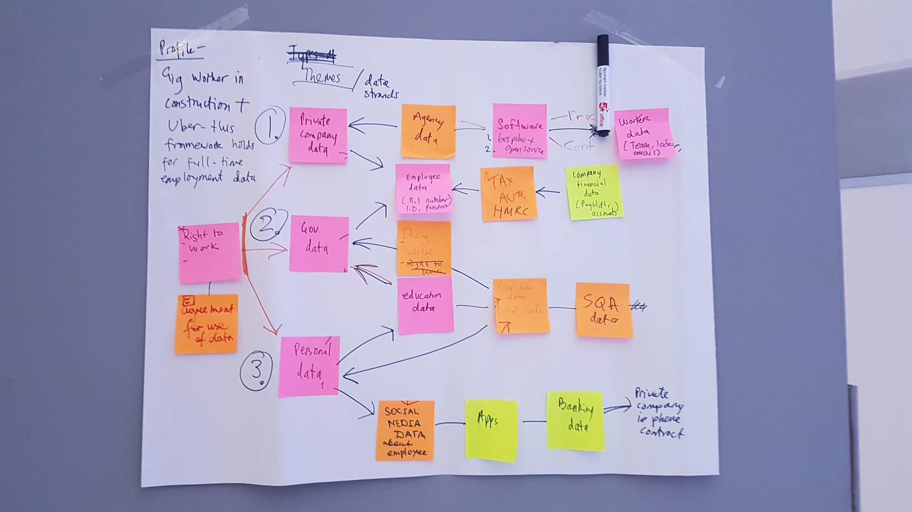
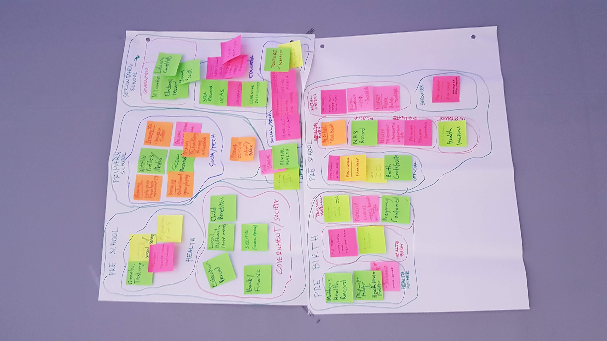

Last week the MyData community meeting and general meeting were held in Scotland. It was the first community meeting I have attended and the first time the newly elected board of MyData global met face to face. This combined with the timing of the [Scottish Data Festival](https://www.datafest.global/), provided MyData Scotland with the perfect opportunity to hold our first meetup as part of the excellent array of DataFest fringe events going on throughout Scotland.

The goal of our meetup was to introduce MyData to Scotland as both an alternative vision and as an organisation. It was a success. The meetup was well attended, many attendees got to hear about MyData for the first time and I hope we have converted at least a few people to the cause.

The main part of our meetup consisted of a mapping workshop. People split into smaller groups and were given paper, post-its and markers. We asked them to map out personal data inside an ecosystem of their choice by drawing from personal experience. The idea came from a workshop I attended at MyData 2018 by the ODI who have created a useful [guide](https://theodi.org/article/mapping-data-ecosystems/) for mapping data ecosystems. For something none of us in the hub had much experience at it went down well, sparked conversations and got people engaged in the event. We were gratefully supported by a number of MyData Global members.

So what was the point? Why did we make people map out a personal data ecosystem? And how do we take this further?

These are valid questions and if I am honest not ones I really considered before the workshop. We rushed to put a proposal together in time for the DataFest application, and in the run-up to the event I was too busy worrying about if the workshop would be coherent to think about the next steps. My measure of success was attendance, participation and general enjoyment at the event.

However, in reflection, I do believe there is a point to mapping out personal data ecosystems and I believe we as the Scottish hub can build on this work in the future. This is largely down to my introduction the tool [personaldata.io](https://wiki.personaldata.io) and the support of Paul-Olivier Dehaye when putting together this workshop.

Personaldata.io is a wiki-base instance which enables you through a relatively easy user interface to create a digital representation of the paper and post-it note map that people create. Personaldata.io looks like Wikipedia (or Wikibase actually), which, as Paul pointed out, helps give the project the feel of Wikipedia. It frames the application as a collaborative project people build on together and gives it the implicit credibility of people associate with Wikipedia.

One thing I really liked about combining this tool with the mapping workshop, is that it shows people the value of data. Everyone has spent an hour creating something physical and by creating a digital representation you are making it long lasting. Opening it up for further collaboration. Creating a resource for future mappers.

Here are the maps we created

## Mapping Personal Data in Events

We didn't manage to capture the digital representation of this one, but I might work to create on from the image over the next couple of weeks.

## Mapping Personal Data within the Gig Economy

[Digital Representation](https://query.personaldata.io/#%23defaultView%3AGraph%0APREFIX%20pdio%3A%20%3Chttp%3A%2F%2Fwiki.personaldata.io%2Fentity%2F%3E%0APREFIX%20pdiot%3A%20%3Chttp%3A%2F%2Fwiki.personaldata.io%2Fprop%2Fdirect%2F%3E%0APREFIX%20pdiop%3A%20%3Chttp%3A%2F%2Fwiki.personaldata.io%2Fprop%2F%3E%0APREFIX%20pdiops%3A%20%3Chttp%3A%2F%2Fwiki.personaldata.io%2Fprop%2Fstatement%2F%3E%0APREFIX%20pdiopq%3A%20%3Chttp%3A%2F%2Fwiki.personaldata.io%2Fprop%2Fqualifier%2F%3E%0A%0ASELECT%20%3Frel%20%3Fpred%20%3Fobj%20%3Fitem%20%3Fdomain%20%3FdomainLabel%20%3Frange%20%3FrangeLabel%20%0A%20%20%20WITH%20%7B%0A%20%20%20%20%20SELECT%20%3Ftable%20%0A%20%20%20%20%20WHERE%20%7B%0A%20%20%20%20%20%20%20BIND%28pdio%3AQ228%20AS%20%3Ftable%29%0A%20%20%20%20%20%7D%0A%20%20%20%7D%20AS%20%25workshop%0A%20%20%20WHERE%0A%20%20%20%7B%0A%20%20%20%20%20%0A%20%20%20OPTIONAL%20%7B%0A%20%20%20%20%20%3Ftable%20pdiop%3AP26%20%3Fdomain_prop.%0A%20%20%20%20%20%3Fdomain_prop%20pdiops%3AP26%20%3Fdomain.%0A%20%20%20%20%20%3Fdomain_prop%20pdiopq%3AP27%20%3FdomainLabel%0A%20%20%20%7D.%0A%20%20%20OPTIONAL%20%7B%0A%20%20%20%20%20%3Ftable%20pdiop%3AP26%20%3Frange_prop.%0A%20%20%20%20%20%3Frange_prop%20pdiops%3AP26%20%3Frange.%0A%20%20%20%20%20%3Frange_prop%20pdiopq%3AP27%20%3FrangeLabel%0A%20%20%20%7D.%0A%20%20%20%7B%0A%20%20%20%20%20SELECT%20%3Fdomain%20%3Frange%20WHERE%20%7B%0A%20%20%20%20%20%20%20%20%20%20INCLUDE%20%25workshop.%0A%20%20%20%20%20%20%20%20%20%20%3Ftable%20pdiop%3AP25%20%3FrelationshipStatement.%0A%20%20%20%20%20%20%20%20%20%20%3FrelationshipStatement%20pdiopq%3AP24%20%3Fdomain.%0A%20%20%20%20%20%20%20%20%20%20%3FrelationshipStatement%20pdiopq%3AP23%20%3Frange.%0A%20%20%20%20%20%20%20%7D%0A%20%20%20%20%20%0A%20%20%20%7D%0A%20%20%20UNION%0A%20%20%20%7B%20%20%0A%20%20%20%20%20SELECT%20%3Fdomain%20%3Frange%20WHERE%20%7B%0A%20%20%20%20%20%20%20%20%20%20INCLUDE%20%25workshop.%0A%20%20%20%20%20%20%20%20%20%20%3Ftable%20pdiop%3AP58%20%3FrelationshipInStatement.%0A%20%20%20%20%20%20%20%20%20%20%3FrelationshipInStatement%20pdiops%3AP58%20%3Frange.%0A%20%20%20%20%20%20%20%20%20%20%3FrelationshipInStatement%20pdiopq%3AP61%20%3Fdomain.%0A%20%20%20%20%20%20%20%7D%0A%20%20%20%7D%0A%20%20%20UNION%0A%20%20%20%7B%20%20%0A%20%20%20%20%20SELECT%20%3Fdomain%20%3Frange%20WHERE%20%7B%0A%20%20%20%20%20%20%20%20%20%20INCLUDE%20%25workshop.%0A%20%20%20%20%20%20%20%20%20%20%3Ftable%20pdiop%3AP59%20%3FrelationshipOutStatement.%0A%20%20%20%20%20%20%20%20%20%20%3FrelationshipOutStatement%20pdiops%3AP59%20%3Fdomain.%0A%20%20%20%20%20%20%20%20%20%20%3FrelationshipOutStatement%20pdiopq%3AP60%20%3Frange.%0A%20%20%20%20%20%20%20%7D%0A%20%20%20%7D.%0A%7D) .

## Mapping Personal Data from pre-birth to the teenage years

[Digital Representation](https://query.personaldata.io/#%23defaultView%3AGraph%0APREFIX%20pdio%3A%20%3Chttp%3A%2F%2Fwiki.personaldata.io%2Fentity%2F%3E%0APREFIX%20pdiot%3A%20%3Chttp%3A%2F%2Fwiki.personaldata.io%2Fprop%2Fdirect%2F%3E%0APREFIX%20pdiop%3A%20%3Chttp%3A%2F%2Fwiki.personaldata.io%2Fprop%2F%3E%0APREFIX%20pdiops%3A%20%3Chttp%3A%2F%2Fwiki.personaldata.io%2Fprop%2Fstatement%2F%3E%0APREFIX%20pdiopq%3A%20%3Chttp%3A%2F%2Fwiki.personaldata.io%2Fprop%2Fqualifier%2F%3E%0A%0ASELECT%20%3Frel%20%3Fpred%20%3Fobj%20%3Fitem%20%3Fdomain%20%3FdomainLabel%20%3Frange%20%3FrangeLabel%20%0A%20%20%20WITH%20%7B%0A%20%20%20%20%20SELECT%20%3Ftable%20%0A%20%20%20%20%20WHERE%20%7B%0A%20%20%20%20%20%20%20BIND%28pdio%3AQ227%20AS%20%3Ftable%29%0A%20%20%20%20%20%7D%0A%20%20%20%7D%20AS%20%25workshop%0A%20%20%20WHERE%0A%20%20%20%7B%0A%20%20%20%20%20%0A%20%20%20OPTIONAL%20%7B%0A%20%20%20%20%20%3Ftable%20pdiop%3AP26%20%3Fdomain_prop.%0A%20%20%20%20%20%3Fdomain_prop%20pdiops%3AP26%20%3Fdomain.%0A%20%20%20%20%20%3Fdomain_prop%20pdiopq%3AP27%20%3FdomainLabel%0A%20%20%20%7D.%0A%20%20%20OPTIONAL%20%7B%0A%20%20%20%20%20%3Ftable%20pdiop%3AP26%20%3Frange_prop.%0A%20%20%20%20%20%3Frange_prop%20pdiops%3AP26%20%3Frange.%0A%20%20%20%20%20%3Frange_prop%20pdiopq%3AP27%20%3FrangeLabel%0A%20%20%20%7D.%0A%20%20%20%7B%0A%20%20%20%20%20SELECT%20%3Fdomain%20%3Frange%20WHERE%20%7B%0A%20%20%20%20%20%20%20%20%20%20INCLUDE%20%25workshop.%0A%20%20%20%20%20%20%20%20%20%20%3Ftable%20pdiop%3AP25%20%3FrelationshipStatement.%0A%20%20%20%20%20%20%20%20%20%20%3FrelationshipStatement%20pdiopq%3AP24%20%3Fdomain.%0A%20%20%20%20%20%20%20%20%20%20%3FrelationshipStatement%20pdiopq%3AP23%20%3Frange.%0A%20%20%20%20%20%20%20%7D%0A%20%20%20%20%20%0A%20%20%20%7D%0A%20%20%20UNION%0A%20%20%20%7B%20%20%0A%20%20%20%20%20SELECT%20%3Fdomain%20%3Frange%20WHERE%20%7B%0A%20%20%20%20%20%20%20%20%20%20INCLUDE%20%25workshop.%0A%20%20%20%20%20%20%20%20%20%20%3Ftable%20pdiop%3AP58%20%3FrelationshipInStatement.%0A%20%20%20%20%20%20%20%20%20%20%3FrelationshipInStatement%20pdiops%3AP58%20%3Frange.%0A%20%20%20%20%20%20%20%20%20%20%3FrelationshipInStatement%20pdiopq%3AP61%20%3Fdomain.%0A%20%20%20%20%20%20%20%7D%0A%20%20%20%7D%0A%20%20%20UNION%0A%20%20%20%7B%20%20%0A%20%20%20%20%20SELECT%20%3Fdomain%20%3Frange%20WHERE%20%7B%0A%20%20%20%20%20%20%20%20%20%20INCLUDE%20%25workshop.%0A%20%20%20%20%20%20%20%20%20%20%3Ftable%20pdiop%3AP59%20%3FrelationshipOutStatement.%0A%20%20%20%20%20%20%20%20%20%20%3FrelationshipOutStatement%20pdiops%3AP59%20%3Fdomain.%0A%20%20%20%20%20%20%20%20%20%20%3FrelationshipOutStatement%20pdiopq%3AP60%20%3Frange.%0A%20%20%20%20%20%20%20%7D%0A%20%20%20%7D.%0A%7D)

 

The digital representations might look small, we were inputting as the maps were being drawn, but they are a start. Anyone could go to these links and fill in more detail on these maps.

What is great about having a digital representation of these is that it helps you see it is not three maps we are creating but one. One big, messy personal data ecosystem that these maps barely scratch the surface of. You can see a combined view of all the maps [here](https://query.personaldata.io/#%23defaultView%3AGraph%0APREFIX%20pdio%3A%20%3Chttp%3A%2F%2Fwiki.personaldata.io%2Fentity%2F%3E%0APREFIX%20pdiot%3A%20%3Chttp%3A%2F%2Fwiki.personaldata.io%2Fprop%2Fdirect%2F%3E%0APREFIX%20pdiop%3A%20%3Chttp%3A%2F%2Fwiki.personaldata.io%2Fprop%2F%3E%0APREFIX%20pdiops%3A%20%3Chttp%3A%2F%2Fwiki.personaldata.io%2Fprop%2Fstatement%2F%3E%0APREFIX%20pdiopq%3A%20%3Chttp%3A%2F%2Fwiki.personaldata.io%2Fprop%2Fqualifier%2F%3E%0A%0ASELECT%20%3Frel%20%3Fpred%20%3Fobj%20%3Fitem%20%3Fdomain%20%3FdomainLabel%20%3Frange%20%3FrangeLabel%20%0A%20%20%20WITH%20%7B%0A%20%20%20%20%20SELECT%20%3Ftable%20%0A%20%20%20%20%20WHERE%20%7B%0A%20%20%20%20%20%20%20pdio%3AQ224%20pdiot%3AP63%20%3Ftable.%0A%20%20%20%20%20%7D%0A%20%20%20%7D%20AS%20%25workshop%0A%20%20%20WHERE%0A%20%20%20%7B%0A%20%20%20%20%20%0A%20%20%20OPTIONAL%20%7B%0A%20%20%20%20%20%3Ftable%20pdiop%3AP26%20%3Fdomain_prop.%0A%20%20%20%20%20%3Fdomain_prop%20pdiops%3AP26%20%3Fdomain.%0A%20%20%20%20%20%3Fdomain_prop%20pdiopq%3AP27%20%3FdomainLabel%0A%20%20%20%7D.%0A%20%20%20OPTIONAL%20%7B%0A%20%20%20%20%20%3Ftable%20pdiop%3AP26%20%3Frange_prop.%0A%20%20%20%20%20%3Frange_prop%20pdiops%3AP26%20%3Frange.%0A%20%20%20%20%20%3Frange_prop%20pdiopq%3AP27%20%3FrangeLabel%0A%20%20%20%7D.%0A%20%20%20%7B%0A%20%20%20%20%20SELECT%20%3Fdomain%20%3Frange%20WHERE%20%7B%0A%20%20%20%20%20%20%20%20%20%20INCLUDE%20%25workshop.%0A%20%20%20%20%20%20%20%20%20%20%3Ftable%20pdiop%3AP25%20%3FrelationshipStatement.%0A%20%20%20%20%20%20%20%20%20%20%3FrelationshipStatement%20pdiopq%3AP24%20%3Fdomain.%0A%20%20%20%20%20%20%20%20%20%20%3FrelationshipStatement%20pdiopq%3AP23%20%3Frange.%0A%20%20%20%20%20%20%20%7D%0A%20%20%20%20%20%0A%20%20%20%7D%0A%20%20%20UNION%0A%20%20%20%7B%20%20%0A%20%20%20%20%20SELECT%20%3Fdomain%20%3Frange%20WHERE%20%7B%0A%20%20%20%20%20%20%20%20%20%20INCLUDE%20%25workshop.%0A%20%20%20%20%20%20%20%20%20%20%3Ftable%20pdiop%3AP58%20%3FrelationshipInStatement.%0A%20%20%20%20%20%20%20%20%20%20%3FrelationshipInStatement%20pdiops%3AP58%20%3Frange.%0A%20%20%20%20%20%20%20%20%20%20%3FrelationshipInStatement%20pdiopq%3AP61%20%3Fdomain.%0A%20%20%20%20%20%20%20%7D%0A%20%20%20%7D%0A%20%20%20UNION%0A%20%20%20%7B%20%20%0A%20%20%20%20%20SELECT%20%3Fdomain%20%3Frange%20WHERE%20%7B%0A%20%20%20%20%20%20%20%20%20%20INCLUDE%20%25workshop.%0A%20%20%20%20%20%20%20%20%20%20%3Ftable%20pdiop%3AP59%20%3FrelationshipOutStatement.%0A%20%20%20%20%20%20%20%20%20%20%3FrelationshipOutStatement%20pdiops%3AP59%20%3Fdomain.%0A%20%20%20%20%20%20%20%20%20%20%3FrelationshipOutStatement%20pdiopq%3AP60%20%3Frange.%0A%20%20%20%20%20%20%20%7D%0A%20%20%20%7D.%0A%7D).

This answers the question of what next? What was the point? Well, the point is we now have part of a map that we can view, extend and build on top of. While right now it is still hard to see the value in this, the map is small, messy and not particularly useful. However, what about after 100 different maps have been combined together? This mapping process happens anyway in many sectors, what would happen if these maps were public and open to everyone. The Wikibase project allows everyone to build on the same map. What will happen once everyone has a common view of the personal data flows within ecosystems that they are part of? How might this map be used as an input for further innovation around personal data? Paul has some cool [ideas](https://www.youtube.com/watch?v=miVWeLuXQuc), but he won't be the only one.

MyData Scotland aims to repeat this workshop in different settings across Scotland. Thomas Presslie from the hub is already planning to run a similar event in schools linked with the DDI. Before the workshop we attemped to contact the local climate strike group to see if they would be interested in mapping out data flows related to climate change, while no one attended it is still something we would be interested in pursuing.

Each of the maps created can be standalone but also feed into the bigger picture. For MyData 2019 my proposal will be a workshop to analyse these maps and work to define a meta-model for mapping personal data ecosystems. The very basic building blocks that I would then encourage all digital representations of personal data ecosystems to use. My belief this would help bring broader interoperability and clarity to the common view of all maps. We will see.

Organising a meetup like this was harder than I expected. For a small group of volunteers, it took a lot of time and effort. But it was worth it. Thanks for everyone who came down, particular shout out to Mia, 16 who came down from the Scottish Borders and is now a full MyData member. I hope everyone had a good time and hope to see you all again soon. We are having a planning meeting for our local hub on Thursday the 28th of March,drop us an email if you are interested in attending scotland@mydata.org. 

I see the huge potential here in Scotland for data-driven innovation, but let's make sure this is the right kind of innovation. We hope as a hub to work alongside the wealth of knowledge already in Scotland to ensure that the innovation happening around data in Scotland is working to empower the individual. 

Our local hub aims to be more than just a talking shop, we want to be actively working towards a world where human-centric control over the data they create is the norm. Our hub aims to explore the possiblities of giving decentralised identifiers to kids. This project is being lead by Iain Henderson and will explore many possible solutions such as [JLinc](https://www.jlinc.com/) and [Sovrin](https://sovrin.org/). We believe providing individuals, particularly children, with identifiers that they can prove control of independently of an external party is essential infastructure that will enable human-centric applications to emerge. Get in touch if you want to find out more!

We were lucky to be able to host the MyData Global community here in Scotland and I hope it will give our local hub a boost of publicity and support. Big thank you to Edinburgh University and the DDI who played a huge part in making that happen by providing the venue and also paying for the food over the two days. We look forward to working closely with them in the future.

There are a lot of projects here in Scotland vying for people's attention and commitment, but to me, the mission of MyData to empowering the individual to use their data for their benefit is one of the most important to pursue. It is about what kind of world do we want to live in. One where we are controlled or have control. One where we are trapped within an ecosystem or have the freedom to exist in the digital space independent of any constraints.

I love the pointed question Shoshana Zuboff raises in the Age of Surveillance Capitalism:

> If industrial capitalism dangerously disrupted nature, what havoc might surveillance capitalism wreak on human nature?

What if control of data is the next global problem we have to deal with? What are the consequences of blindly following this current path in pursuit of profit? I only hope we are not ignored like the climate scientists of the 60s.

If any of this resonates with you, or if you have a project that aligns with our goals please get in touch. You can email MyDataScotland: scotland@mydata.org. Or you can join the MyData Global [slack](https://mydata.org/slack/) where you can find us all at #hub-scotland.