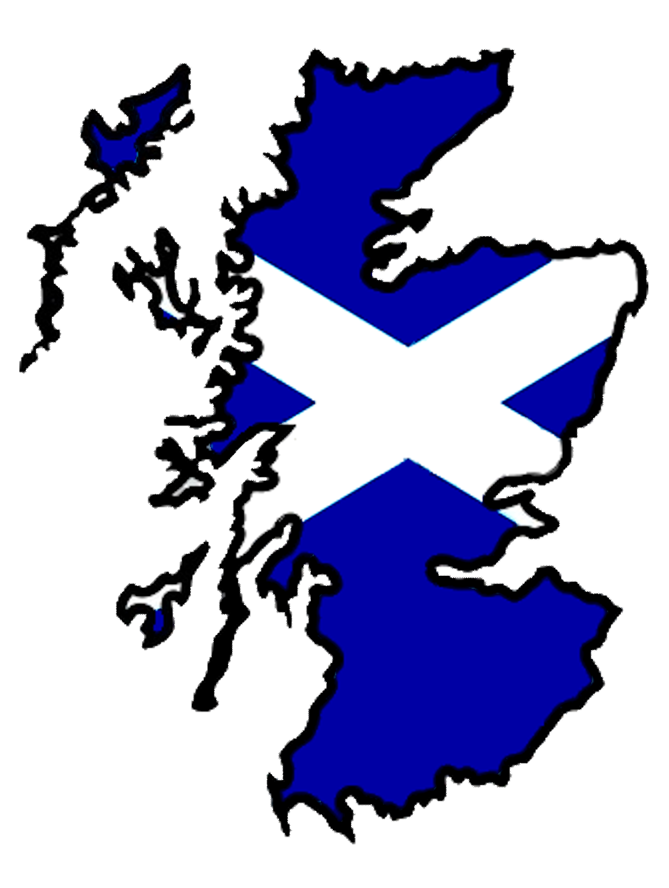

I have been working towards officially establishing MyData Scotland with help from Thomas Presslie, Iain Henderson and others. We recently went through our peer acceptance interview. It got us thinking and talking about what MyData means to us and why we wanted to establish MyData Scotland.

I will share some of those thoughts as well our rough objectives for the hub in the following year.

We are all passionate about MyData but had differing reasons for wanting to form a hub. For Thomas it is more about education and outreach, Iain is interested in running PoCs and attempting to do tangible things to empower people with their data. We have a good balance of differing viewpoints and I believe between us we should be able to form an active, sustainable hub.

We are all concerned about the current state of data management today and believe the time is right for a human-centric approach to data. We want to spread the MyData vision throughout Scotland. By forming MyData Scotland we hope to get people talking about data, about user consent and user control. Not as a means of restricting data flow but enabling more considered and directed flows of data. I think of it as giving citizens another way of expressing their support. 

Just like we have the economic power to decide what we spend our money on, I would like to build towards a future where people have data power. We should get to decide where to contribute our data and influence how that data is used. Giving individuals a say could help bring much-needed accountability and transparency to the world of data. 

All of us involved in setting up the hub expressed our excitement and optimism over the prospects of the hub. While we are currently in a foundation phase, with few active members there is a clear focus on data in Scotland. Edinburgh is aiming to become the [data capital](https://www.ed.ac.uk/local/city-region-deal/data-capital-of-europe) of Europe, they have established a [Data-Driven Innovation centre](https://ddi.ac.uk/). We believe there needs to be a strong focus on how data is obtained and who is in control of it. Being a part of the MyData community can only be a positive thing if organisations want to show they are taking the current concerns around data seriously.

We want to ensure that within the Scottish data community and beyond there is an open discussion about data ethics, control, privacy and most importantly empowerment. As a hub, we hope to foster collaboration across organisations, there is a huge opportunity for us to work together to build out the human-centric applications of tomorrow. 

MyData is a global movement and organisation. The strength of that network is something the Scottish hub can both contribute to and learn from. This is just the beginning. 

# Hub Objectives

In line the MyData Global requirements we worked together to outline some objectives for the following year. 

Our primary objective is to achieve sustainability. By this I mean hold regular meetings with active MyData Scotland members who share the responsibilities of running a hub. We have a long way to go and recognise that to achieve our other goals we will need more members, we all have time constraints on our effort towards the hub. We need to ensure that effort is maintainable.

To that end our key results are: 
* Sign up 20 MyData global members
* Sign up 2 organisations to be part of MyData
* Regularly hold meetings (monthly) with active members to discuss and plan how to move our hub forward

We have a more general objective which is spreading the MyData ideas throughout Scotland. As MyData Scotland we hope to foster discussion and communities throughout Scotland who are interested in the MyData ideas.

Our Key Results are:
* Host a sold-out [Data Fest Fringe](https://www.datafest.global/fringe-events/) event 
* Host 4 large MyData public engagements with at least two being outside of Edinburgh

There is also more specific MyData action we want to focus on:

* Education, particularly to younger children. Educating them about the risks of the current state of data management. 
* Proof of concepts that build on the MyData ideas to create tangible applications empowering people with their data.

I believe the key results of these objectives need to be further refined. However, as what we can achieve depends greatly on who we can get involved I think we should revisit these later.

Our focus currently is on building momentum for the Data Fest fringe event and making arrangements to host the [MyData Global](https://mydata.org/) general meeting at the same time. Once we have momentum, interest and support we can look to our more ambitious goals. 

In a years time, we would like to be a firmly established hub that is well known throughout Scotland. Regularly hosting meetups attended by a diverse variety of interested parties. We want to start a discussion on data and believe everyone should be involved. We hope to have sparked that discussion over the course of the next year.

Then next year things can really get started. Get involved and help us shape the conversation around data. Join us on [slack](https://mydata.org/slack), we have our own channel #hub-scotland. Or just drop us an email - scotland@mydata.org. 

