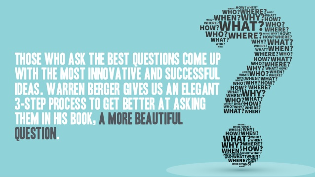
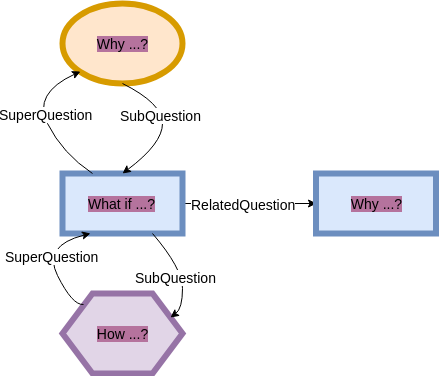
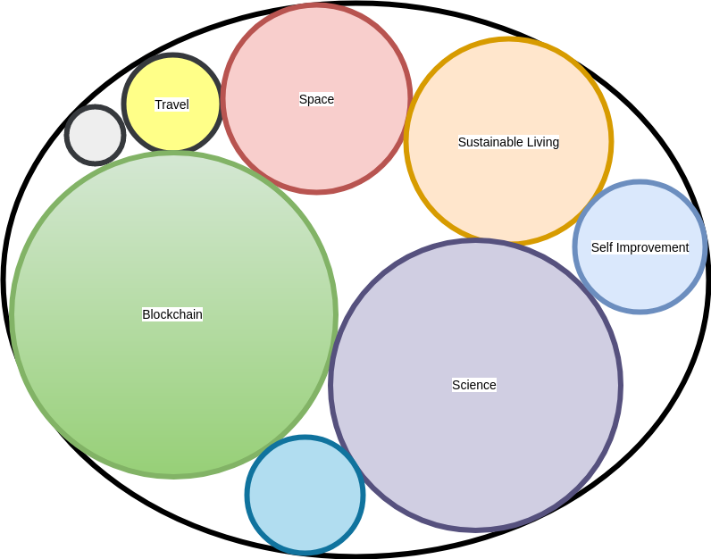
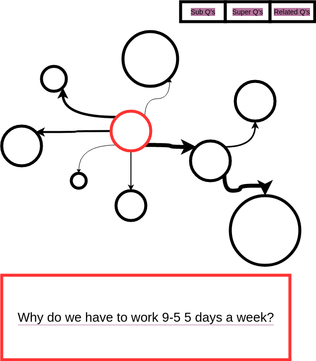
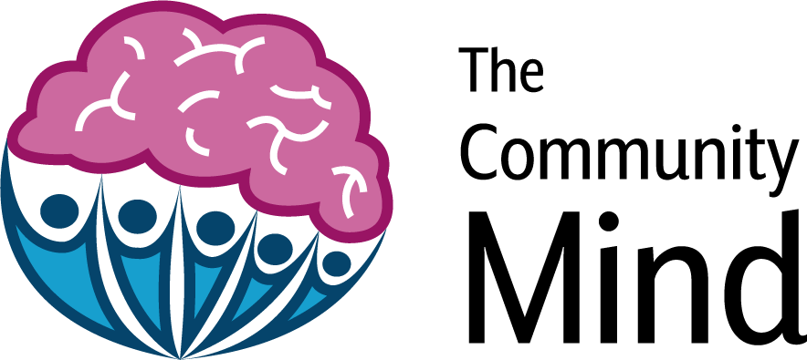

My vision, inspired by the book [A More Beautiful Question](http://amorebeautifulquestion.com/), to open source creativity by inspiring ideas through a connected web of open-ended, thought-provoking questions.

Ideas will be the currency of the future. As our technological advancement increases the only thing holding us back will be our ability to envision new ideas and bring them into reality.

My aim is to build a tool providing open access to inspiration through collecting and connecting our questions. I want to help develop a community of questioners and thinkers.

Whether we realise it or not questions define our decisions. They frame our thoughts and they drive our actions.

All the best ideas can be traced back to a question or series of questions that often challenged the status quo and redefined how society viewed things.

Polaroid is a great [example](https://www.boston.com/uncategorized/noprimarytagmatch/2012/10/03/history-of-polaroid-and-edwin-land) of this, beginning when Mr Land's 3 year-old daughter asked why she could not see the picture straight away.

Then think of all the answers that are such a part of our daily life, we have forgotten there ever was a question. For example - What is the most efficient way to maximise seating capacity on a train? The current answer is very basic, we have seen some advancements such as double-decker trains. The point is how many people stop and think about it.

Or what about - Why do I need to be in an office to do my work? 

The world is full of answers.

We accept the answers we are given to questions we don't even think about as the absolute truth far too often. Sometimes stepping back and considering the problem independently from any answers can provide the spark of a fresh idea.

Warren Berger's defines a beautiful question in his book as:

> "A beautiful question is an ambitious yet actionable question that can begin to shift the way we perceive or think about something - and that might serve as a catalyst to bring about change" - Warren Berger, A More Beautiful Question

It is these questions that The Community Mind aims to collect and connect.

By starting to appreciate the power of these questions and by thinking about the kinds of questions that we ask ourselves we can help frame the solutions that we come up with and the problems we solve.

A question provides the glue that for ideas to stick to in your mind, without them we struggle to make the connections that can turn a fleeting thought into an inspired idea.

Both individually and as a society, we need to think more carefully about the questions we ask and the reality we want our questions to shape.

After all, if you aren't asking the right questions, you are never going to find the right answers.

My hope for The Community Mind is that it will become a searchable connected web of such "beautiful" questions maintained by a community of questioners.

Questions that will cause people to think, that will reframe their thoughts and direct their actions. Hopefully, questions that will inspire innovative solutions to the problems of the world.

We need a world of thinkers and creators. A world of dreamers and big bold ideas.

Starting with questions is a great way to move towards that world.

As we continue to follow the exponential curve of technological advancement what is possible will be increasingly shaped by what we can imagine and what we can imagine is shaped by the questions we ask ourselves.

# Questions Without Answers

Is there more value to an unanswered question?

I believe so.

The Community Mind will be a place for questions without answers. A site for questions and questions alone. The answers, I hope, come from each and every one of us. But they should form as applications, solutions and action independent from The Community Mind.

The Community Mind aims to be just that, a communal brain for inspiration. Allowing answers to questions would reduce the potential of such a site.

There is power to an unanswered question. Possibilities. Opportunity.

An answer lets someone else frame the problem in your mind before you have a chance to frame it yourself.

Each and every one of us is unique. We are all capable of coming up with inspired, unique ideas. People need to believe in themselves, believe in their ideas. We need to start thinking for ourselves.

I hope to encourage everyone to go out there and start creating. Nothing motivates the mind more than the belief in your own ideas. Getting a *beautiful* question stuck in your head plants the initial seed of these ideas. If you care for it, if the question becomes one you cannot stop thinking about, then it will have the potential to blossom into an idea. It will have the potential to inspire action.

The beauty of an unanswered question is that it could be answered a hundred different ways and each and every one could lead to an innovative solution that brings value to the world.

I imagine capturing questions to be the same as capturing inspiration.

A *beautiful* question has no right or wrong. Only the different ideas that they produce, some better than others depending on your perspective.

But as my friend once asked. 

>  "Is there such thing as a bad idea?"

The point is by capturing these questions and storing them independently of the ideas they produce is to capture their potential. The potential for unique interpretation and innovation that the diversity of the human mind produces.

Someone from a different country, with different life experiences or from a future time period could look at these questions and come up with a completely different solution. 

A question can remind us of the problem without giving away any preconceived individual or societal notions of how the solution should be approached. Technology is only going to further highlight this.
Just imagine if we had a connected web of questions that the ancient greats like Democritus and Aristotle were asking. The first know scientists and philosophers. Deep thinkers and true questioners.

How might we interpret those today? What hidden ideas would they unlock in our minds?

We have no way of knowing but we do have a way to capture our questions now.

A well-worded question defines the essence of the problem without suggesting how it should be approached. It is up to any member of The Community Mind who reads it, to interpret it, to think about it, to question it and to eventually, hopefully, answer it.

Let's start recording these questions!

# A Community of Questioners

I want to build a community of questioners. A community of equal members not an application with users.
Members should have a say in maintaining the network and be rewarded for contributing value to the network. That is a community I would be both proud to build and happy to contribute to.

I have been grappling with the problem of how do I ensure the quality of questions accepted into the Community Mind? What about bad actors? What are the incentives for members to ask good questions? How can the best questions be rewarded?

Through my interest in blockchain technology, I believe I have found a possible set of solutions to explore. I hope to use crypto economic incentives and explore token engineering concepts to create a community that can generate value for its members and where everyone is responsible and incentivised to maintain the reputation of the community and its content.

My first exploration of this was to integrate Simple Token. Minting a branded token called Inspiration that I used as the local currency inside the Community Mind's micro-economy. The idea was to make users pay to ask a question but get rewarded for every like and follow that they received. Check out my [final video](https://www.youtube.com/watch?v=kMABXKGoiAk&t=2s) submission for more detail. 

This was just the first iteration. The idea was to integrate a token-based system that creates and rewards the community of questioners.

More recently I have applied for the [Blockternship](https://github.com/Blockternship/take-off) an open source project where I hope to explore Token Curated Registries.

I imagine a layered curation system that is something along these lines:

- Anyone can submit questions to any of the topics along with a deposit
- Topic curators can challenge any questions also putting down a deposit, this leads to a vote taking place among the community
- New topics can be submitted to a higher level of curators
- Curation of the top Topics

The network needs to provide open easy access to questioners while maintaining integrity without requiring too much effort from maintainers.

I am still figuring out the value proposition, for example, what will incentivise curators in the network?

This is a work in progress if anyone has any suggestions they are more than welcome!

# The Web of Questions

I want to create a web of interconnected questions. Where questioning members not only submit new questions but suggest new connections between questions. New links in the web.

I would expect through curation that these links should be approved by the community in some way. Although the threshold for approval should be low. Furthermore, these links should be weighted or rated by the community so a member of the community can more usefully navigate through the inspiration web.

Currently, I see the web being defined as three layers of connections between questions:

A question is either on a higher more broad level, on a lower more fine-grained level or on the same level. 

- **Super Question** - This is when the question you are asking is at a higher level to the question you are asking it on.
- **Sub Questions** - A sub question is when you are asking a question on a question that is at a finer lower level. For example a What If to a Why
- **Related Questions** - these are questions on the same level

I don't know if this is the best way and I am open to suggestions. Particularly, I don't like the naming of the types of links and think that could be much clearer.

# Long-Lived Interoperable Questions
Another reason for wanting to move to a dApp/blockchain approach to developing The Community Mind is because I want these questions to be long-lived.

What happens today when a website shuts down, a company folds or some disaster strikes?

You potentially lose everything.

I want these questions to belong to the community that generated them. I want them to be open to everyone in the world.

Why should they be stored on a single database on AWS server that I control?

Storing them in an immutable blockchain would solve this problem. It would create long-lived questions that everyone would be able to access.

These questions would be interoperable. I hope the Community Mind would be the first application to make use of these but I imagine and hope an ecosystem of applications arising around generating solutions and ideas from these questions.

I want to make this as easy as possible.

Again this is just an idea that I am exploring. I am not the most experienced dApp developer, but The Community Mind has been my vehicle for learning from the beginning so I see no reason to stop now.
Migrating to a dApp raises some questions that I am going to need to answer if anyone has any suggestions they would be much appreciated:

- Where should questions be stored, Ethereum, IPFS, other?
- If questions are saved to a blockchain do I still need a database?
- Will I need users or are addresses enough? I am particularly interested in SSI solutions so would love to implement uPort as the user login.
- How do I search the blockchain for questions and any other information stored there? How could I link questions stored in a blockchain together.

# Other Ideas

I have a number of other ideas for this project ...

## Embeddable Questions

I read medium posts a lot. Often they contain thought-provoking, open questions. These questions can easily be lost in the middle of a post. While they may be picked up on by individuals they are shared in a way that captures that value most effectively.

Questions could be submitted to The Community Mind then embedded in blog posts much like people embed tweets. That way you still have the question, you highlight its importance and you ensure people will be thinking about it in the future. You capture its inspiration potential.

## A Mobile Version

The world is mobile. The Community Mind needs a mobile-friendly version at least to keep up. Users should be able to ask questions as they come into there head no matter where they are. A mobile version will help enable that.

## A Web Visualiser - The Inspiration Mine

A well-designed visualiser for the web of interconnected questions is crucial to enabling The Community Mind to reach it's full potential.

By looking at the current implementation of [The Community Mind](https://www.thecommunitymind.com/), you struggle to see the big picture. How does your question fit into the wider mind? Where are you in the Community Mind when you are thinking about a question. Where are the hot spots? What area of the mind is underquestioned?

I have always imagined the potential for a tool to visualise the questions in the web that I describe. With questions as nodes and paths and connections. Where weight (Rating/Ranking) could be easily conveyed by width of link or radius of nodes. You could color code the nodes depending on Topic, allow easy filtering of topics. I want to make this. One day soon…

My initial idea for the view of all topics users are questioning about. Ideally, it would use d3 and look something similar to [this](https://bl.ocks.org/mbostock/ca5b03a33affa4160321).

Then as users navigate into topics the questions would become finer grained and a different visualisation could be used. Something similar to this, where size of nodes and size of links represents community approval.

## Searchable Questions

Questions should be searchable by keyword topic and possibly hashtags much like Twitter. The Community Mind needs to be as easy for users to find questions that interest them as well as connecting their questions into the most relevant section of the mind.

## Notifications

Users should be able to follow questions, users and topics. This should lead to them receiving notifications when new content is added to or by the entity that they follow. This will allow users to easily keep up with areas of interest and provide them with new ways to think about ideas they are interested in exploring.

## Gitcoin Bounties

It has long been my plan to create Gitcoin bounties for some of these ideas. I just need to create some good first issues that people could easily complete to get them started. I think Gitcoin is a great way to get others interested in the project and incentivise them to work on it. I am unfortunately to busy to make this project as good as I really believe it could be, hopefully through Gitcoin bounties, I can harness the power of open source to achieve the vision I have for The Community Mind. 

# Questions Driving The Community Mind
As this is a site for questions I thought I would share some questions that I have been thinking about and attempting to answer through developing The Community Mind.

- How can we encourage a world of creators, innovators and builders?
- What tools do we need to open source creativity?
- What if we could capture, connect and curate every "beautiful" question ever asked?
- How can we incentivise individuals to share their questions?
- How might a platform for shared questions change our perception of what is possible?

# Long Term

I would like to see the Community Mind become the beginning of answering bigger questions:

- How can we efficiently organise capital and brainpower behind the best ideas, where best is defined by an open global community?
- How can we as a community of questioners collectively decide on the best solutions and crowdsource funding and support for them?

The success of this century and probably the future of humanity will depend on our ability to focus the collective minds on this planet to bring to life our best ideas.

Humans have long been thinkers, but for the first time in history, we will have the ability to create whatever we set our minds to. The stars really are the limit. We need a vehicle for deciding which ideas we want to focus our capital and brain power on.

Trent McConaghy has a similar vision for human self-actualization that he outlines wonderfully in [Starships and Tokens](https://blog.bigchaindb.com/starships-and-tokens-d8c32728a24b). Well worth a read.

We need a better method for funding ideas and I would love The Community Mind to be the beginning of fulfilling that vision.

Together anything is possible.

The questions we ask today will lay the foundations for the solutions we create tomorrow.

What's your beautiful question?

# Get Involved

This is an open source project I started to learn JavaScript, React and GraphQl but it has developed into something that I really believe in.

These are all ideas, I am but one person at the moment. I am looking for anyone interested in helping develop this application further. Any thinkers and questioners to give their feedback.

The Community Mind is a bit rough around the edges but I believe it has potential, I hope you can see it too.

I am currently taking part in the [Blockternship](https://github.com/Blockternship/TheCommunityMind) an open source blockchain internship in collaboration with [Giveth](https://giveth.io/), [Status](https://status.im/), [Aragon](https://aragon.org/), [Swarm City](https://thisis.swarm.city/), [Colony](https://colony.io/) and [ChainShot](https://www.chainshot.com/).

